# Docker files, kontener jako definicja etapu - Jakub Michalik

## Oprogramowanie

1.Jako iż ciężko było znaleźć odpowiednie repozytorium do tego laboratorium, wybrane początkowo
z react po kilkunastu próbach nie działało, wybrano więc https://github.com/spring-projects/spring-petclinic

2.Sklonowano repozytorium poleceniem "git clone https://github.com/spring-projects/spring-petclinic

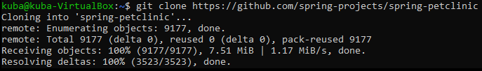

3.Następnym krokiem było zainstalowanie niezbędnych narzędzi poleceniami:

"sudo apt install maven" oraz "sudo apt install default-jdk"

W związku z tym iż była to już kolejna próba wykonania ćwiczenia, maszyna "pokazała", że te usługi są
już zainstalowane

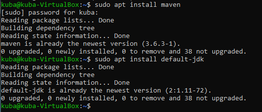

4.Potem nastąpiło zbudowanie i przetestowanie poleceniami:

"./mvnw install -DskipTests" oraz "./mvnw test"

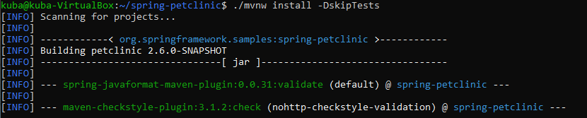
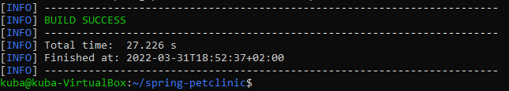

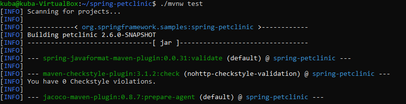
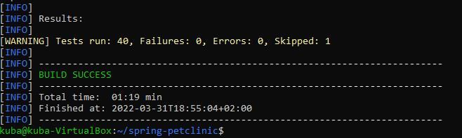

## Działania w kontenerze

5.Uruchomiono kontener, podłączono TTY, oraz zainstalowano gita poleceniem "apk add git"

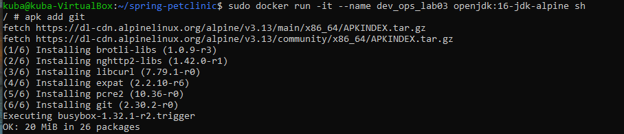

6.Sklonowano repozytorium poleceniem "git clone" oraz zbudowano poleceniem jak wcześniej

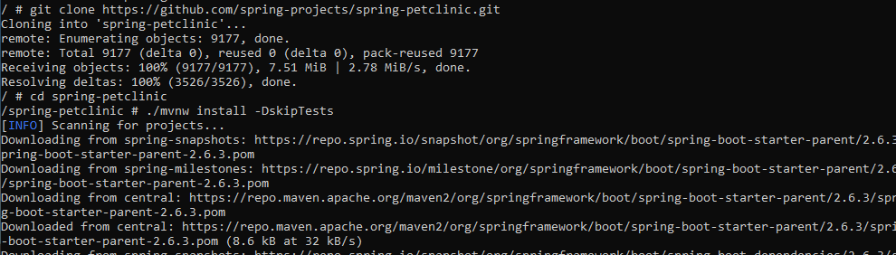
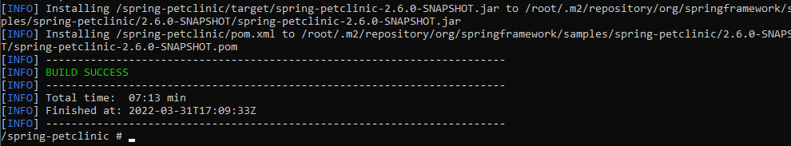

7.Uruchomiono testy poleceniem "./mvwn test"

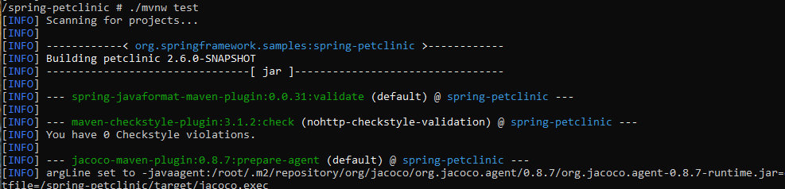
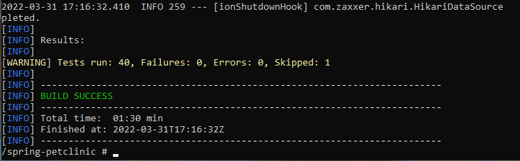

8.Stworzono plik dck_builder polecenim "touch dck_builder" oraz odpowiednio zmodyfikowano go

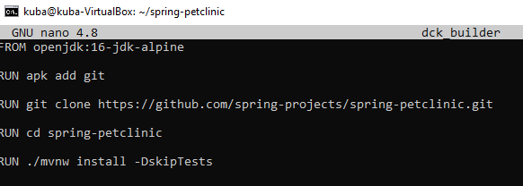

9.Zbudowano obraz za pomocą pliku, poprzez komendę "sudo docker build . -f dck_builder -t dev_ops_lab03"

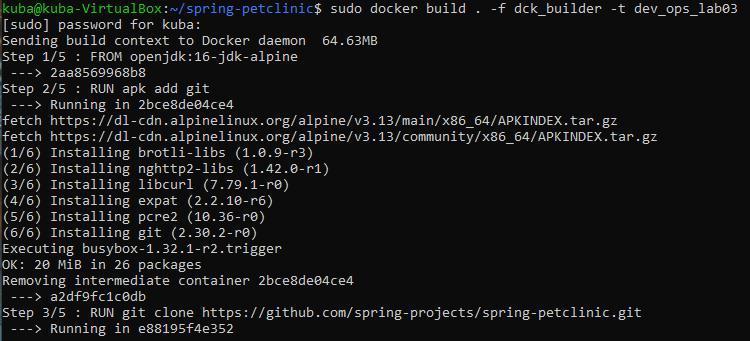
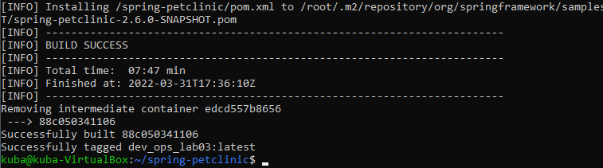

10.Stworzono plik dck_test poleceniem "touch dck_test" oraz odpowiednio zmodyfikowano go

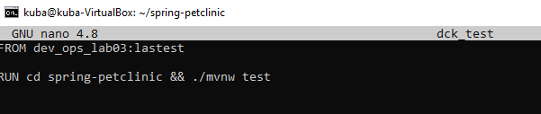

11.Ztestowano obraz za pomocą pliku

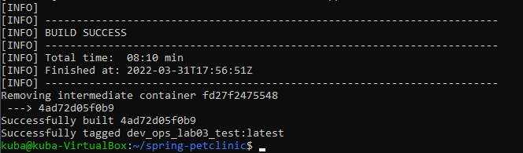

12.Podczas uruchamiania kontenera ciągle występował błąd, którego niestety nie byłem w stanie naprawić

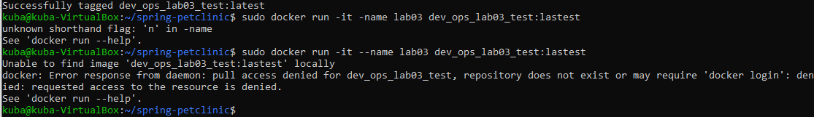

