# Dodatkowa terminologia w konteneryzacji, instancja Jenkins - Jakub Michalik

## Zachowywanie stanu

1.Pierwszym zadaniem w tym ćwiczeniu laboratoryjnym było przygotowanie woluminów:
	-wejściowego: poleceniem "sudo docker volume create input"
	-wyjściowego: poleceniem "sudo docerk volume create --name output"

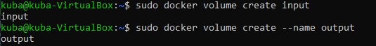

2.Następnie podłączono je do kontenera bazowego, oraz uruchomiono go poleceniem:

	"sudo docker run -it --name BUILDER --mount 'source=input,destination=/input' 
	--mount 'source=output,destination=/output' openjdk:16-alpine sh"

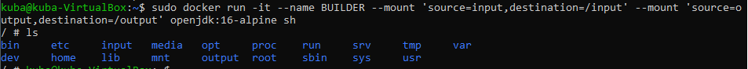

3.Następnym krokiem było stworzenie tymczasowego kontenera i podłączenie do niego woluminu wejściowego
poleceniem:

	"sudo docker run -it --name copied --mount 'source=input,destination=/input' alpine sh"

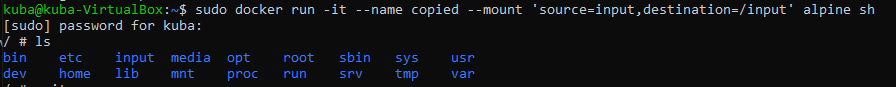

4.W folderze input zainstalowano gita, oraz pobrano repozytorium, kolejno poleceniami:

	"apk add git", oraz
	"git clone <nazwa repozytorium>"

Oraz sprawdzono w kontenerze bazowym zawartość woluminu wejsciowego:

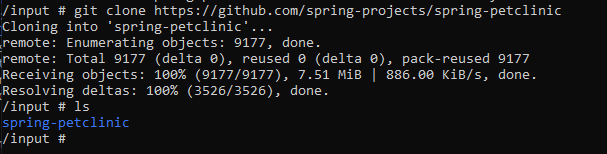

5.Potem nalezało uruchuchomić budowanie projektu poleceniem: 

	"./mvnw install -DskipTests"

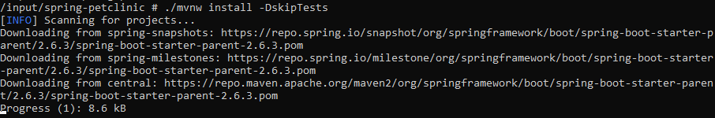

6.Kolejnym krokiem było skopiowanie pliku .jar do folderu output oraz sprawdzono dostęp do niego z 
poziomu maszyny

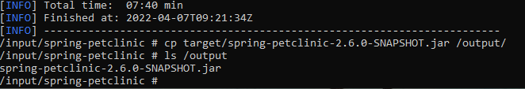

## Eksponowanie portu

7.Utworzono kontener ip3_server i zainsatlowano w nim program iperf3

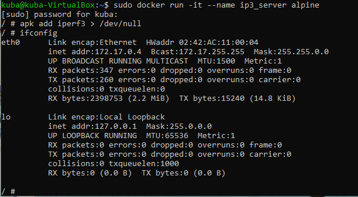

Tak samo zrobiono z nowo-utworzonym kontenerem ip3_client

8.Ustawiono nasłuchiwanie na serverze na porcie 9000

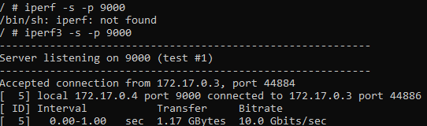

9.Na podstawie adresu IP połączono klienta z serverem

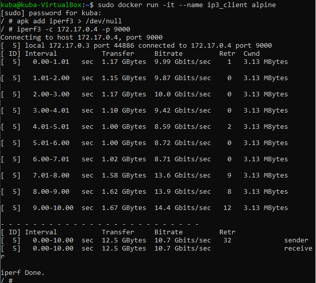

10.Następnie połączono ip3_server z hostem

11.Ze screenów można odczytać przepustowość, tak więc:
	-Kontener do Kontener - ok. 1,20 GBytes
	-Host do Kontener - ok. 1,30 GBytes
Można także zauważyć, że w przypadku hosta, przepustowość jest bardziej stała i ta wartość mniej "waha się" 

## Instalacja Jenkins

12.Jenkins'a zainstalowano zgodnie z dokumentacją na jego stronie. Pierwsze stworzono sieć poleceniem:

	-"sudo docker network create jenkins"

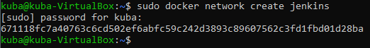

13.Potem stworzono kontener docker:dind, zgodnie z dokumentacją:

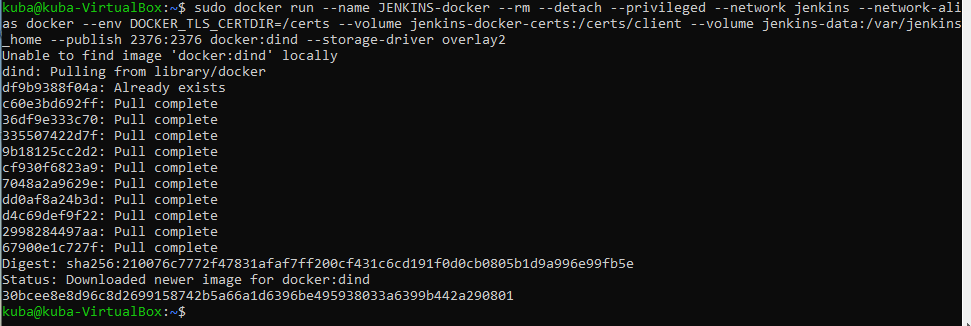

14.Następnie stworzono Dockerfile, dzięki wspomnianej już dokumentacji:

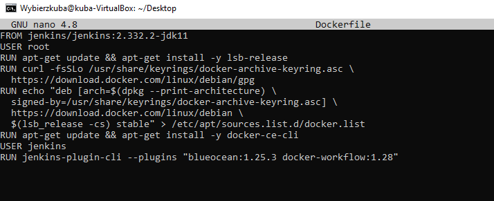

15.Kolejnym krokiem było zbudowanie obrazu z Dockerfile. Wykorzystano dokumentacje Jenkins'a

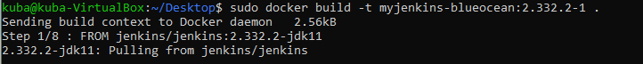

16.Następnym krokiem było uruchomienie własnego obrazu Jenkins'a:

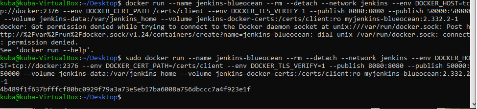

17.Wykazanie poprawności działanie kontenerów:

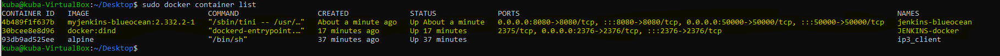

18.Po otworzeniu adresu localhost:8080 w przeglądarce, ukazał się następujący widok:

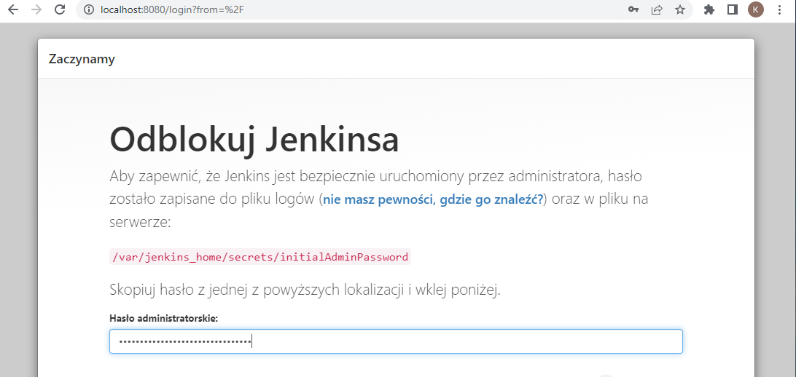

19.Po stworzeniu administratora i zalogowaniu się można stwierdzić sukces:

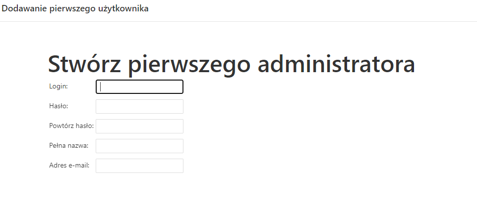
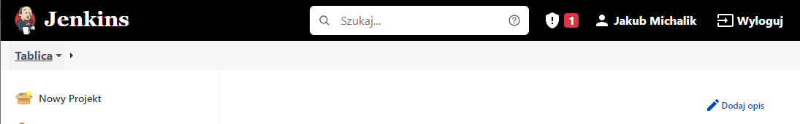

