# Przygotowanie wdrożeń nienadzorowanych dla platform z pełnym OS - 
# Jakub Michalik - LAB09

## Wykonane zadania:

### Przygotowanie systemu do pracy:
1. Utworzono nową maszynę wirtualną, na której należało zainstalować system Fedora Server 36, podany
przez prowadzącego zajęcia.

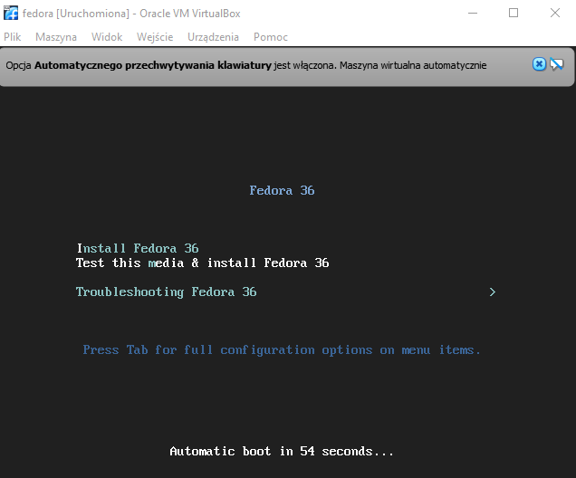

2. Zgodnie z wydanym poleceniem, wybrano minimalną instalację.

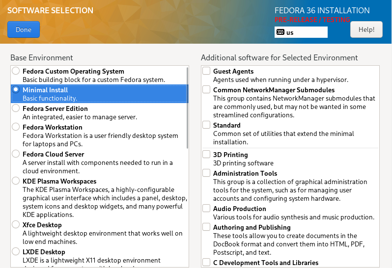

3. Kolejnym krokiem było utworzenie konta dla root'a, z nieskomplikowanym hasłem.

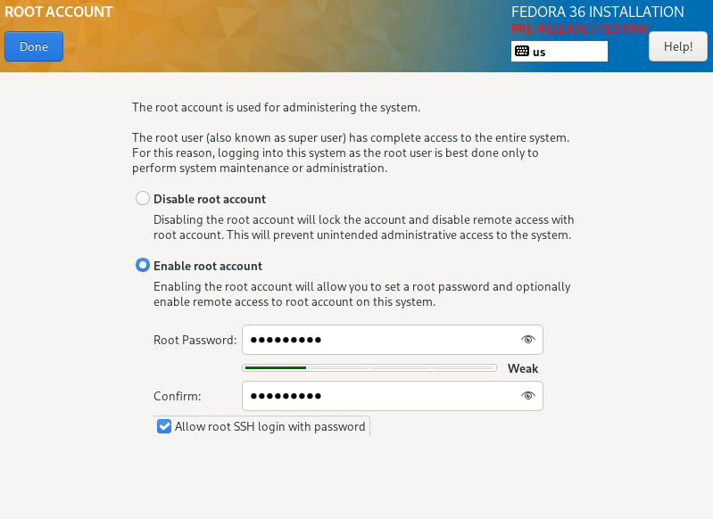

4. Na nazwę hosta nadano nazwę pokazaną na zajęciach.

5. Podsumowanie instalacji wygląda jak poniżej.

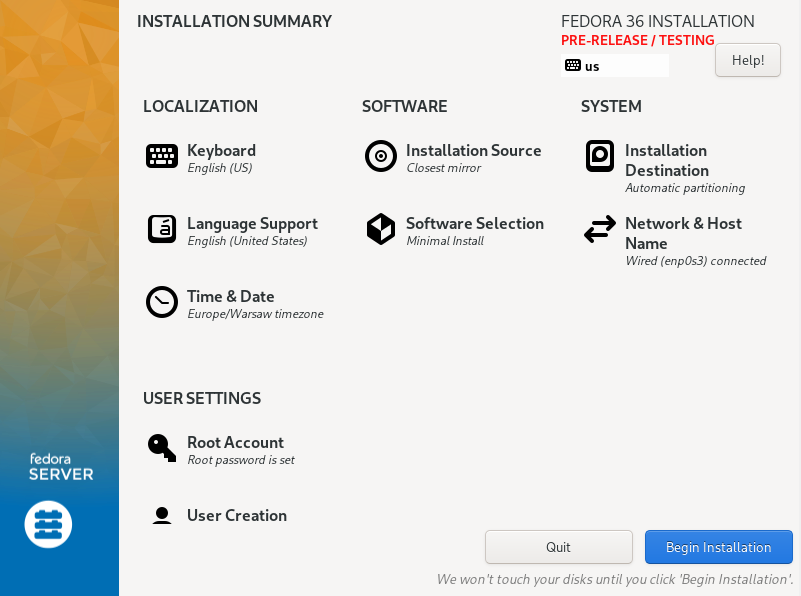

6. Proces instalacji:

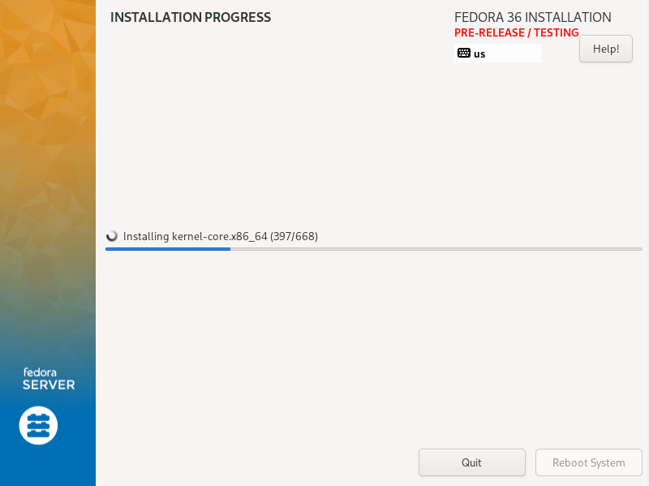

7. Po zainstalowaniu systemu należało przeprowadzić jego restart, oraz zalogować się wcześniej 
ustalonymi danymi.

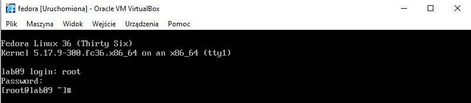

8. Kolejnym krokiem było stworzenie drugiej maszyny z systemem Fedora. Różnica polega na tym że należało
wybrać "Fedora Server Edition":

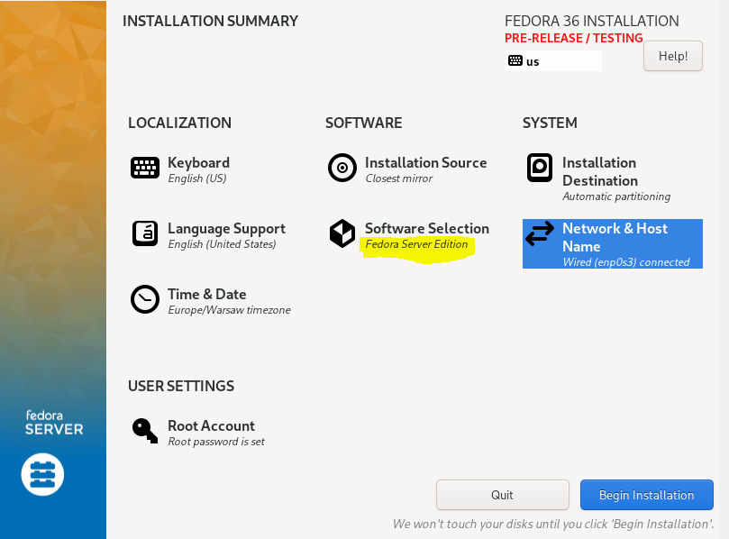

oraz jako nazwę hosta ustalono "lab09.http.agh" :

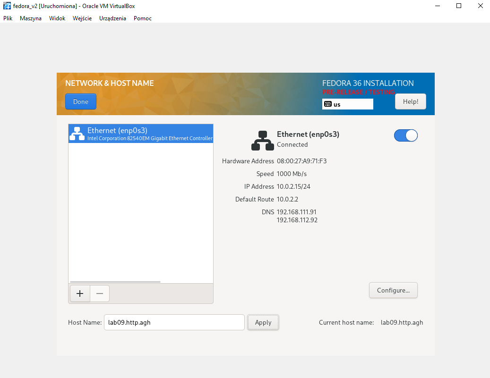

9. Następnie zainstalowano system i zalogowano się:

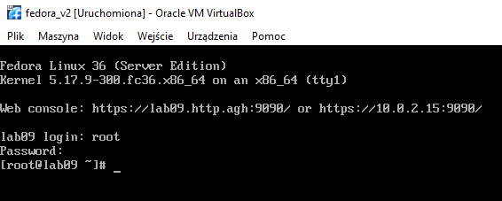

10. Potem skonfigurowano serwer poleceniem "dnf group install "Web Server" :

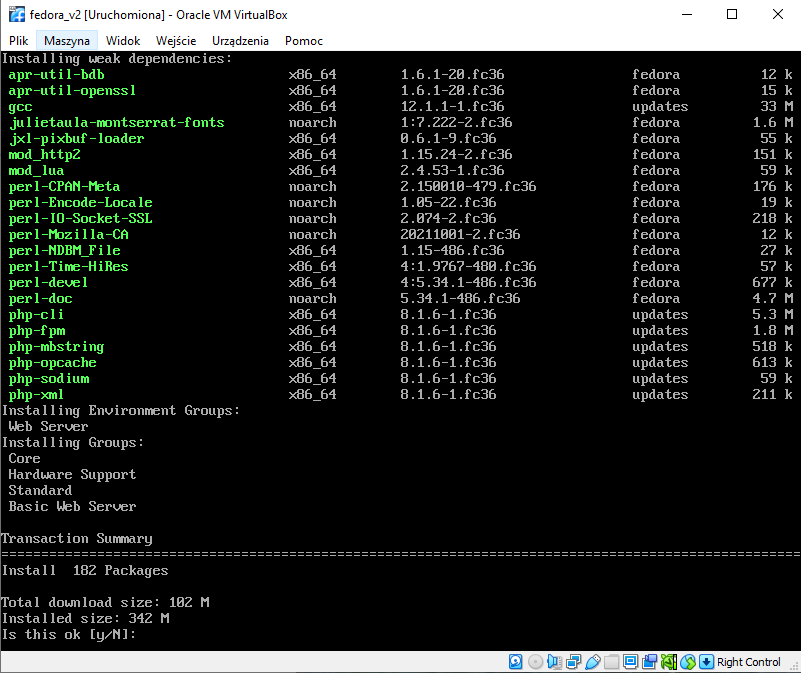

11. Po teście połączenia i połączeniu z serwerem, wyświetliła się strona testowa:

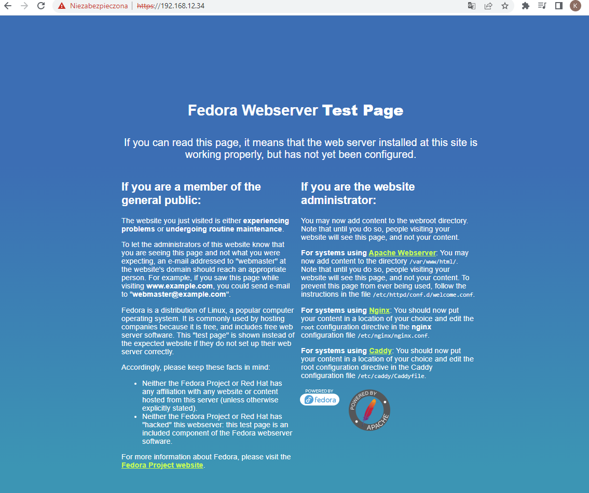

12. Następnie utworzono katalog, w którym umieszczono archiwum reprezentujące artefakt z pipelina. W tym celu 
wykorzystano program FileZilla, który okazał się być bardzo pomocny.

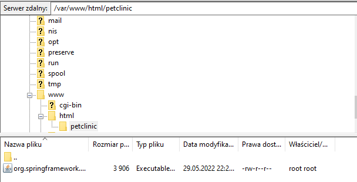

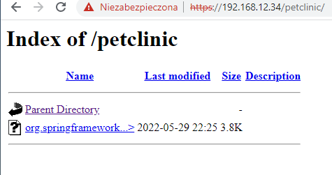

### Instalacja nienadzorowana

13. Aby zainstalować system w sposób nienadzorowany niezbędne było zdobycie pliku konfiguracyjnego 
"anaconda-ks.cfg". W pliku tym dodano klazulę %post - %end, gdzie uzyto polecenie
"scp root@192.168.12.34:/var/www/html/petclinic/org.springframework.petclinic.repository.eclipselink-2.1.0.release.jar ./petclinic"

14. Utworzono nową maszynę, i po naciśnięciu klawisza TAB należało wpisać ścieżkę do repozytorium:

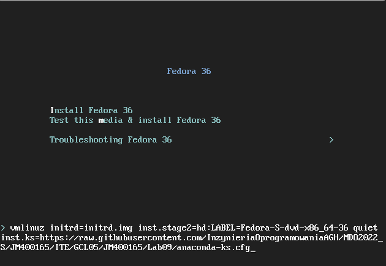

15. Po wciśnięciu Enter, rozpoczął się proces instalacjii:

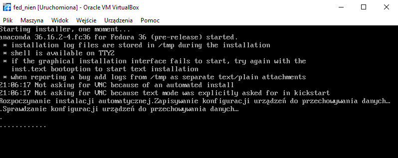

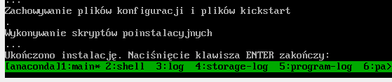

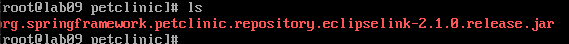

