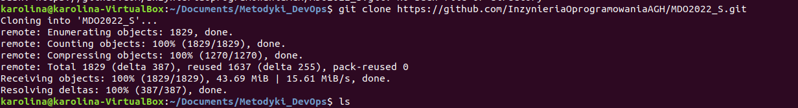
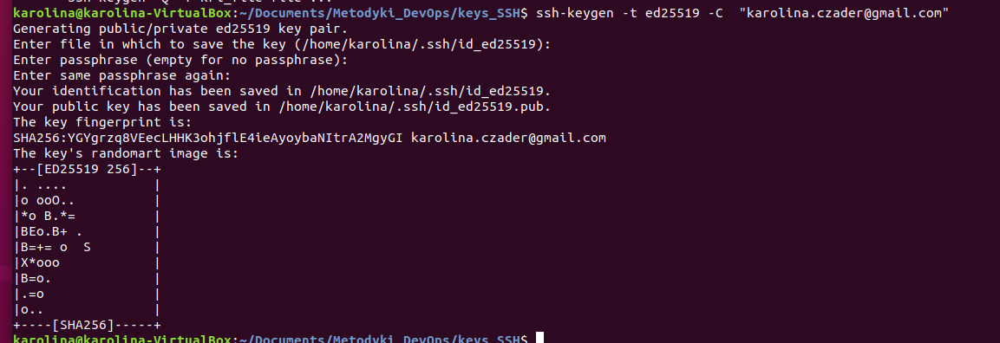
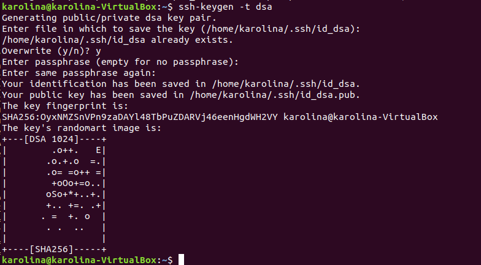
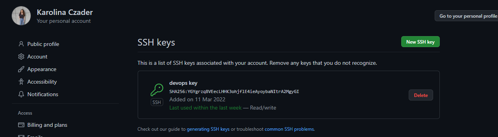
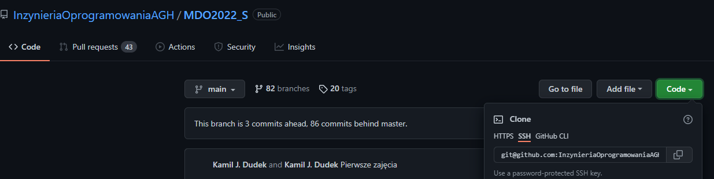
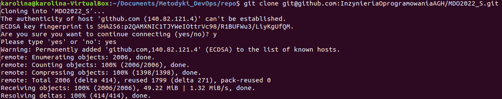
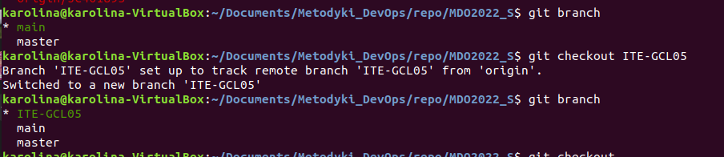
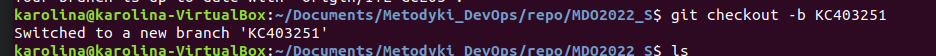
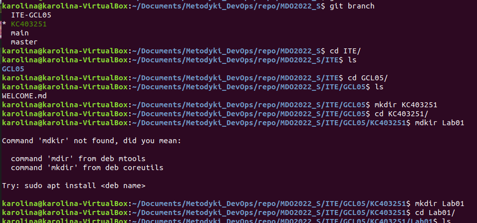
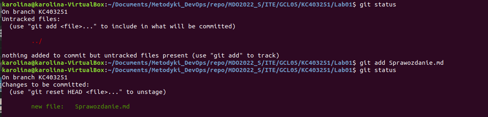

# SPRAWOZDANIE LABORATORIUM 1

### KOLEJNE KROKI

1. Sklonowanie repozytorium za pomocą opcji HTTPS 
git clone ...

2. Skonfigutowanie obsługi kluczy SSH (dwie opcje)

3. Dodanie klucza SSH do githuba

4. Sklonowanie repozytorium za pomocą opcji SSH
git clone ...

5. Przełączenie się na gałąź main, a następnie na gałąź grupy
git checkout ...

6. Utworzenie własnej gałęzi (nazwka składająca się z inicjałów i numeru indeksu)
git checkout -b ...

7. Stworzenie na zrobionej właśnie gałęzi katalogu na dodania sprawozdania (odpowiednia ścieżka)

8. Próba dodania sprawozdania do repozytorium

