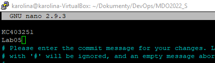
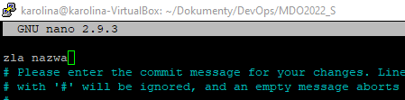
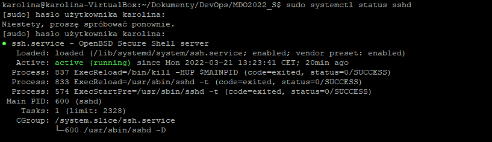
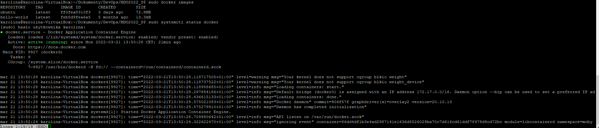
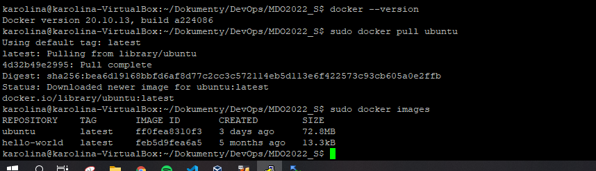
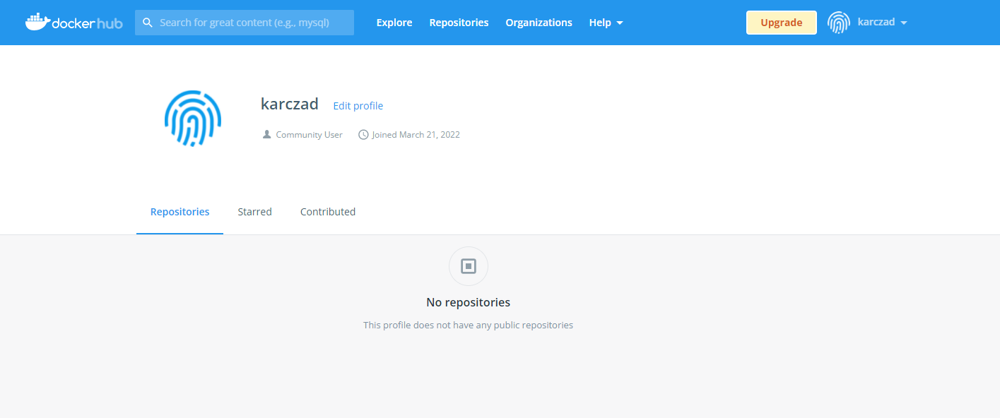

# SPRAWOZDANIE LABORATORIUM 2

### KOLEJNE KROKI

1. Przygotowanie git hooków, które sprawdzają najczęstsze błędy w nazwie commita

poprawny commit message

błędny commit message

2. Przygotowany git hook

~~~BASH
#!/usr/bin/env bash
INPUT_FILE=$1
START_LINE=`head -n1 $INPUT_FILE`
PATTERN="^(KC403251 )"
PATTERN2=".*(Lab)[0-9][0-9]*."
if ! [[ "$START_LINE" =~ $PATTERN ]]; then
  echo "Bad commit message"
  exit 1
fi

while IFS= read -r line
do	
	if [[ $line =~ $PATTERN2 ]]; then
		exit 0
	fi
done < <(sed 1d $INPUT_FILE)

echo "Bad commit message"
exit 1
~~~

3. Przygotowanie środowiska dockerowego

4. Wykazanie działania środowiska dockerowego

z definicji

z własności

5. Założenie konta na DockerHubie

