# SPRAWOZDANIE LABORATORIUM 3

### KOLEJNE KROKI

1. Wybór oprogramowania na zajęcia - sklonowanie repozytorium.

Wybrane oprogramowanie ma otwartą licencję, posiada narzędzie Makefile (npm), są w nim dostępne testy.

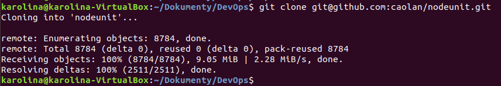

Przeprowadzenie builda programu (doistalowanie odpowiednich zależności)

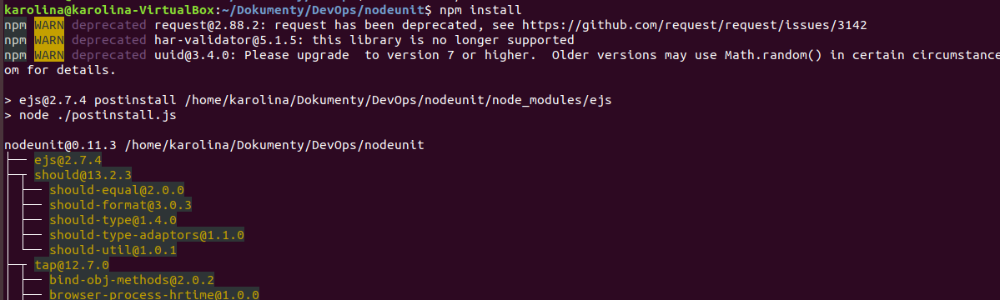

Uruchomienie testów dołączonych do repozytorium.

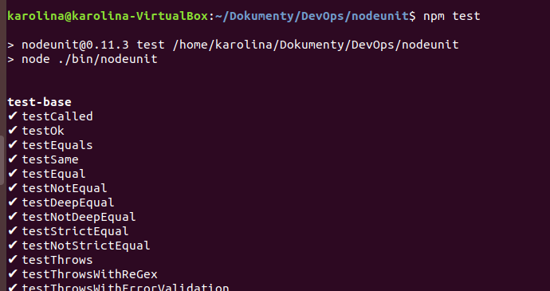

2. Przeprowadzenie buildu w kontenerze:

Uruchomienie kontenera.

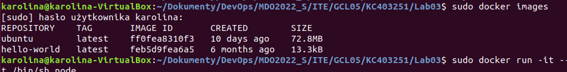

Sprawdzenie, czy kontener posiada potrzebne oprogramowanie.

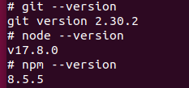

Sklonowanie repozytorium.

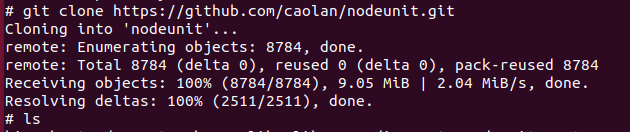

Zbudowanie aplikacji.

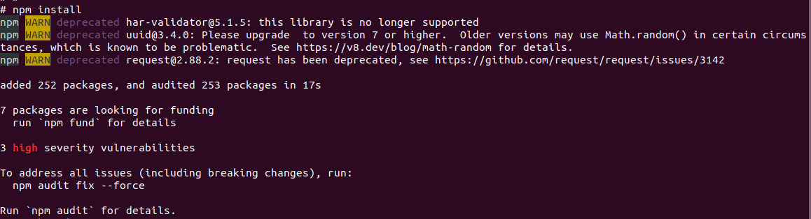

Uruchomienie tesów.

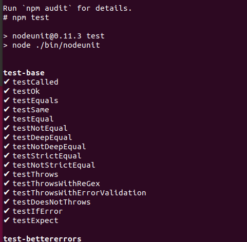

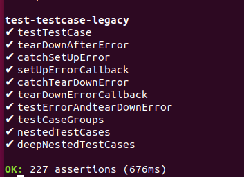

3. Stworzenie dwóch plików Dockerfile

Stworzenie plików dockerfile.

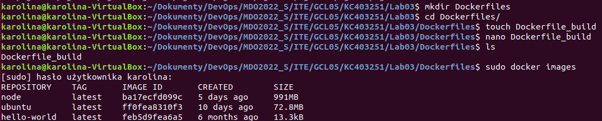

Pierwszy dockerfile przeprowadza wszystkie kroki, aż do builda aplikacji.

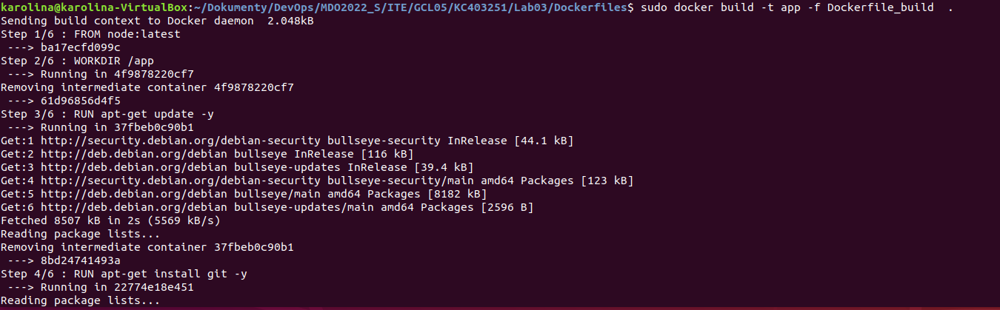

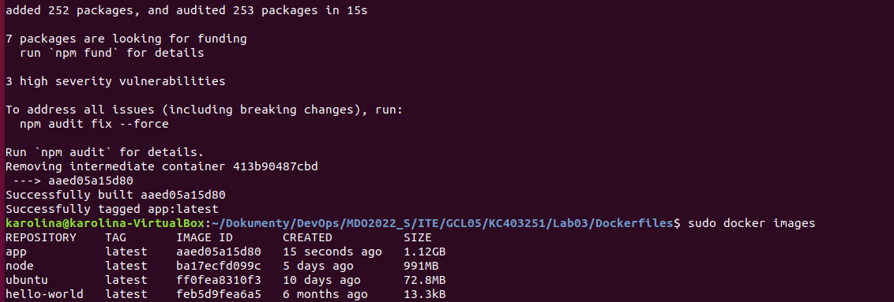

Drugi dockerfile bazuje na pierwszym i uruchamia testy.

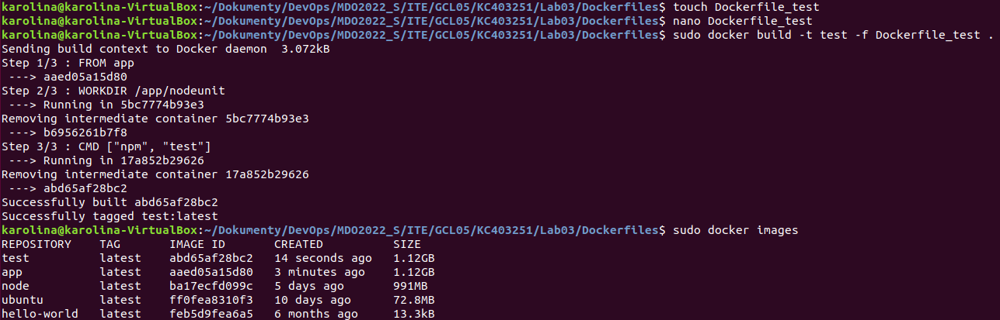

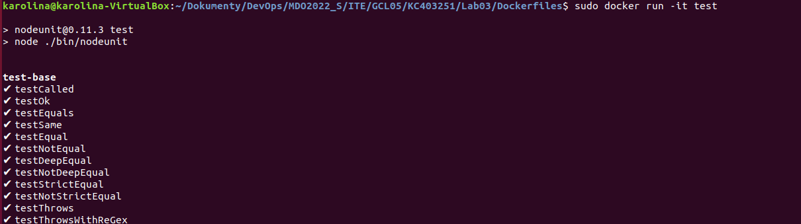

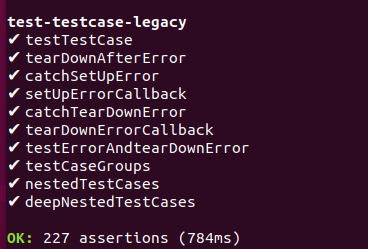

Sprawdzenie, czy kontener wdraża się i pracuje poprawnie.

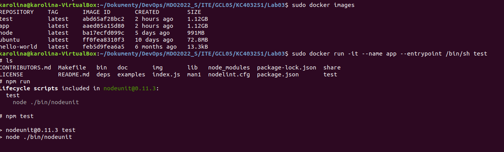

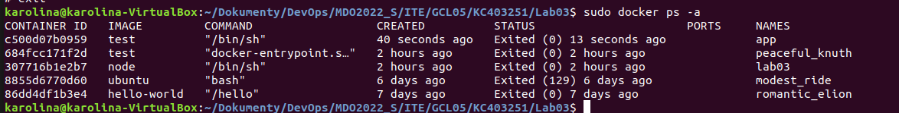

