# SPRAWOZDANIE LABORATORIUM 4

## ZACHOWYWANE STANU

1. Przygotowanie wolumina wejściowego i wyjściowego

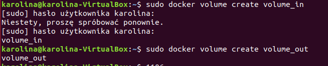

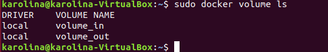

Sprawdzenie ich poprawności

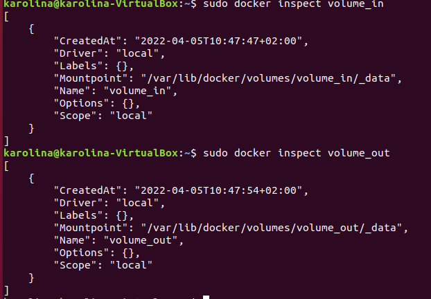

2. Uruchomienie kontenera i skolowanie repozytorium na wolumin wejściowy (brak konieczności instalacji czegokolwiek wcześniej)

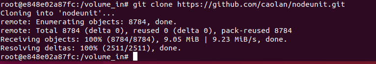

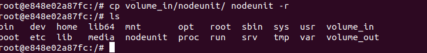

3. Uruchomienie builda w kontenerze

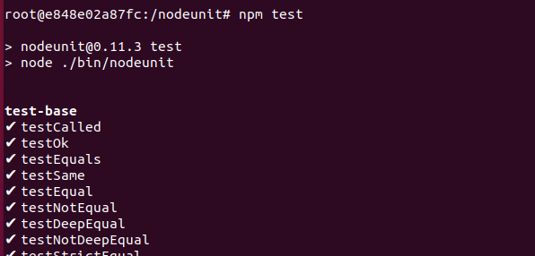

4. Zapisanie powstałych plików na wolumin wyjściowy

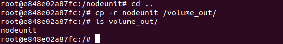

## EKSPONOWANIE PORTU

1. Uruchomienie wewnątrz kontenera serwera iperf, połączenie z nim drugiego kontenera

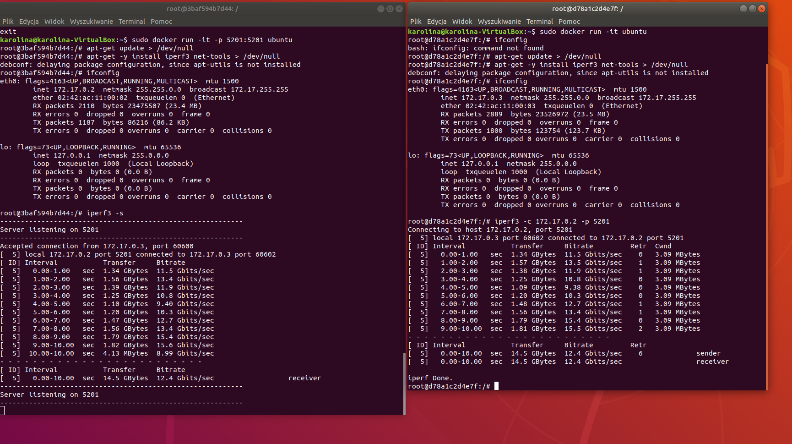

2. Połączenie z hosta

## INSTALACJA JENKINSA

1. Przeprowadzenie instalacji

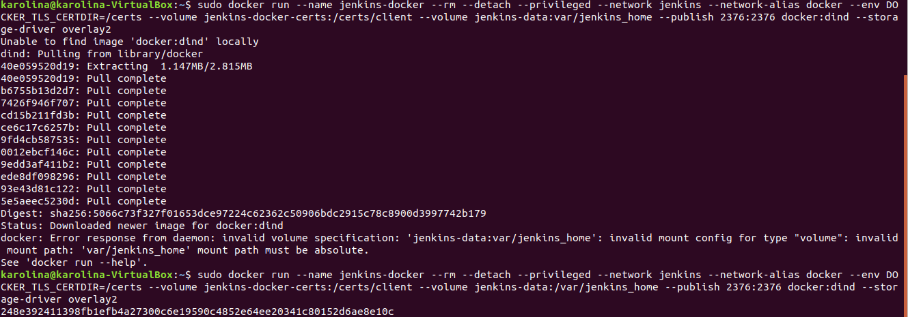

Utworzenie pliku dockerfile

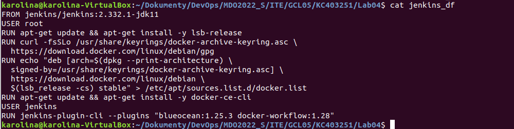

Zbudowanie programu (używając dockerfile)

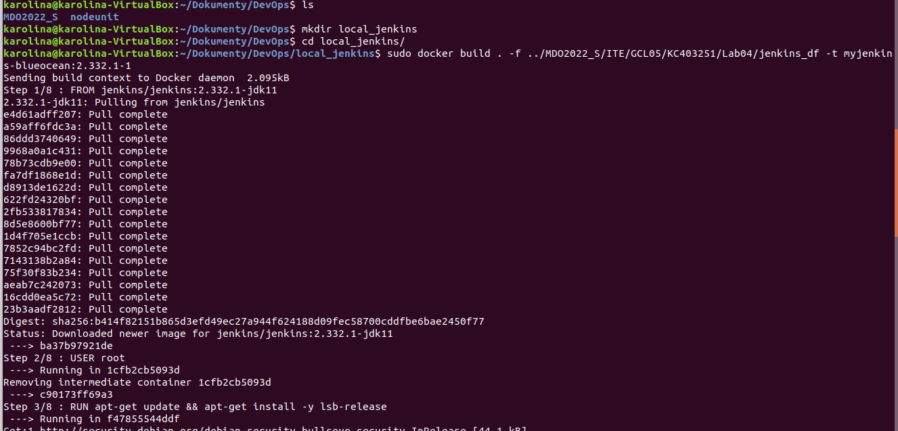

Uruchomienie obrazu

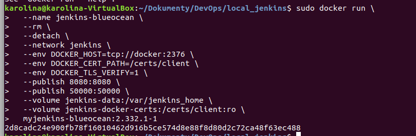

Otworzenie Jenkinsa poprzez wejście w przeglądarce na adres localhost:8080

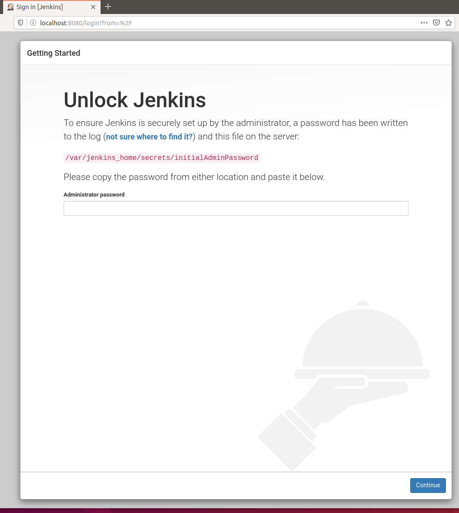

Skonfigurowanie środowiska, założenie konta

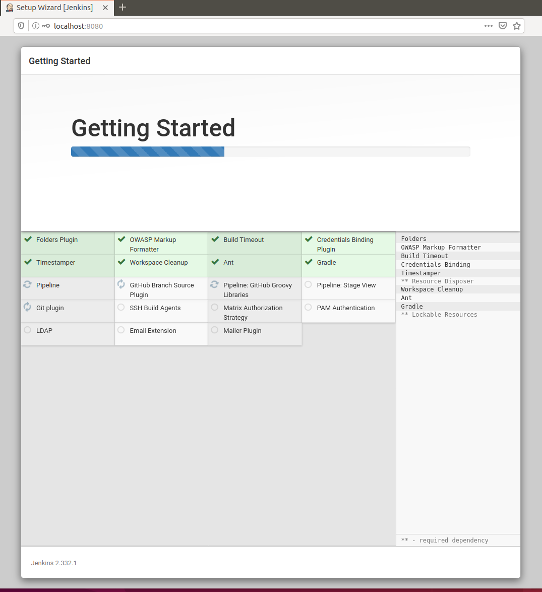

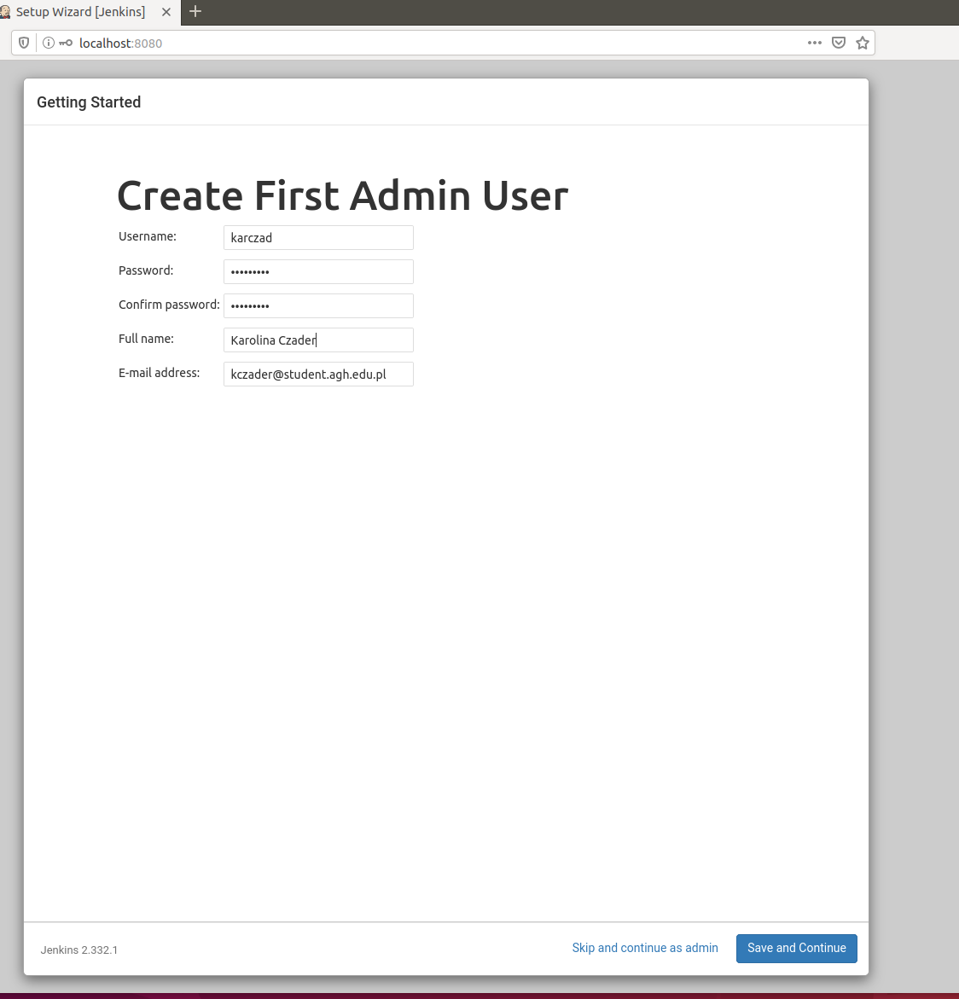

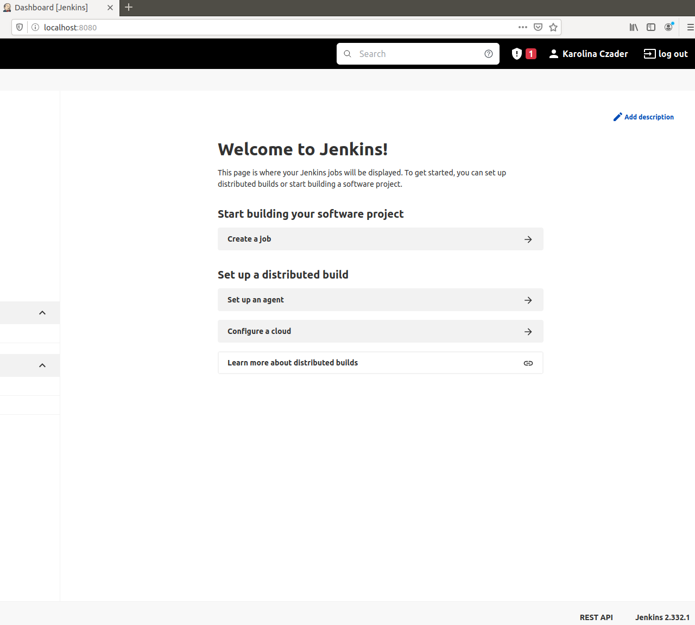

Ekran logowania i dzałąjący kontener

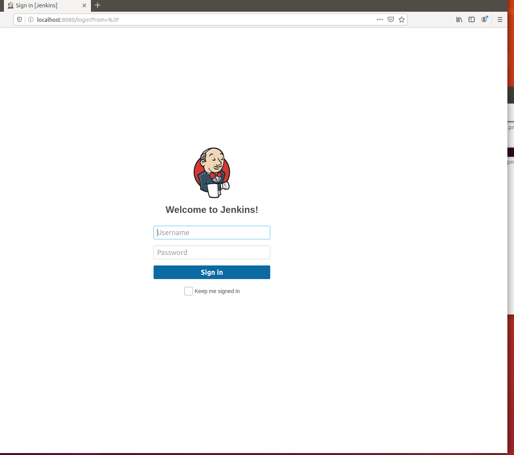

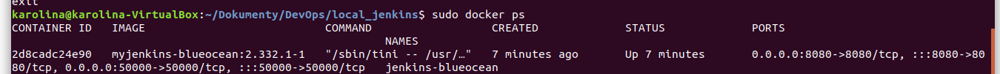