# SPRAWOZDANIE LABORATORIUM 11

## INSTALACJA KLASTRA KUBERNETES

Pierwszym krokiem było zainstalowanie odpowiednich środowisk.

Instalacja minikube:

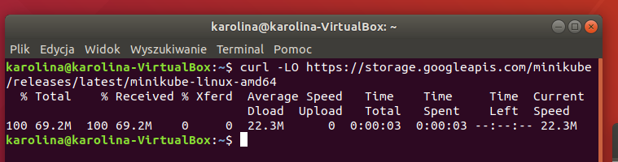 

Uruchomienie minikube:
* podczas pierwszego uruchomienia wystąpił błąd, ponieważ użytkownik na dockerze nie był dodany do grupy. 

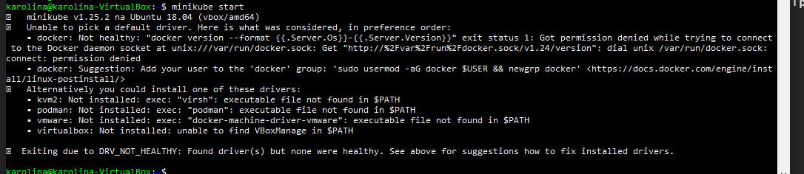

Poprawne uruchomienie, po naprawie błędu.

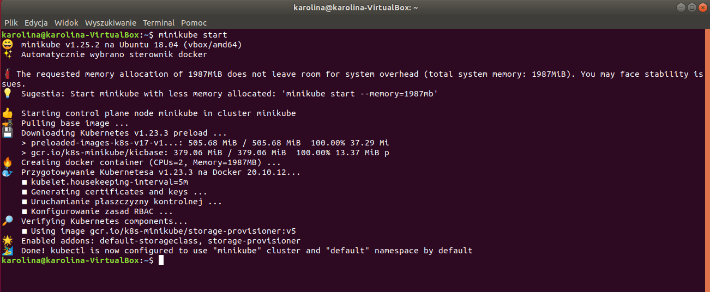

Pobranie pakietów polecenia kubectl (oraz sprawdzenie sumy kontrolnej):

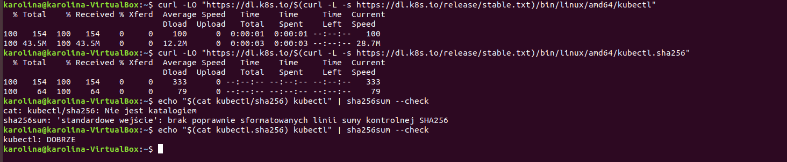

Instalacja kubestl:

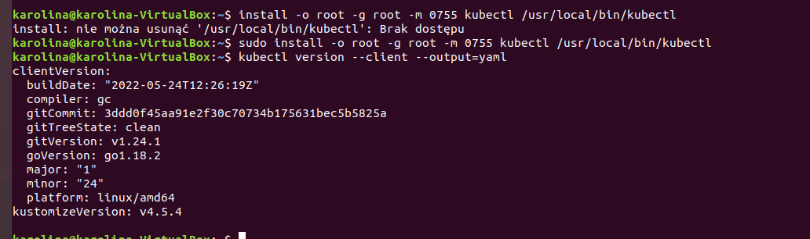

Działający worker (node) i pody:

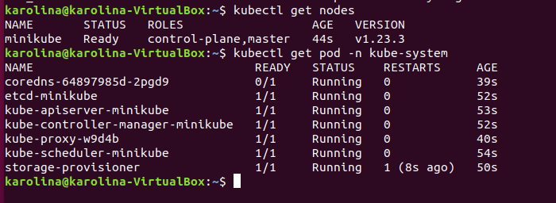

Darhboard:

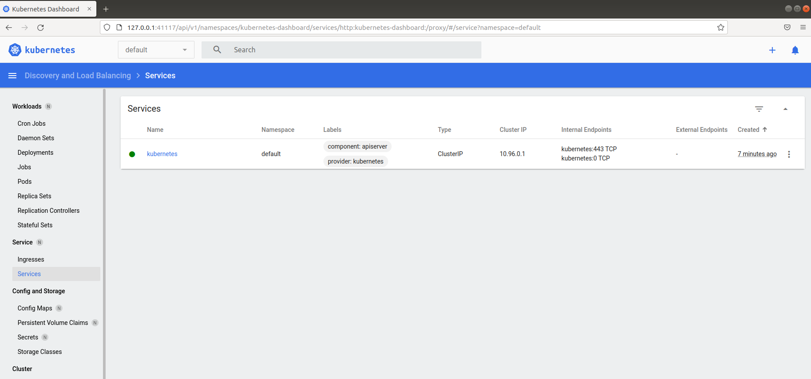

Jeśli chodzi o wymagania sprzętowe to potrzebne tutaj było 20GB miejsca, co jak można się domyślić nie na każdym komputerze będzie realną rzeczą do osiągnięcia. Do minikube potrzebne jest środowisko konteneryzacji, ja użyłam dockera.

## ANALIZA POSIADANEGO KONTENERA

Gotowy Dockerfile zawarty w aplikacji:

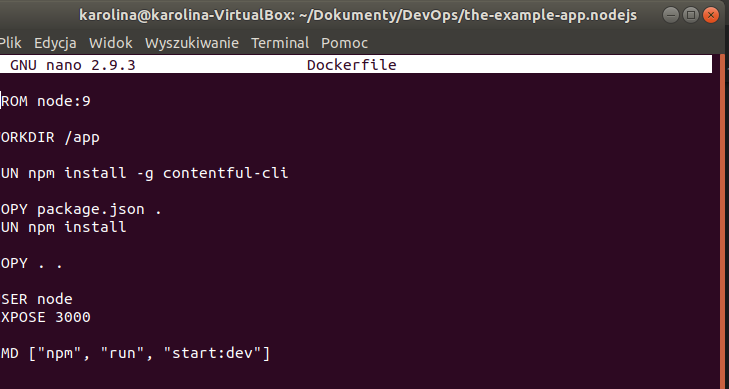

Build:

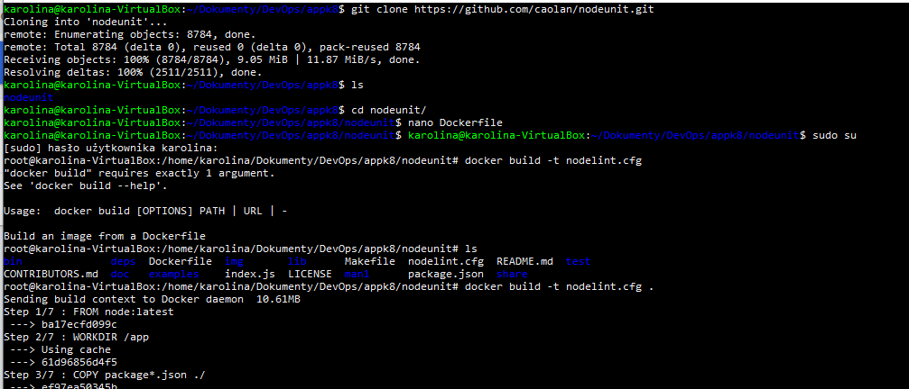

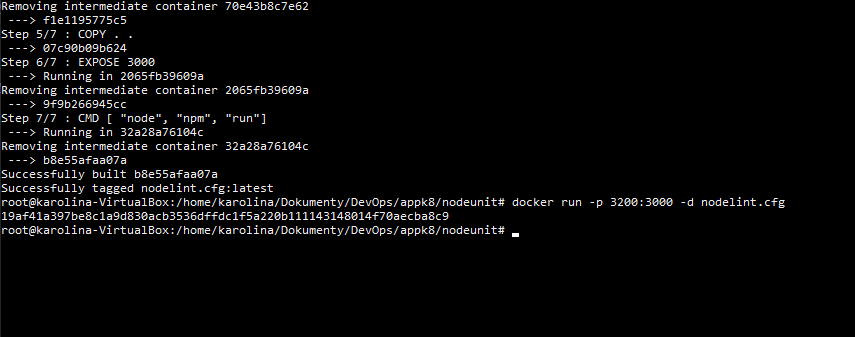

## URUCHOMIENIE OPROGRAMOWANIA

Utworzony plik .yaml

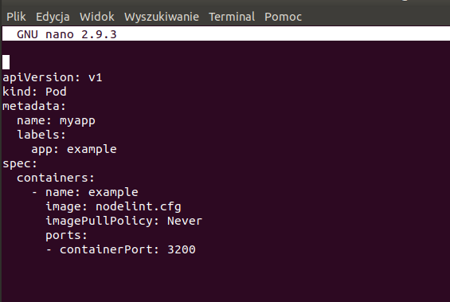

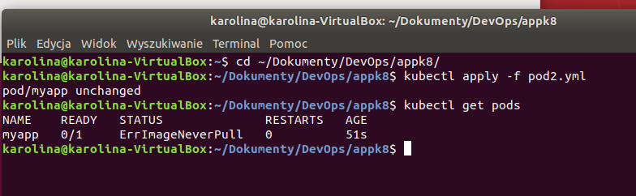

Jednak nie można utworzyć poda, ponieważ obraz jest w Dockerze lokalnym, a nie w k8s.
Rozwiązaniem jest polecenie: 

    eval $(minikube docker-env).

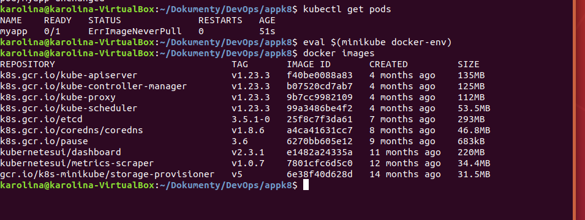

Obrazy w klastrze:

Działanie poprawnego poda widoczne na dashboarcie:

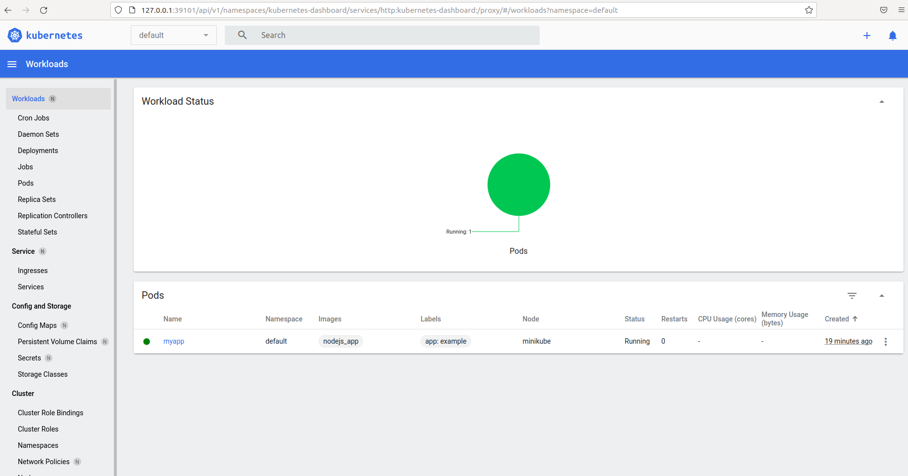

Wyprowadzenie portu na 4200 w celu dotarcia do opcji:

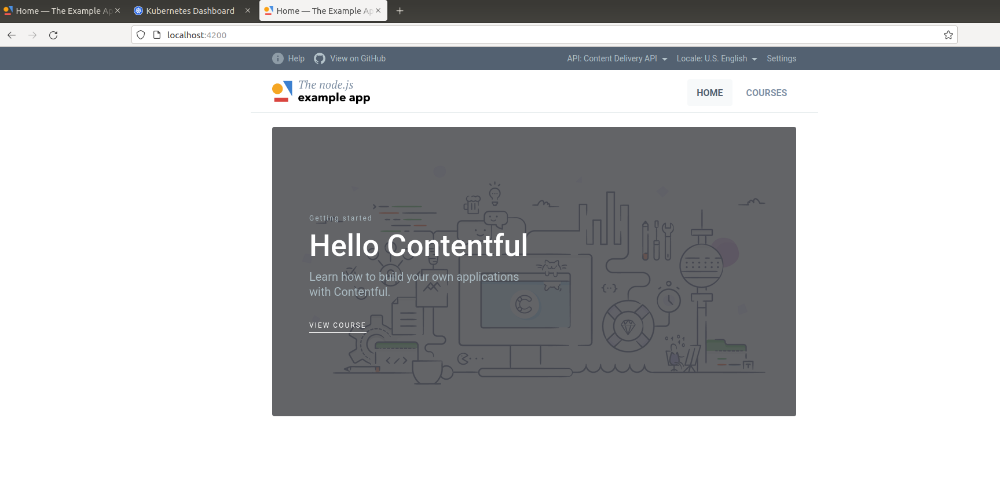

*Na screenach może występować pewnego rodzaju nieścisłości jeśli chodzi o nazwę aplikacji, gdyż początkowo korzystałam z repozytorium: https://github.com/caolan/nodeunit, które jest tylko frameworkiem, dlatego nie nadaje się do samoistnego uruchomienia. Dlatego byłam zmuszona wybrać inną aplikację a kroki powtórzyć, ale nie robiłam już kolejny raz screenów, bo jedyna różnica tak naprawdę to nazwa aplikacji, cała reszta kroków była analogiczna.

## PRZEKUCIE WDROŻENIA MANUALNEGO W PLIK WDROŻENIOWY

Drugi plik .yaml

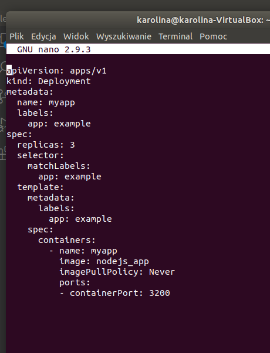

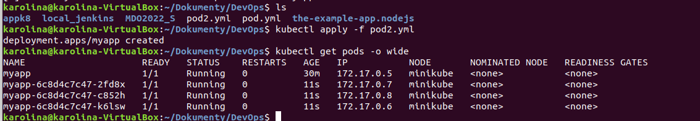

Działanie widoczne na dashboarcie:

# SPRAWOZDANIE LABORATORIUM 12

## KONWERSJA WDROŻENIA RĘCZNEGO NA WDRŻENIE DEKLARATYWNE YAML

Zmodyfikowano plik pod2.yml z poprzedniego laboratorium, ilośc replik zmieniono na 4. Zmiany wdrożono za pomocą polecenia kubectl rollout.

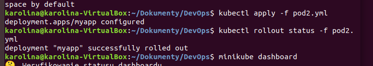

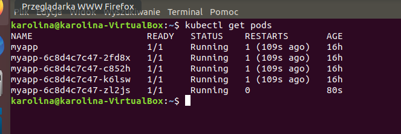

Zmiany widoczne na dashboarcie:

## ZMIANY W DEPLOYMENCIE

Następnie ponownie zmieniono liczbę replik, tym razem na 9.

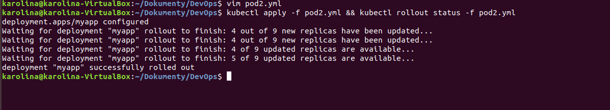

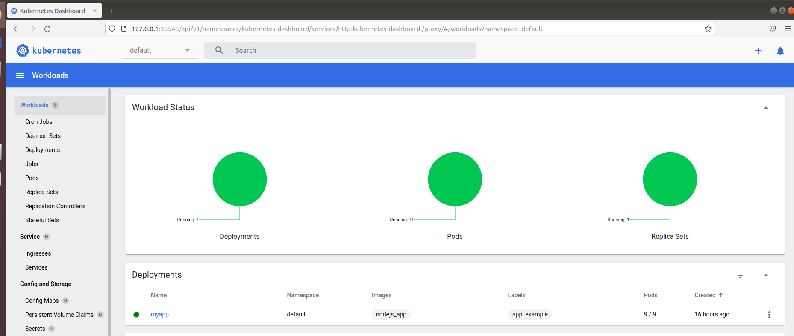

Kolejnym testem było zmienienie liczy replik na 1.

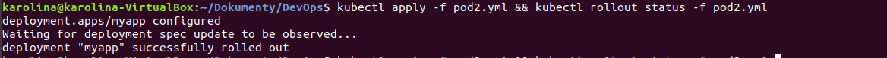

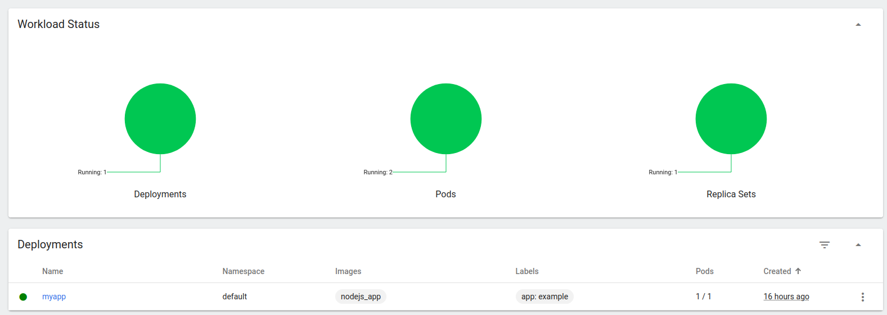

I na koniec ustawiono liczbę replik na 0.

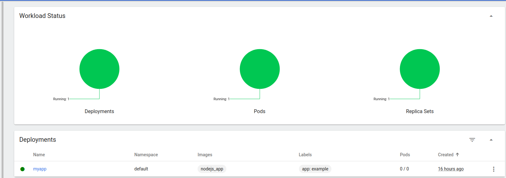

## KONTROLA WDROŻENIA

Utworzony został skrypt, który zwraca informacje o błędzie, kiedy czas wdrożenia jest większy niż 60 sekund.

    #!/bin/bash

    if [ $# -ne 1 ]; then
        echo "Please enter an argument!"
        exit 1
    fi

    name=$1

    kubectl apply -f pod2.yml
    timeout 59 /usr/local/bin/minikube kubectl rollout status $name

    if [ $? -eq 0 ]; then
        echo "SUCCESS"
    else
        echo "FAIL"
    fi

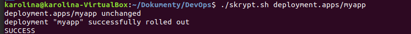

## STRATEGIE WDROŻENIA

STRATEGIA RECREATE: wszystkie aktualne instancje są ubijane i następnie wdrażana jest nowa wersja.

    spec:
    replicas:  5
    strategy:
      type: Recreate

STRATEGIA ROLLINGUPDATE: pody są stopniowo wdrażane - tworzony jest dodatkowy zestaw replik z nową wersją, potem zmiejszana jest liczba replik starej wersji aplikacj, a nowej zwiększana aż osiągnięta zostanie prawidłowa liczba. Parametr maxSurge odpowiada za ilość podów możliwą do dodania w danym czasie, a maxUnavailable za ilość podów niedostęonych we wdrożeniu.

    spec:
      replicas:  5
      strategy:
        type: RollingUpdate
      rollingUpdate:
        maxSurge: 2
        maxUnavailable: 0
