# SPRAWOZDANIE LABORATORIUM 12

## Przygotowanie systemu pod uruchomienie

Na początku należało pobrać fedorę (ja wybtałam wersję 36), oraz ją zainstalować odpowiednio konfigurując (dodałam konto roota oraz wybrałam opcję instalacji "minimal").

Następnie za pomocą programu WinSCP przegrałam plik anaconda-ks.cfg na system Windows. Ten plik zaiwera informacje dla automatycznego instalatora i będzie potrzebny potem przy instalacji nienadzorowanej.

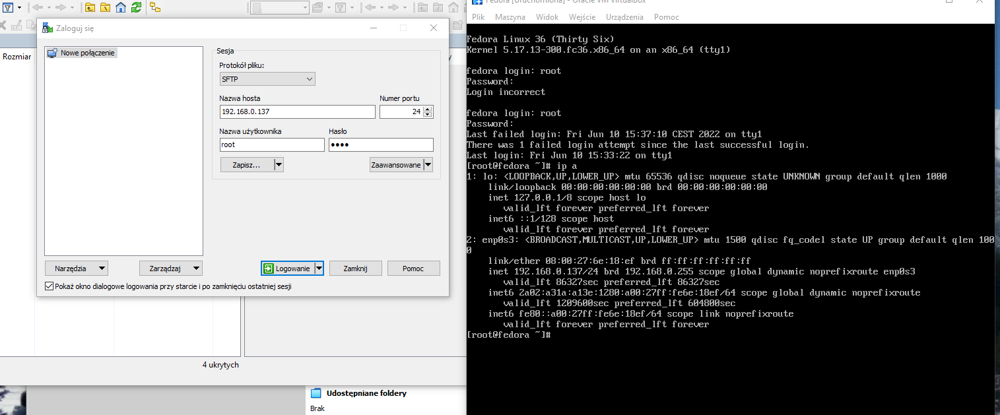 

 

Kolejnym krokiem było zainstalowanie drugiej fedory (identyczna konfiguracja jak w poprzedniej). Jedyną różnicą jest nazwa, tym razem fedora będzie się nazywać "serwer".

Zaktualizowano pakiety:

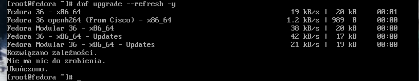 

Instalacja httpd:

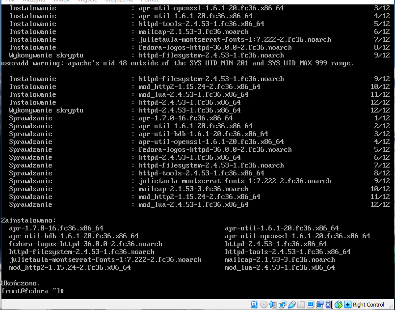 

Dodanie wyjątków do firewalla:

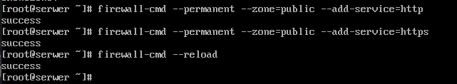 

Uruchomienie i sprawdzenie statusu:

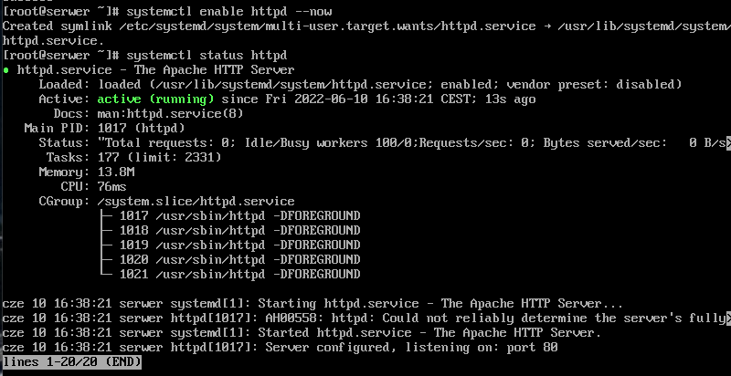 

Artefakt (zwrócony przez pipeline) przerzucono na fedorę (serwer) używając programu WinSCP.

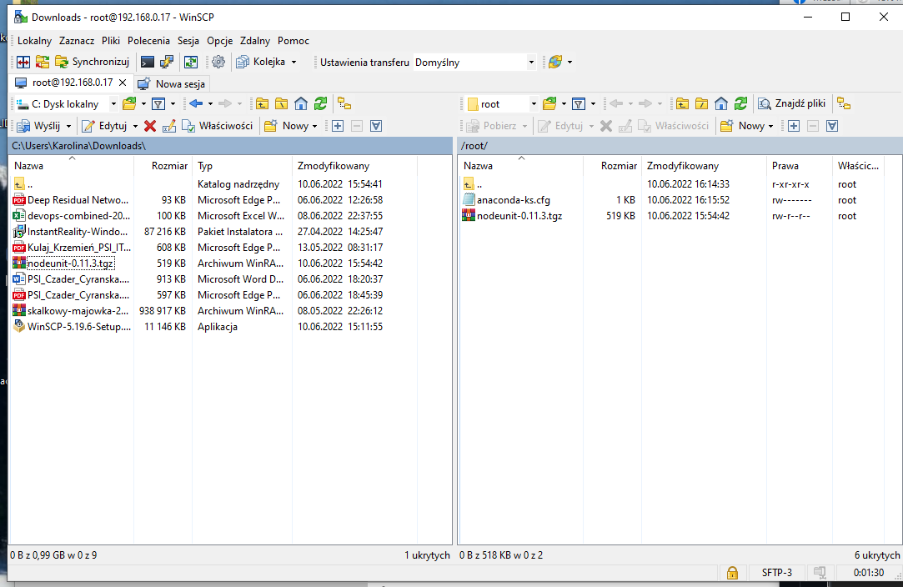 

Katalog /var/www/html jest udostępniany, dlatego utworzony w nim katalog nodeunit do którego przeniesiono pobrany artefakt.

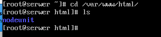 

Na maszynie klienckiej pobrano wget:
    
    dnf install wget

Następnie za pomocą tego polecenia pobrano artefakt z fedory (serwer):

    wget adres_ip_fedory_serwer/nodeunit/nodeunit-0.11.3.tgz

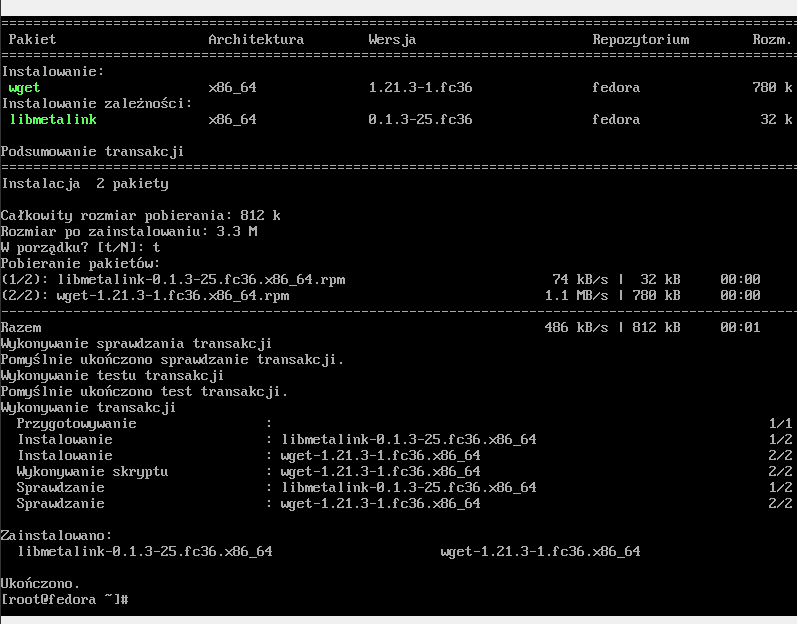 

Po lewej artefakt na fedorze-serwis, po prawej pobrany już na fedorze-klient.

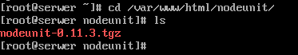 
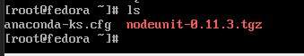 

Po pobraniu należało zmienić uprawnienia, aby użytkownik był w stanie uruchomić plik.

Uruchomienie poleceniem:

    npm install nazwa_artefaktu

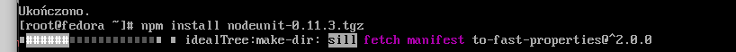 

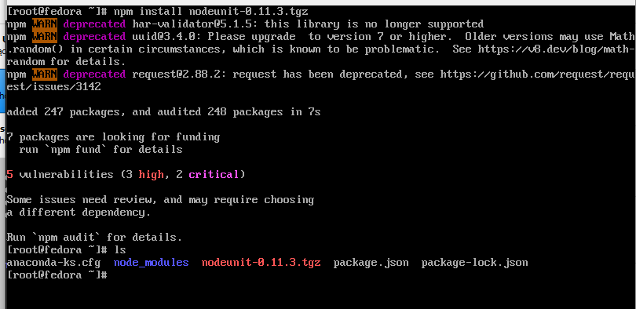 

