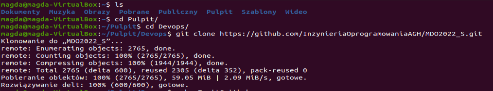
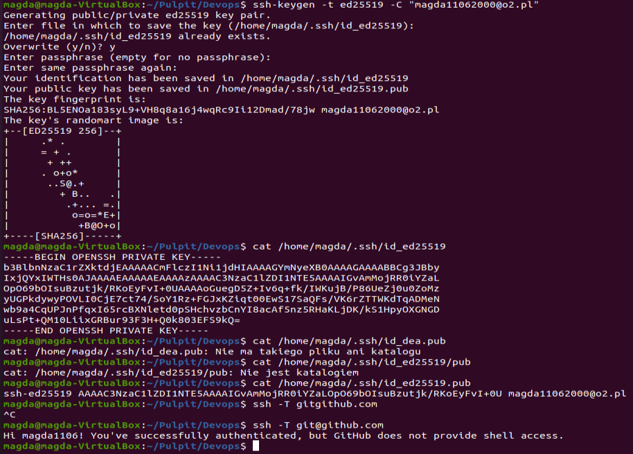
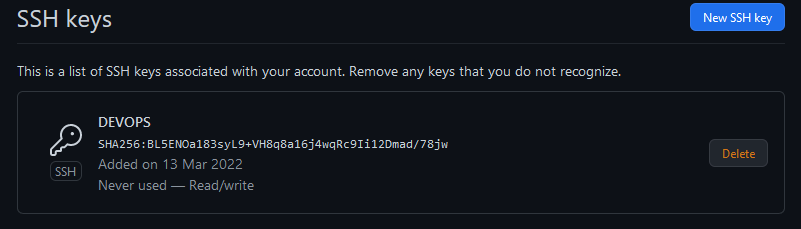
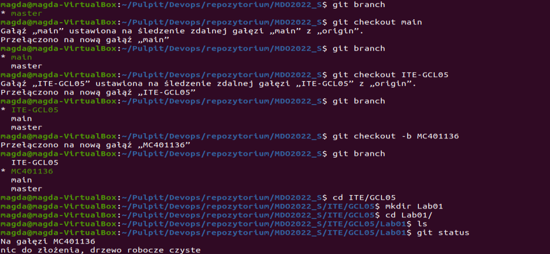
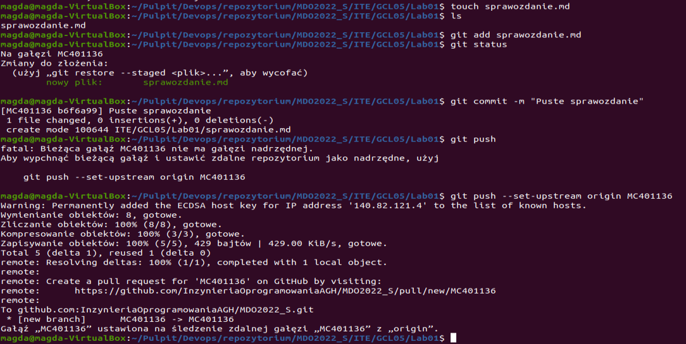

# Wprowadzenie, Git, Gałęzie, SSH

## Zadania, które były do wykonania

>1. Instalcja klienta Git

>2. Sklonowanie repozytorium za pomocą HTTPS

>3. Instalacja obługi kluczy SSH

>4. Sklonowanie repozytorium za pomoca SSH

>5. Przełączenie się na gałąź main, a potem na gałąź swojej grupy GCL05, stworzneie gałęzi MC401136, stworzenie na niej katalogu Lab01

>6. Dodanie pliku ze sprawozdaniem  i wysłanie do zdalnego źródła (na swojej gałęzi)

>7. Wystawienie pull request do gałęzi głównej