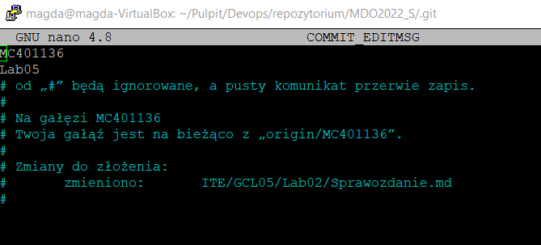
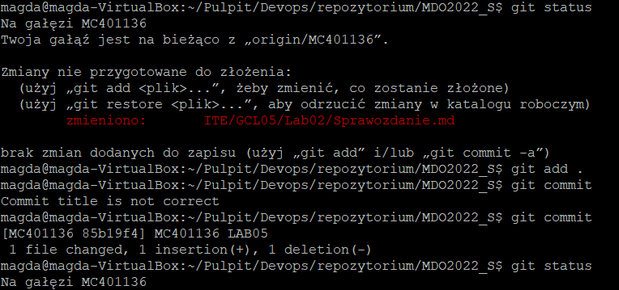
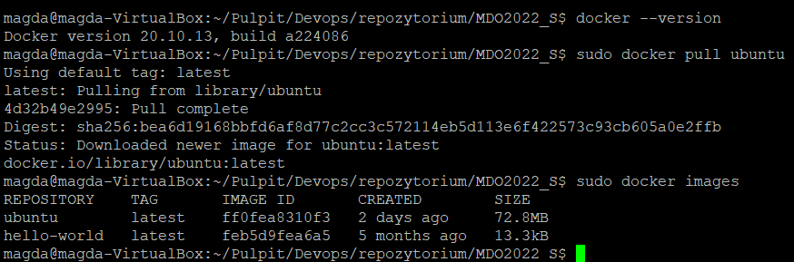
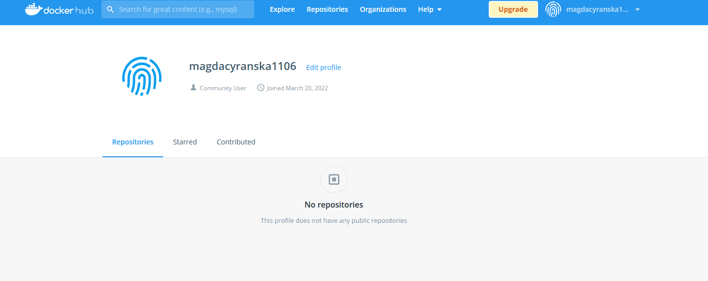

# Hooks, heterogeniczne środowisko pracy, instancja Dockera

## Zadania, który były do wykonania

>1. Przygotuj hook git, który sprawdza czy tytuł commita nazywa się MC401136 i sprawdzający czy treść commita zawiera numer Lab.


> 2. Umieść hook w sprawozdaniu tak aby dało się go przejrzeć

```BASH
COMMIT=$1
line_commit=`head -n1 $COMMIT`
pattern_indeks="^(MC401136)"
pattern_lab=".*(Lab)[0-9][0-9]*."

until [ "$line_commit =~ $pattern_indeks" ]; do
    echo "Commit title is not correct"
    exit 1
done


while IFS= read -r line
do
    if [[ $line =~ $pattern_lab ]]; then
    exit 0
    fi
done < <(sed 1d $COMMIT)

echo "Commit message is not correct"
exit 1
```

>3. Rozpocznij przygotowanie środowiska Docerowego. Zainstaluj środowisko dockerowe w stosowanym systemie operacyjnym. 


>4. Wykaż, że środowisko dockerowe jest uruchomione i działa, wykaż działanie( pobierz obraz dystrybucji linuksowej i uruchom go), wyświelt numer wersji.

> 5. Załóż konto na Docker Hub.
