# Docker files, kontener jako definicja etapu

## Zadania, które były do wykonania

>1. Znajdź repozytorium z kodem dowolnego oprogramowania, które, dysponuje otwartą licencją, sklonuj to repozytorium, przeprowadź build programu. 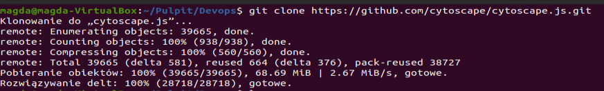           

>2. Uruchom testy jednostkowe dołączone do repozytorium.
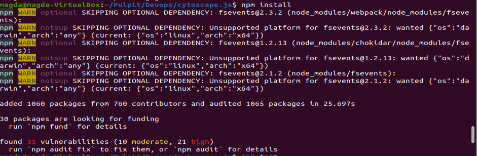
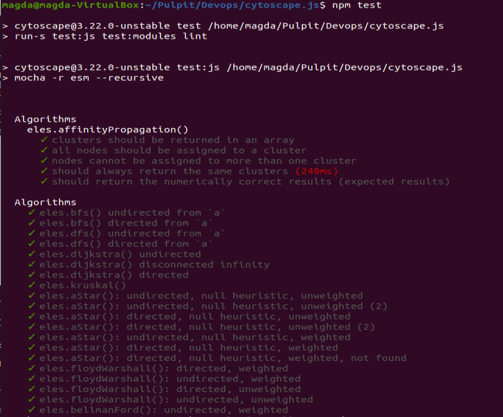
>3. Uruchomienie kontenera
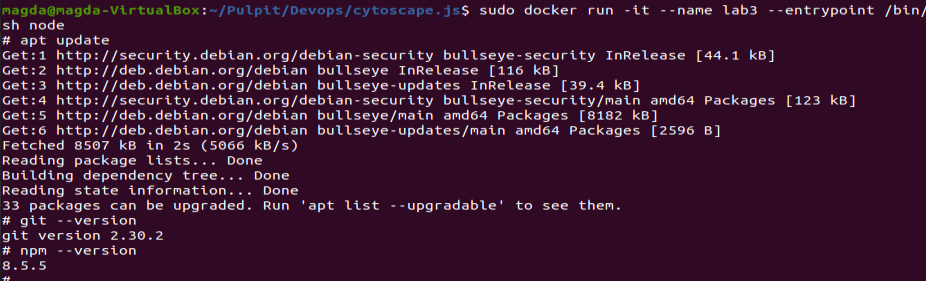

>4. Sklonowanie repozytorium do kontenera
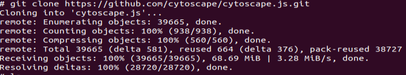

>5. Przeprowadzenie buildu
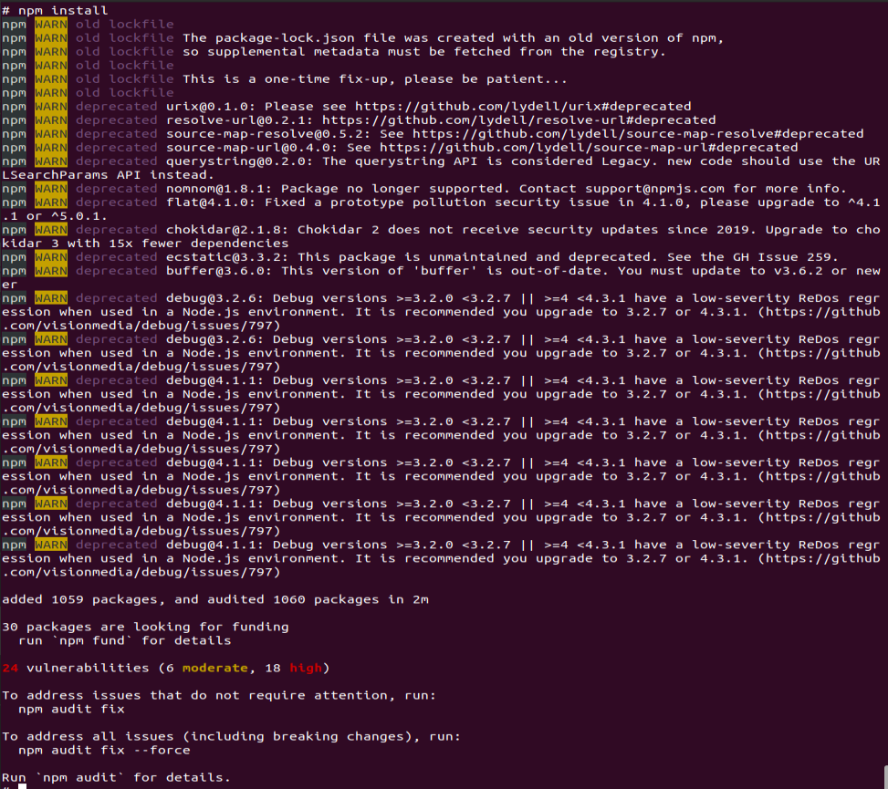

>6. Uruchomienie testów
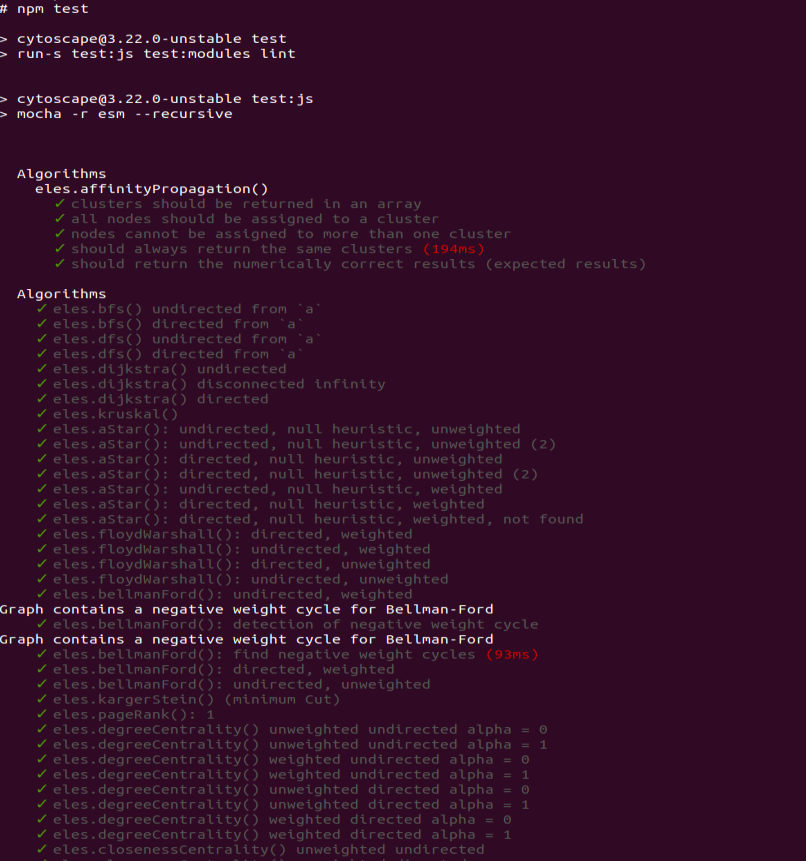
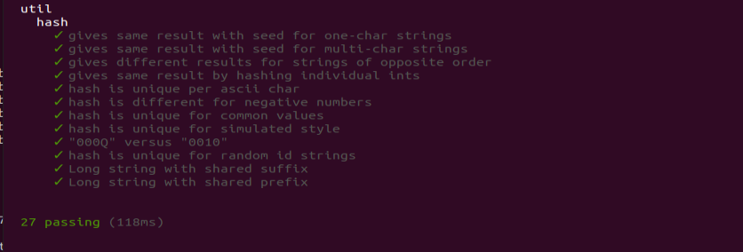

>7. Stworzenie dwóch plików dockerfile. Pierwszy ma za zadanie przeprowadzać wszystkie kroki aż do biulda, natomiast drugi ma bazować na pierwszym i wykonywać testy.
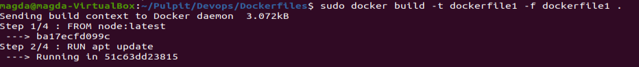
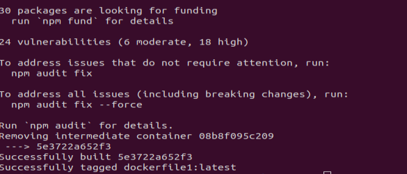
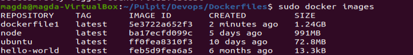
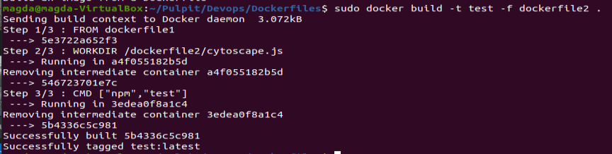
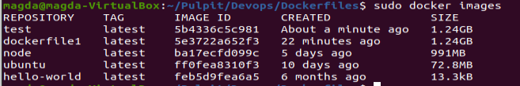
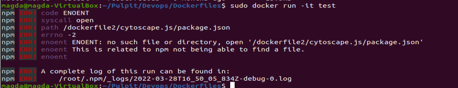

Komentarz:
Sprawozdanie wysłane po czasie, z powodu usterek zwązanych z virtualboxem, problem zgłosiłam na zajęciach w czwartek.
