# Dodatkowa terminologia w konteneryzacji, instalacja Jenkins

## Zadania, które były do wykonania

>1. Przygotuj woluminy wejściowy i wyjściowy, o dowolnych nazwach i podłącz je do kontenetra bazowego.
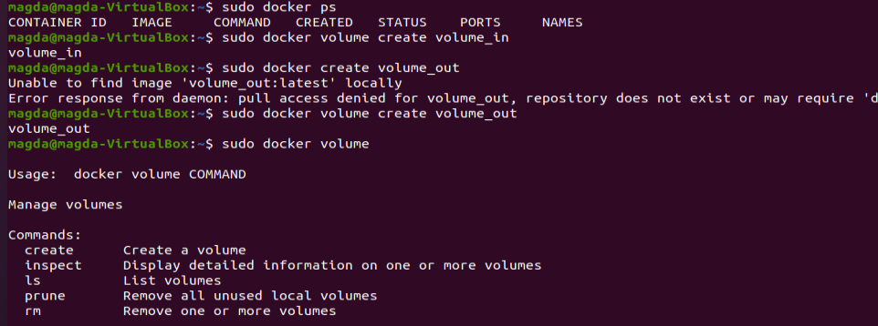
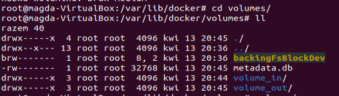
>2. Sklonowanie repozytorium na wolumin wejściowy( niestety zapomniałam o wykonaniu screena w tym momencie). Uruchomienie builda w kontenerze
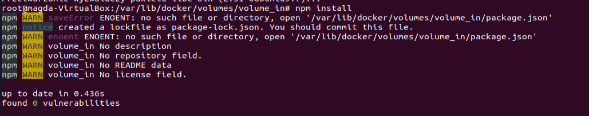
>3. Zapisanie zbudowane pliki na woluminie wyjściowym.
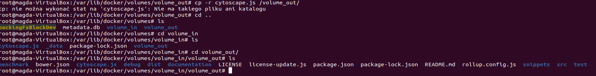
>4. Uruchomienie wewnątrz kontenera serweru iperf3
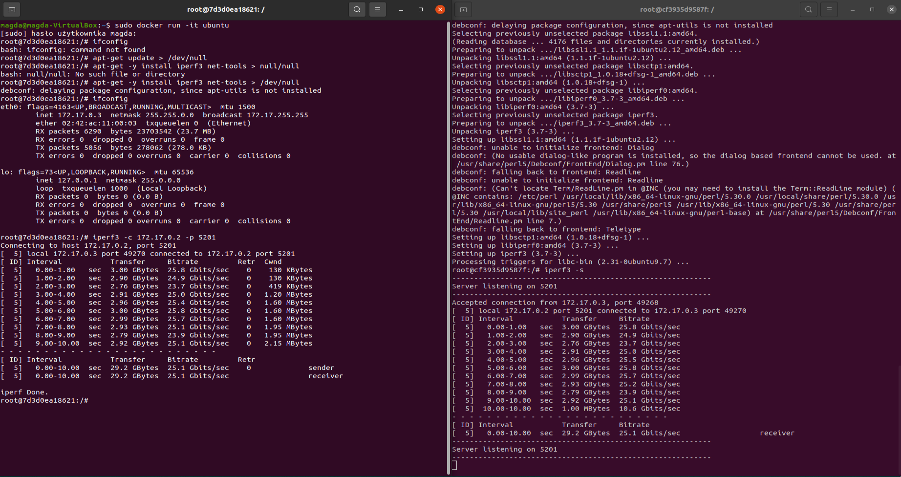

>5. Instalacja Jenkinsa
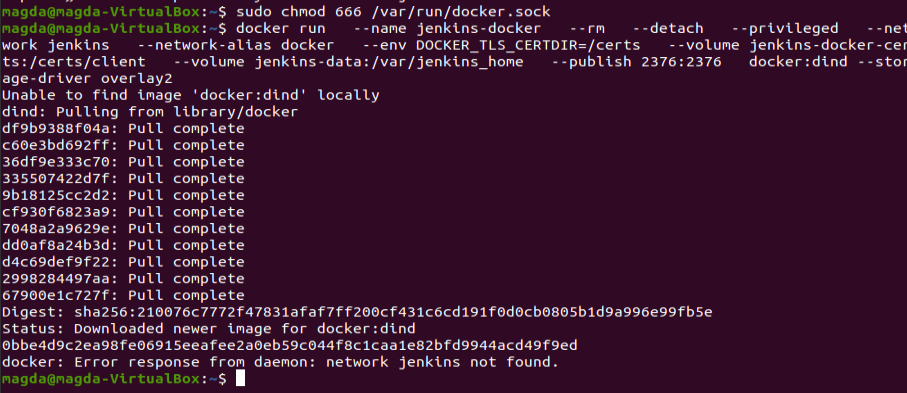
>6. Utworzenie i wyświetlenie za pomocą polecenia cat pliku dockerfile.
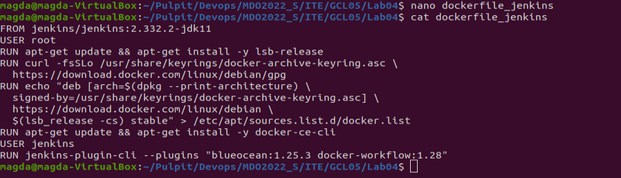
>7. Przeprowadzenie builda.
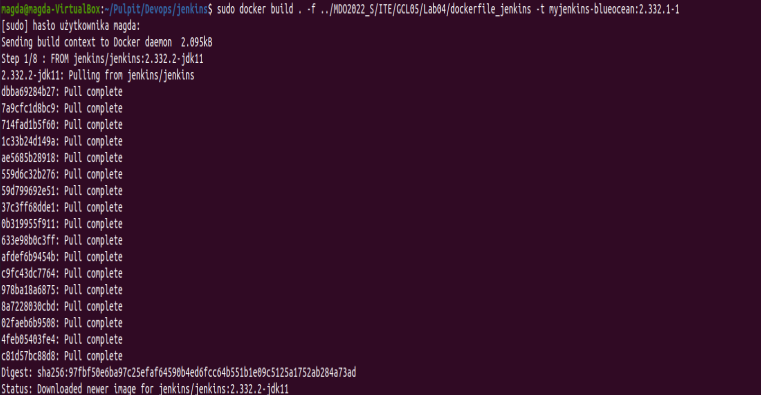

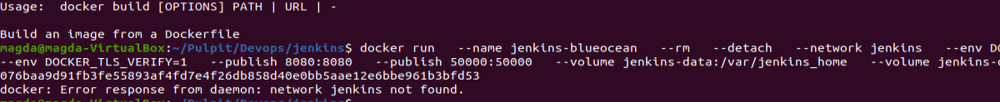
>8. Otworzenie jenkinsa w przeglądarce po wpsianiu localhost:8080
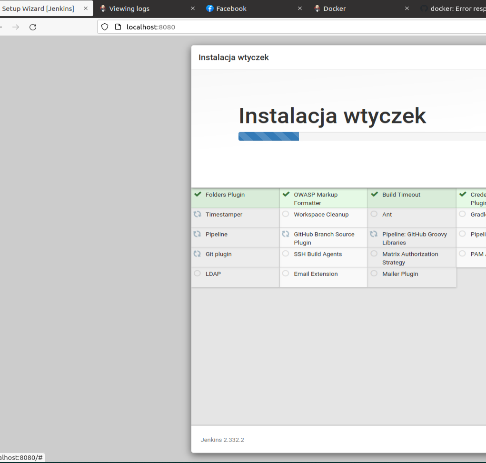
>9. Stworzenie konta.
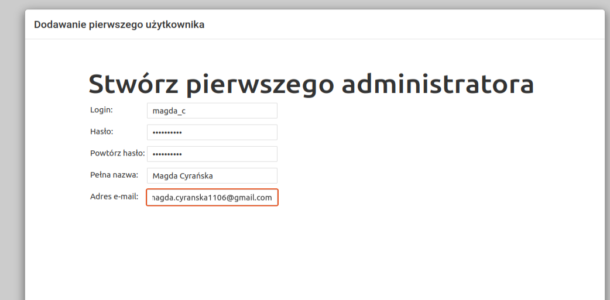
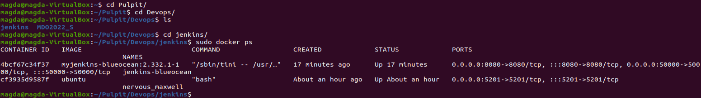
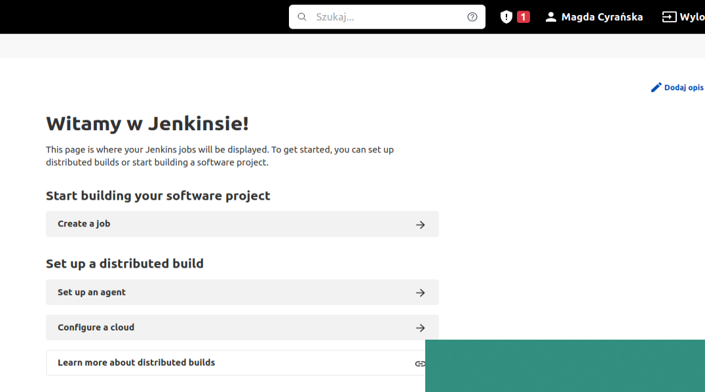

