#Lab 1

1. Zainstalowałem klienta GIT i obsługę kluczy 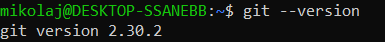
    
2. Sklonowałem repozytorium https://github.com/InzynieriaOprogramowaniaAGH/MDO2022_S za pomocą HTTPS 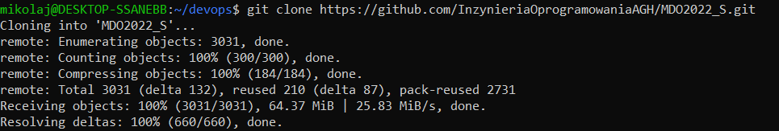
    
3. Utworzyłem klucz ssh
    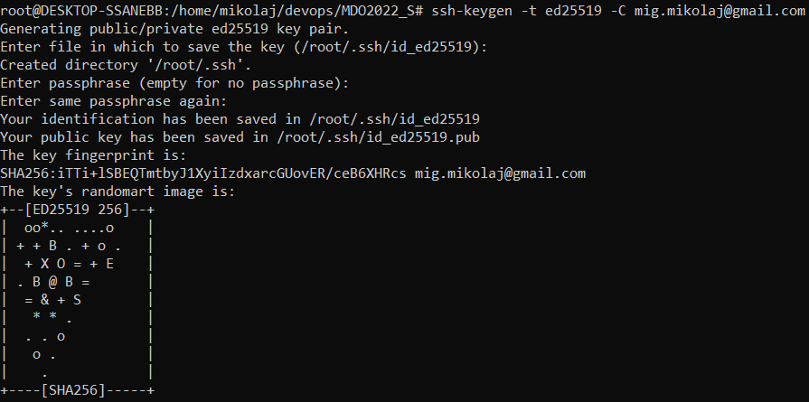
   1. Skonfigurowałem klucz SSH jako metodę dostępu do GitHuba. 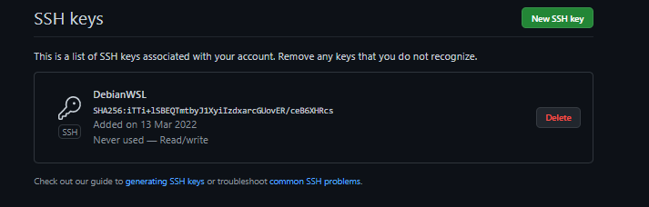
   2. Sklonowałem repozytorium z wykorzystaniem protokołu SSH 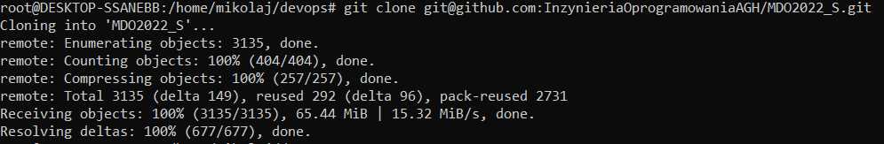

4. Przełączyłem się na gałąź swojej grupy 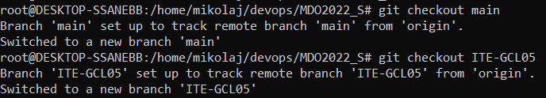

5. Utworzyłem gałąź o nazwie "inicjały & nr indeksu" 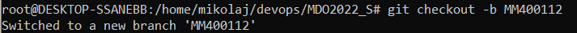

6. Rozpocząłem pracę na nowej gałęzi
   1. W katalogu właściwym dla grupy utworzyłem nowy katalog, także o nazwie "inicjały & nr indeksu" 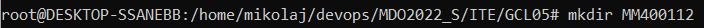
   2. W nim także utworzyłem katalog: Lab01 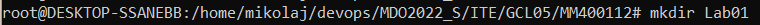
   3. W nowym katalogu dodałem plik z sprawozdaniem 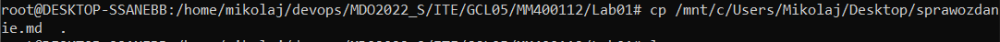
   4. Dodaj zrzuty ekranu (jako inline) 
   5. Sprobowałem wciągnąć swoją gałąź do gałęzi grupowej co skutowało następującym błędem 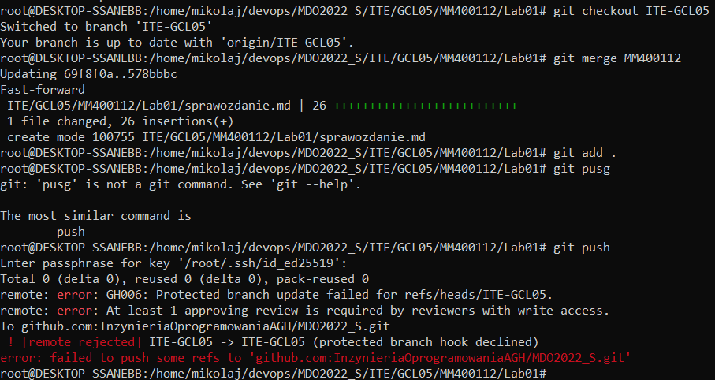
        
        
    
   

    