# Lab02
## Mikołaj Migacz

1. Przygotowuje git hooks, który rozwiąże najczęstsze problemy z commitami
   1. hook sprawdzający, czy tytuł commita nazywa się `<inicjały><numet indeksu` 
      1. Przechodzę do ukrytego katalogu `hooks` 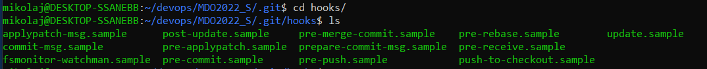
      2. Otwieram plik `commit-msg.sample` i edytuje go 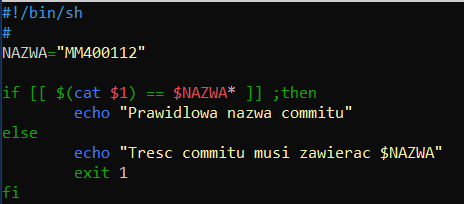
      3. Zmieniam nazwę na `commit-msg` 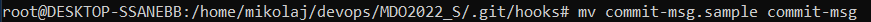
      4. Działanie dla niepoprawnych danych 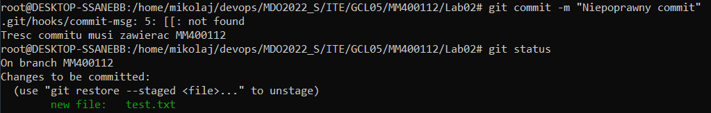
      5. Działanie dla poprawnych danych 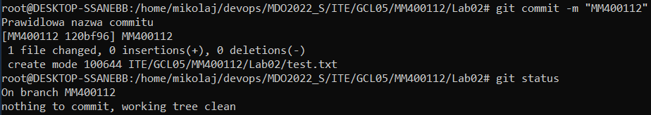
   2. hook sprawdzający, czy w treści commita pada numer labu, właściwy dla zadania
      1. Tak jak poprzednio w ukrytym katalogu `.git` otwieram folder `hooks` i w nim edytuje plik `pre-commit.sample` 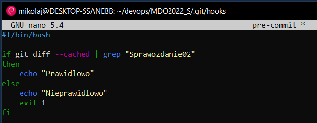
      2. Zmieniam nazwę pliku na `pre-commit` 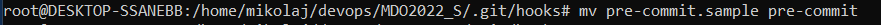
      3. Działanie dla niepoprawnych danych 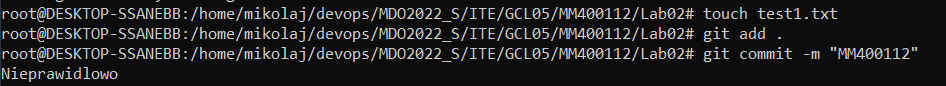
      4. Działanie dla poprawnych danych (commit zawierający plik o nazwie `Sprawozdanie02`) 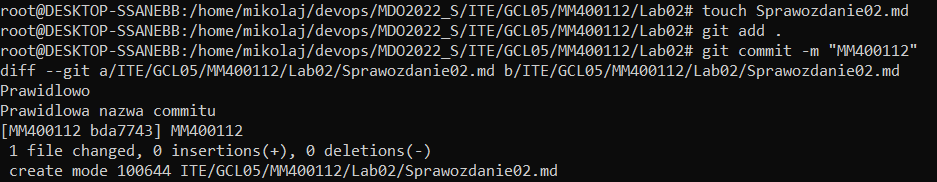
2. Rozpocząłem przygotowanie środowiska Dockerowego
   1. Zapewniłem dostęp do maszyny wirtualnej przez konsolę "cmd" 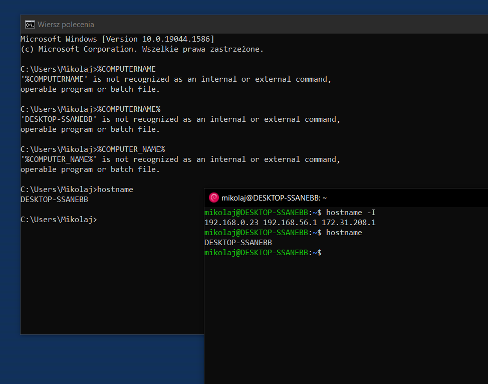
   2. Zainstalowałem Docker Desktop dla systemu Windows oraz WSL 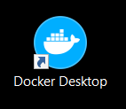
   3. Wersja docker'a sprawdzona na WSL 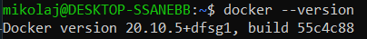
3. Działanie środowiska
   1. Pobrałem obraz ubuntu i uruchomiłem kontener z tym obrazem a na nim konsolę 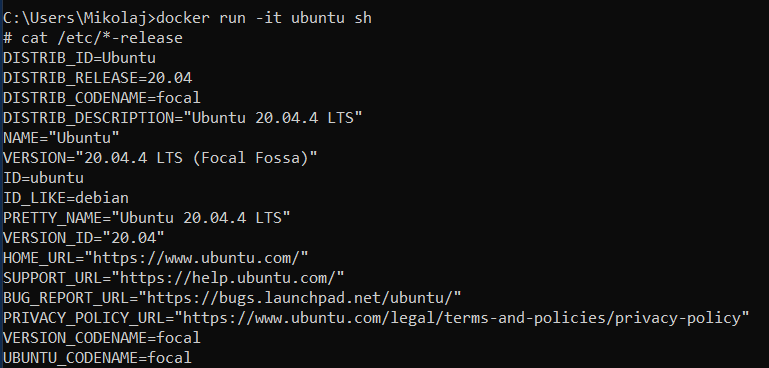
   2. Wyświetliłem jego numer wersji 
4. Założyłem konto na DockerHub 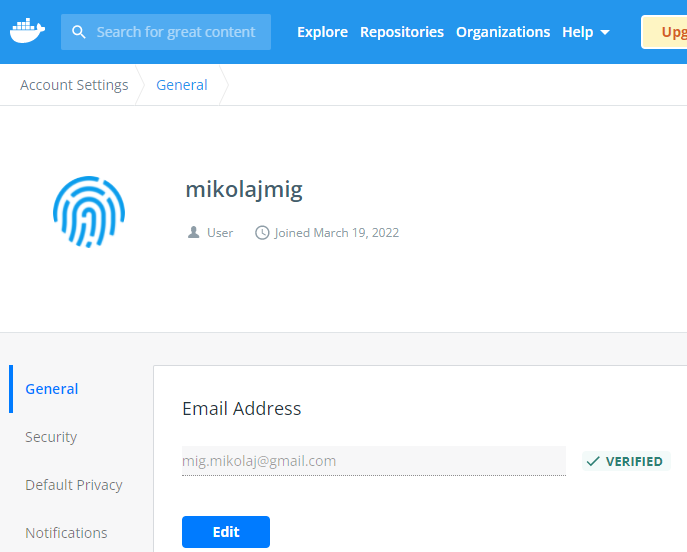

*Plik "historia_polecen.txt" - Historia poleceń terminala WSL