# Lab02
## Mikołaj Migacz
### Wybór oprogramowania
1. Wybrałem repozytorium `https://github.com/spring-projects/spring-petclinic`
2. Sklonowałem wybrane repozytorium komendą `git clone git@github.com:spring-projects/spring-petclinic.git`
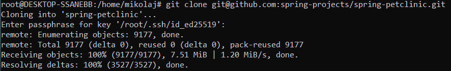
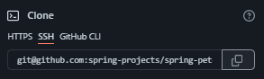
3. Zainstalowałem potrzebne narzędzia.
```
sudo apt install maven
sudo apt install default-jdk
```
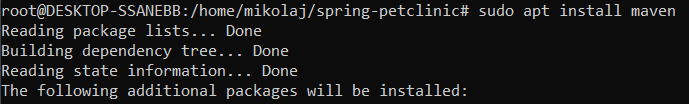
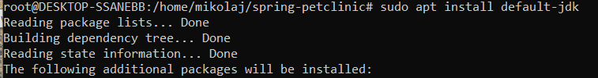
4. Zbudowałem skonowane repozytorium.
```./mvnw install -DskipTests```
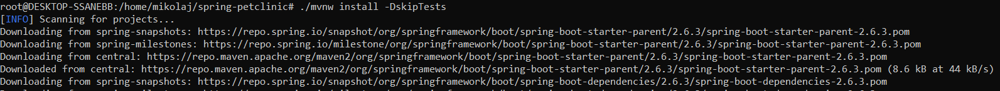
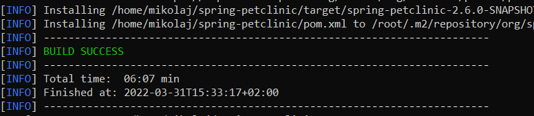
5. Uruchomiłem testy.
```./mvnw test```
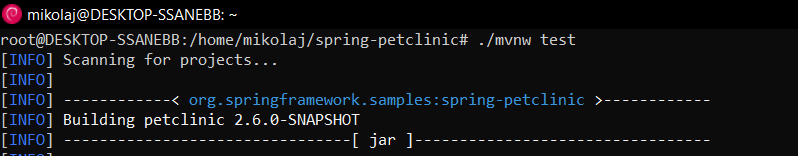
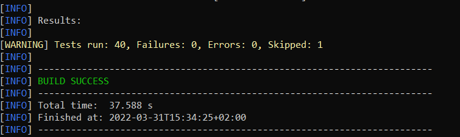
### Przeprowadzenie buildu w kontenerze
1. Uruchomiłem kontener i podłączyłem do niego TTY.
```docker run -it --name test_lab3 openjdk:16-jdk-alpine sh```
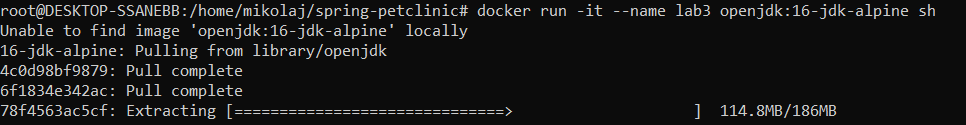
2. W obrazie instalujemy gita i klonujemy repozytorium.
```
apk add git
git clone https://github.com/spring-projects/spring-petclinic.git
```
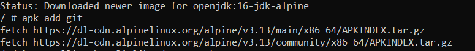
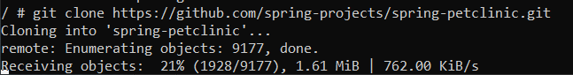
3. Przechodzimy do sklonowanego repozytorium i tak jak poprzednio budujemy go.
```
cd spring-petclinic
./mvnw install -DskipTests
```
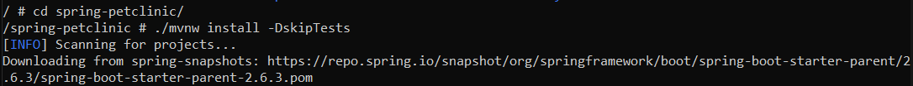
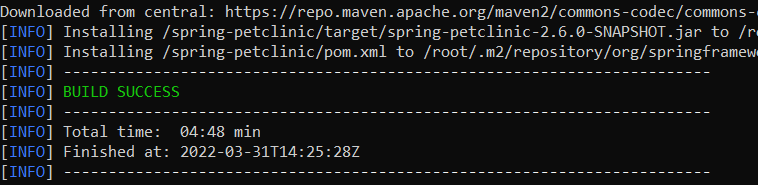
4. Uruchamiam testy.
```
./mvnw test
```
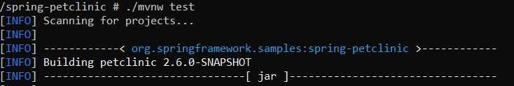
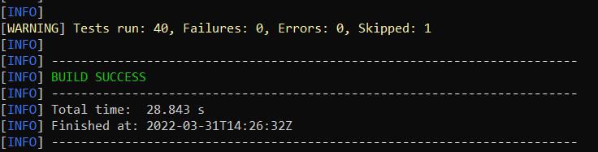
### Tworzenie plików Dockerfile
1. Kroki które wykonaliśmy w poprzedniej sekcji, chcemy zapisać w pliku Dockerfile aby zostały wykonywane  za nas.
2. Tworzę dockerBuild - automatyzujący budowanie projektu.
```
touch dockerBuild
```
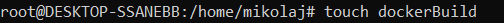
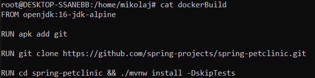
3. Buduje obraz z dockerBuild'a.
```docker build . -f dockerBuild -t lab3-petclinic```
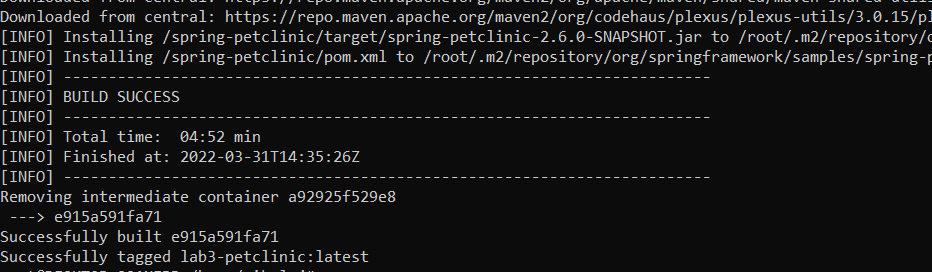
4. Analogicznie postępuje z obrazem z dockerTest.
```
touch dockerTest
nano dockerTest
cat dockerTest
```

5. Buduje obraz z dockerTest'a.
```
docker build . -f dockerTest -t lab3-petclinic-test
```

6. Uruchamiamy kontener z zbudowanym obrazem. Domyślnie uruchamiany jest jshell. Aplikacje możemy wystartować po uruchomieniu kontenera.
```
Docker run -it –name pet-clinic-tested lab3-petclinic-test:latest
```
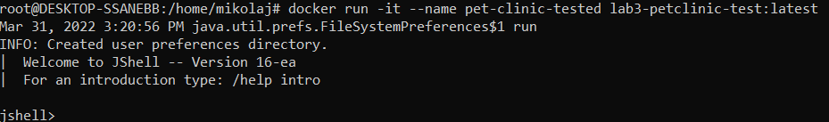