# Lab04
## Mikołaj Migacz
### Zachowywanie stanu
1. Przygotowałem woluminy : wejściowy 
`docker volume create input`
i wyjściowy 
`docker volume create --name output`
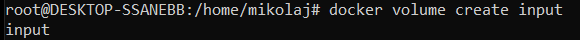
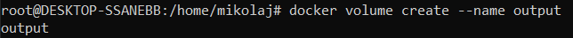
2. Podłączam je do kontenera bazowego i uruchamiam go
`docker run -it --name build --mount 'source=input,destination=/input' --mount 'source=output,destination=/output' openjdk:16-alpine sh`
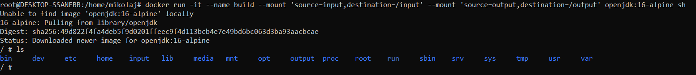
3. Tworzę tymczasowy kontener i podłączam do niego wolumin wejściowy
`docker run -it --name build --mount 'source=input,destination=/input' alpine sh`
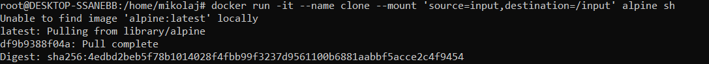
4. Instaluje gita i klonuje repozytorium
`apk add git`
`git clone <repozytorium>`
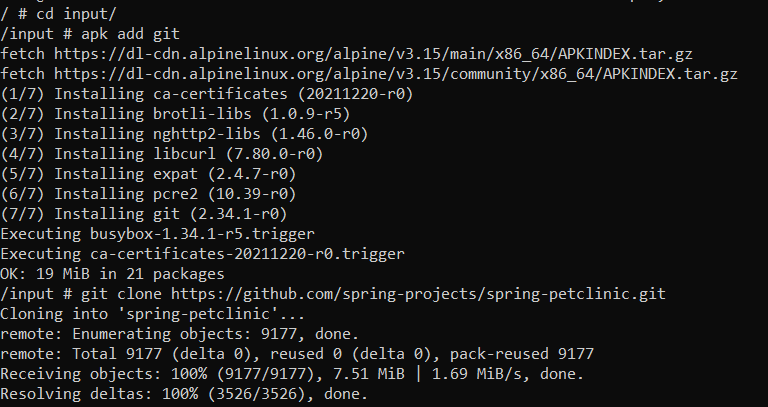
5. Na kontenerze 'build' sprawdzam wolumin wejściowy
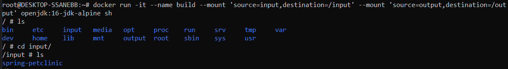
6. Uruchomiłem budowanie projektu
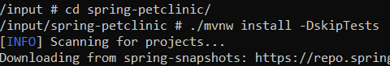
7. Skopiowałem plik `.jar` do folderu `/output/`
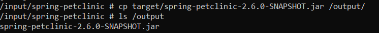
8. Sprawdziłem dostępność pliku z hosta
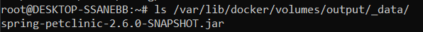
### Eksponowanie portu
1. Stworzyłem dwa kontenery `ip3-server` oraz `ip3-client` i zainstalowałem na nich program `iperf3`
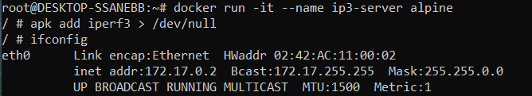
2. Na kontenerze `ip3-server` ustawiłem nasłuchiwanie na porcie 9000
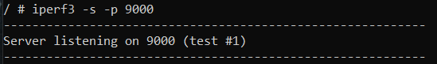
3. `ip3-client` połączyłem z `ip3-server` na podstawie IP.
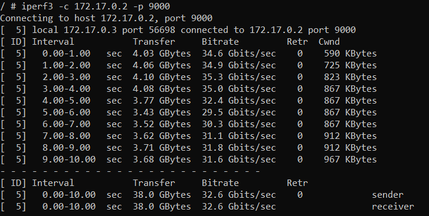
4. Połączyłem `ip3-server` z hostem
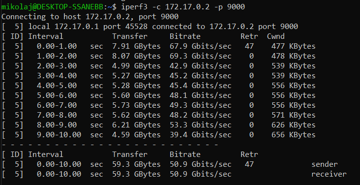
5. Możemy odczytać przepustowość:
   1. Kontener -> Kontener - około 3.75GB/s,
   2. Host -> Kontener - około 6GB/s
### Instancja Jenkins
1. Tworzę sieć dla Jenkins'a.
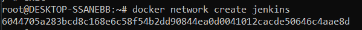
2. Tworze kontener docker:dind używając komend z dokumentacji Jenkins'a.
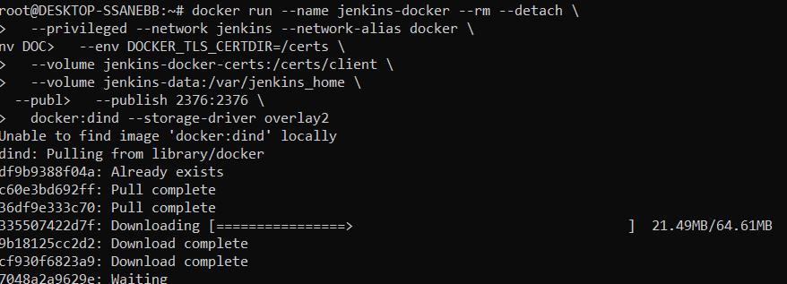
3. Stworzyłem `Dockerfile` kopiując zawartość z dokumentacji Jenkins'a.
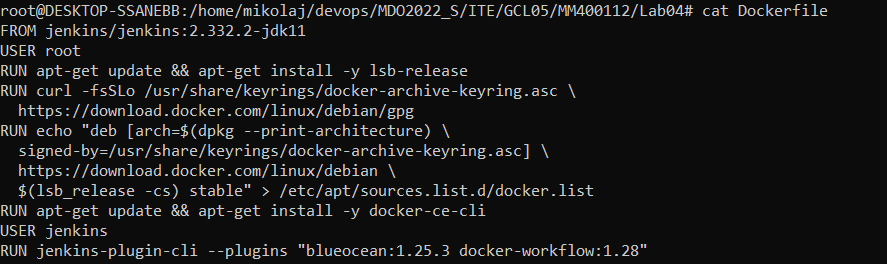
4. Zbudowałem obraz z stworzonego pliku `Dockerfile`, kopiując komendę z dokumentacji Jenkins'a.

5. Uruchomiłem własny obraz Jenkins'a jako kontener używając komendy z dokumentacji Jenkins'a.
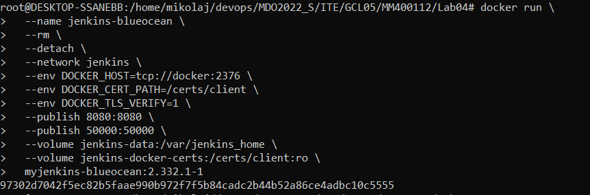
6. Poprawność działania kontenerów.
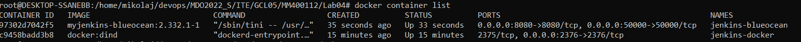
7. Otwieram interface graficzny działający w przeglądarce pod adresem `localhost:8080`. Wpisałem hasło zachowane w logach kontenera aby go odblokować. Zainstalowałem domyślną listę pluginów. Następnie stworzyłem administratora.
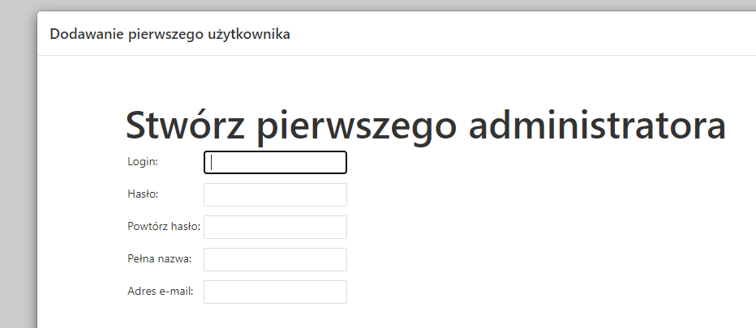
8. Wszystko zakończyło się sukcesem.
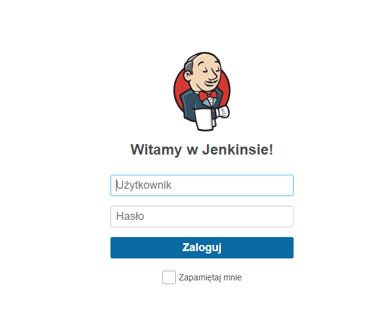

