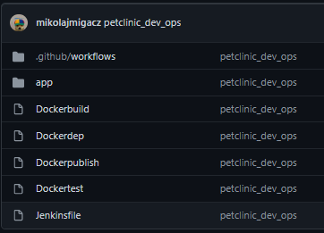
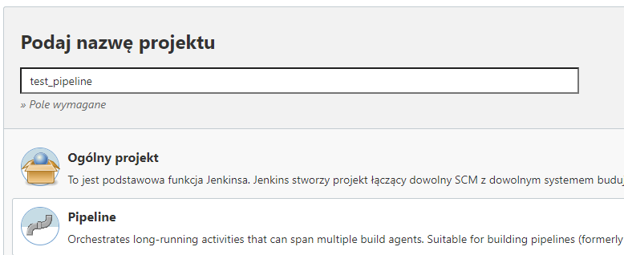
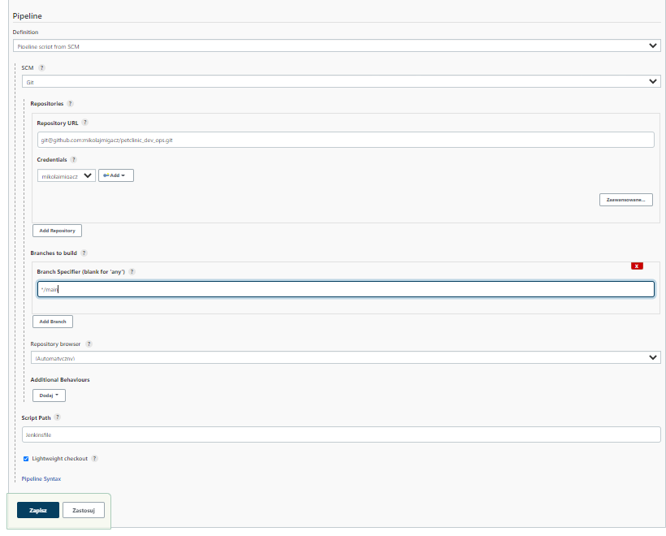

# Lab05
## Mikołaj Migacz
### Pipeline
1. Stworzyłem repozytorium na którym znajduje się Jenkinsfile z pipelinem, Dockerfile potrzebny do wykonania i kod aplikacji.
 
2. Dodałem w Jenkinsie Credentials do Github'a, aby w trakcie wykonywania pipeline'a był w stanie pobierać nasze repozytorium. Aby dokonać konfiguracji skorzystałem z poradników z wyszukiwarki Google.
3. Stworzyłem nowy pipeline.
 
4. Skonfigurowałem pipeline zostawiając wszystkie opcje puste. W zakładce 'Definition': 
   1. Pipeline script from SCM
   2. SCM ustawiłem na : git
   3. Repository URL : https://github.com/mikolajmigacz/petclinic_dev_ops.git
   4. Dodałem Credentials - klucz SSH
 
5. W reopozytorium umieściłem folder który zawiera pliki źródłowe naszej aplikacji, Dockerfile i Jenkinsfile.
6. Przygotowuje pipeline:
   1. Dockerdep
    
   Posłuży do pobrania dependencji aplikacji.
   2. Dockerbuild
    
   Bazuje na poprzednio zbudowanym obrazie, buduje aplikacje z kodów źródłowych i dependecji. Jeśli wszystko przejdzie poprawnie, zostanie zapisany artefakt.
   3. Dockertest
    
   Uruchamia testy
   4. Dockerpublish
    
   Budowany na czystym openjdk-alpine aby sprawdzic czy aplikacja uruchomi sie na pliku .jar.
      1. Dodajemy bash
      2. Kopiujemy plik .jar do obrazu
      3. Ustawiamy entrypoint
7. Tworzenie pipeline:

   Opis stage'ów:
   1. Buduje obraz z dependencjami
   2. Buduje obraz budujący wewnętrzną aplikacje. Po tym tworzy katalog 'shared_volume'. Podczas uruchomienia kontenera zbudowany plik .jar kopiowany jest do tego katalogu.
   3. Buduje obraz w którym uruchamiane są testy.
   4. Deploy - tworzony jest obraz bazujący na Dockerpublish.
   5. Zapisanie artefaktu w przypadku sukcesu.

   

