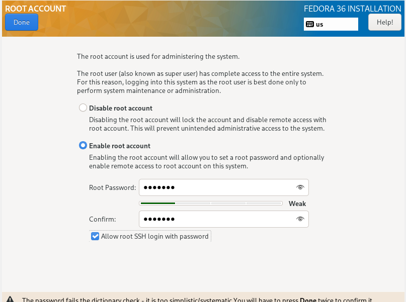
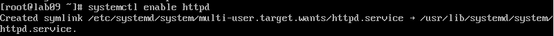
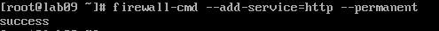

# Lab09
## Mikołaj Migacz
### Przygotowanie wdrożeń nienadzorowanych dla platform z pełnym OS
#### Przygotowanie systemu pod uruchomienie
1. Utworzyłem nową maszynę wirtualną, na której zainstalowano system Fedora Server 36. Wybrałem instalację minimalną.

2. Utworzyłem konto root'a

3. Nadałem nazwę hosta. Wykorzystałem schemat który przedstawiony był na zajęciach.

4. Zainstalowałem drugi system operacyjny. Schemat postępowania był taki sam jak z poprzednim natomiast jako podstawowe środowisko wybrałem opcje domyślną, czyli **Fedora Server Edition** oraz nadałem nazwę hosta **lab09.http.agh**

5. Na zainstalowanym serwerze uruchomiłem komendę ```dnf group install "Web Server"```

6. Uruchomiłem usługę **HTTP** i dodałem ją do zapory za pomocą komend 
```
systemctl enable httpd
firewall-cmd --add-service=http --permanent
```


7. Po udanym połączeniu z serwerem, wyświetliła się następująca strona.

8. Utworzyłem nowy katalog i dodałem do niego przykładowy artefakt z pipeline'a.


9. Aby pobrać artefakt należało użyć następującego polecenia:
```
scp root@192.168.0.34:/var/www/html/petclinic/spring-petclinic-2.6.0-SNAPSHOT.jar ./petclinic
```
#### Instalacja nienadzorowana
1. Aby przeprowadzić instalację nienadzorowaną potrzebowałem uzyskać plik konfiguracyjny. Mogłem go znaleźć w poprzedniej instalacji, w pliku pod nazwą **anaconda-ks.cfg**. Aby plik był kompletny dodałem klauzulę **%post %end** która zapewniała zaciągnięcie artefaktu.
2. Utworzyłem nową maszynę w której edytowałem polecenie instalatora w menu głównym, dodając polecenie:
```
inst.ks=https://raw.githubusercontent.com/InzynieriaOprogramowaniaAGH/MDO2022_S/MM400112/ITE/GCL05/MM400112/Lab09/anaconda-ks.cfg
```
3. Za pomocą tego polecenia wczytałem plik konfiguracyjny z repozytorium, co pozwoliło zacząć proces instalacji.

4. Po ukończeniu instalacji sprawdzono poprawność wykonania.
