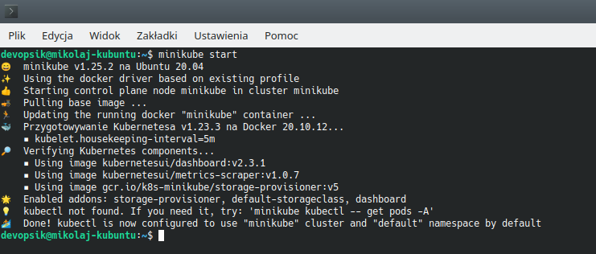
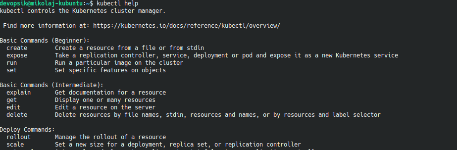
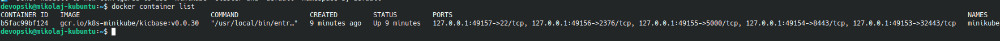
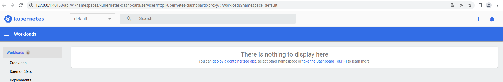
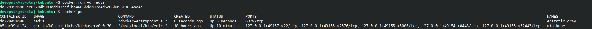
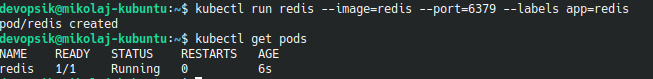
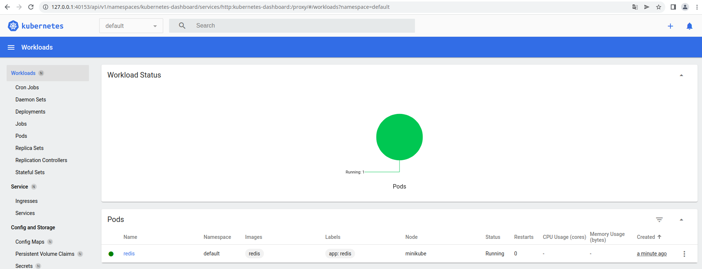
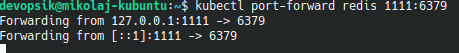
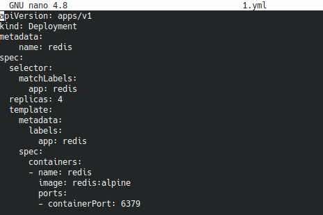

# Lab11
## Mikołaj Migacz
## Zadania do wykonania
### Instalacja klastra Kubernetes
 * Zaopatrz się w implementację stosu k8s: minikube

 * zaopatrz się w polecenie kubectl
 * 
 * Uruchom Kubernetes, pokaż działający kontener/worker
 * 
 * Zmityguj problemy wynikające z wymagań sprzętowych lub odnieś się do nich (względem dokumentacji)
 Stworzyłem dual boot z Ubuntu, ponieważ na virtualBox'ie nie dałem rady zainstalować minikube'a. 
 * Uruchom Dashboard, otwórz w przeglądarce, przedstaw łączność


### Analiza posiadanego kontenera
 * Zdefiniuj krok "Deploy" swojego projektu jako "Deploy to cloud":
 Wybrałem gotowy serwis "Redis"
   * Deploy zbudowanej aplikacji powinien się odbywać "na kontener"
   * Przygotuj obraz Docker ze swoją aplikacją
   * Wykaż, że wybrana aplikacja pracuje jako kontener

   
### Uruchamianie oprogramowania
 * Uruchom kontener na stosie k8s
 * Kontener uruchomiony w minikubie zostanie automatycznie ubrany w pod.
 * ```minikube kubectl run -- <nazwa-wdrożenia> --image=<obraz-docker> --port=<wyprowadzany port> --labels app=<nazwa-wdrożenia>```

 * Przedstaw że pod działa (via Dashboard oraz kubectl)
 * 
 * Wyprowadź port celem dotarcia do eksponowanej funkcjonalności
 * ```kubectl port-forward <nazwa-wdrożenia> <LO_PORT>:<PODMAIN_CNTNR_PORT> ```

 * Przedstaw komunikację z eskponowaną funkcjonalnością

 
### Przekucie wdrożenia manualnego w plik wdrożenia (wprowadzenie)
 * Zapisanie wdrożenia jako plik YML
 * Dodanie replik
 * ```kubectl apply``` na pliku


