## Zadania do wykonania
### Konwersja wdrożenia ręcznego na wdrożenie deklaratywne YAML
 * Upewnij się, że posiadasz wdrożenie z poprzednich zajęć zapisane jako plik

 * Wzbogać swój obraz o 4 repliki
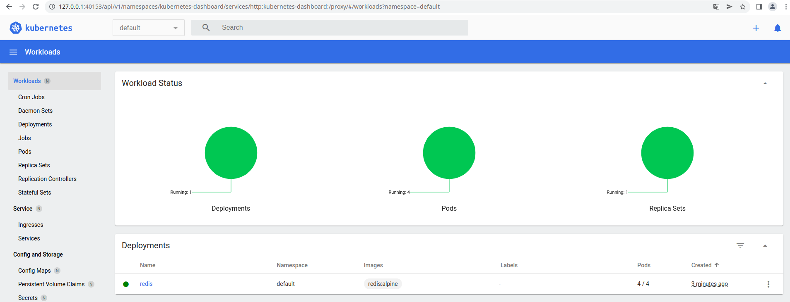
 * Rozpocznij wdrożenie za pomocą ```kubectl apply```
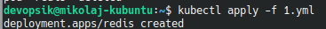
 * Zbadaj stan za pomocą ```kubectl rollout status```
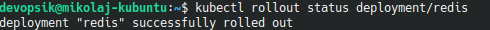

### Przygotowanie nowego obrazu
Wybrałem obraz gotowy i używane będą "Redis 6" oraz "Redis 7" jako różne wersje.
  
### Zmiany w deploymencie
 * Aktualizuj plik YAML z wdrożeniem i przeprowadzaj je ponownie po zastosowaniu następujących zmian:
   * zwiększenie replik
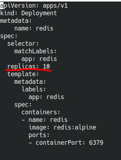
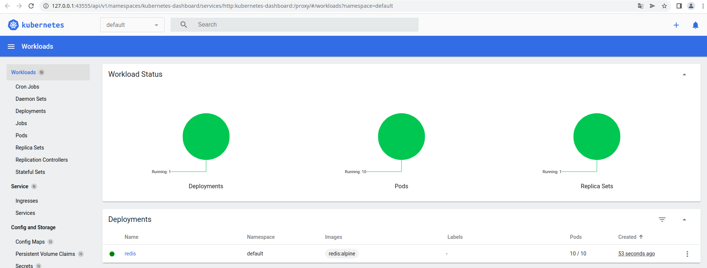
   * zmniejszenie liczby replik do 1
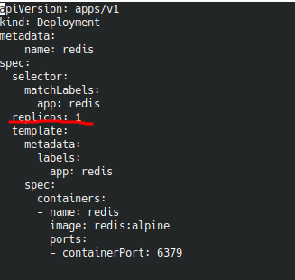
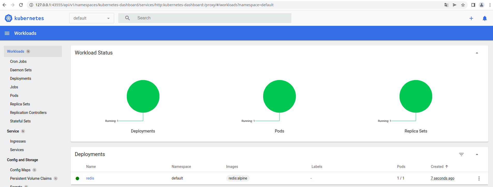
   * zmniejszenie liczby replik do 0
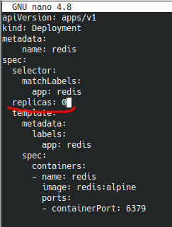
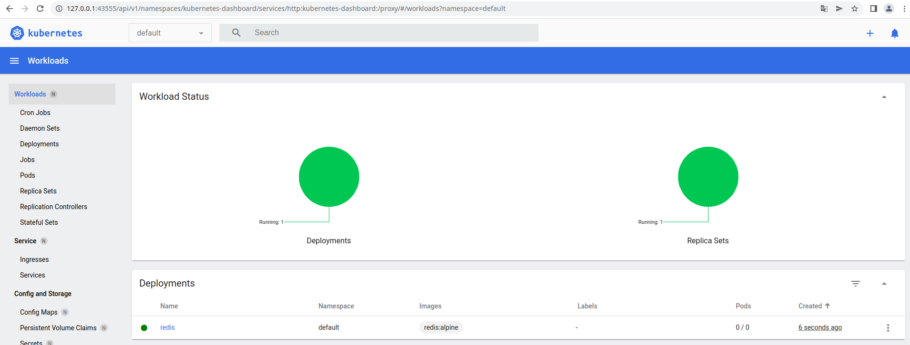
   * Zastosowanie nowej wersji obrazu
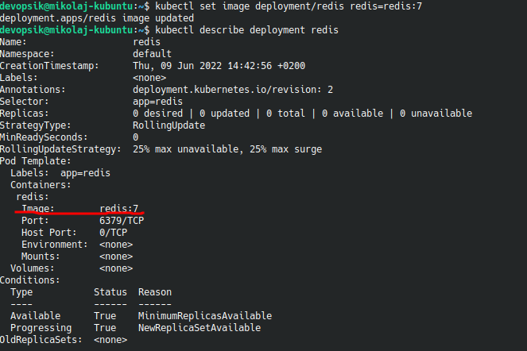
   * Zastosowanie starszej wersji obrazu
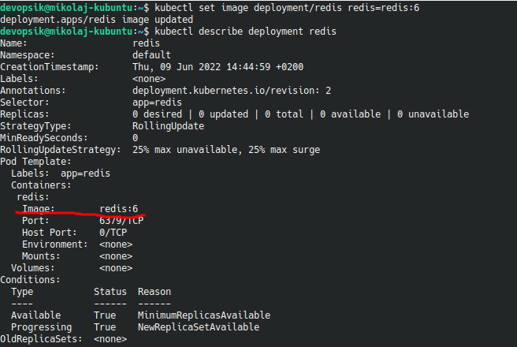
 * Przywracaj poprzednie wersje wdrożeń za pomocą poleceń
   * ```kubectl rollout history```
   * ```kubectl rollout undo```
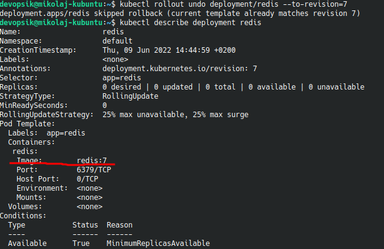

### Kontrola wdrożenia
 * Napisz skrypt weryfikujący, czy wdrożenie "zdążyło" się wdrożyć (60 sekund)
Nie wiedziałem jak zastosować to w skrypcie ale działająca komenda od kubectl była by dobrym tropem. Czeka czy stan Poda jest "ready". Można byłoby opakoawć go w skrypt który czeka 60 sekund.
`minikube kubectl -- wait pod --for=condition=Ready -l app=$labelname`
 
### Strategie wdrożenia
 * Przygotuj wersje wdrożeń stosujące następujące strategie wdrożeń
   * Recreate
Ta strategia wdrożenia może powodować downtime ponieważ przykładowo w trakcie update'ów wszystkie pody są wyłączane jednocześnie i zastępywane nowymi wersjami.
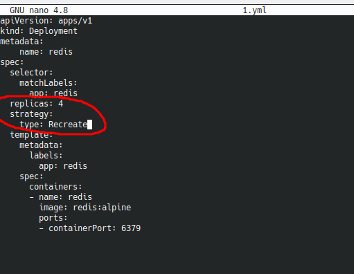
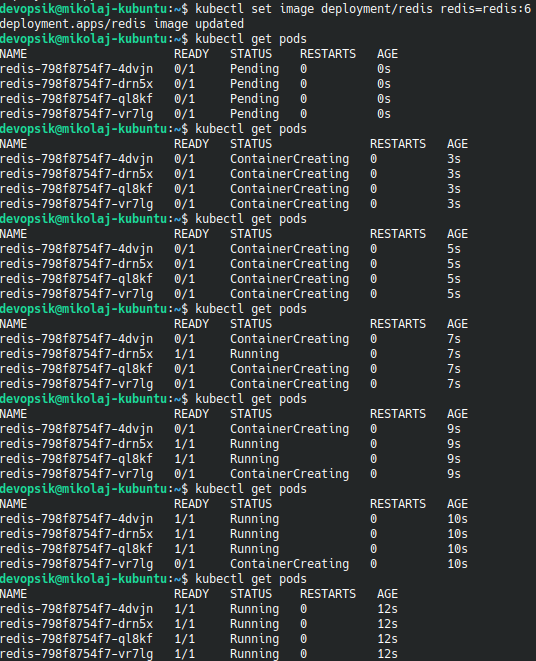
   * Rolling Update
Ta strategia nie powoduje downtime'ów ponieważ aktualizuje po jednym pod'zie na raz.
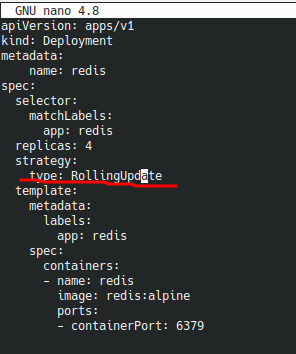
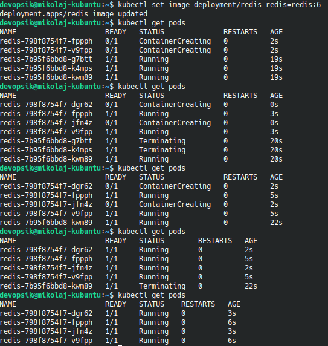
   * Canary Deployment workload

Canary Deployment otrzymujemy poprzez utworzenie dwóch różnych deploymentów ze wspólnymi etykietami. Działa to na zasadzie wystawienia dwóch różnych wersji z tym że wersja wdrażana otrzymuje mniejszy procent udziału w całym deploymencie.