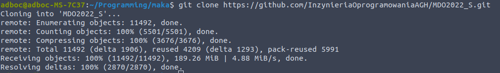
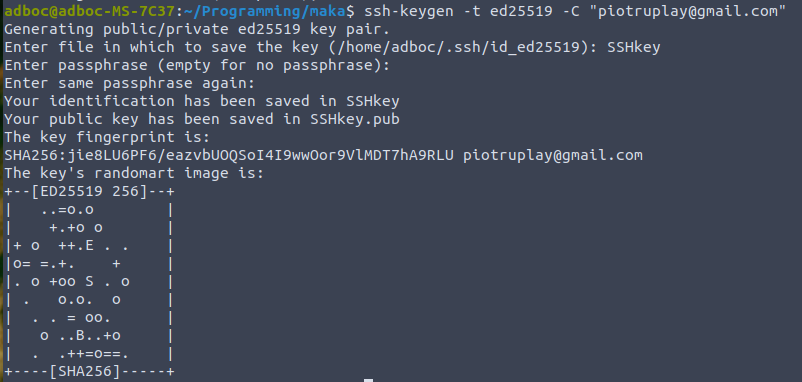
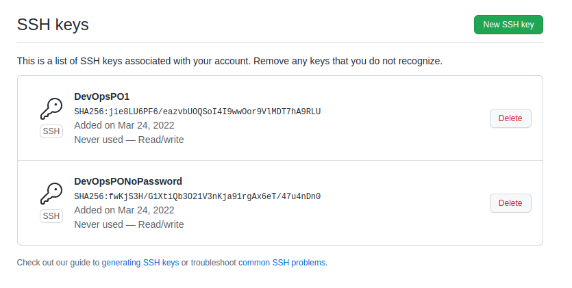

##### Na początku zainstalowano GIT
Sklonowano repozytorium za pomocą HTTPS
git clone https://github.com/InzynieriaOprogramowaniaAGH/MDO2022_S.git

##### Utworzono klucze SSH - jeden chroniony hasłem a drugi nie, dodano je na GitHUB
ssh-keygen -t ed25519 -C "piotruplay@gmail.com"

##### utworzenie gałąź poiadającą  mmoje inicjały i numer indeksu oraz zawierającą odpowiednią treść
git checkout -b PO299724

#####Stworzenie pliku sprawozdanie1.md:
cat>sprawozdanie1.md
#####/fix - przenieesiono PO299724 wodpowiednie miejsce i zmergowano
