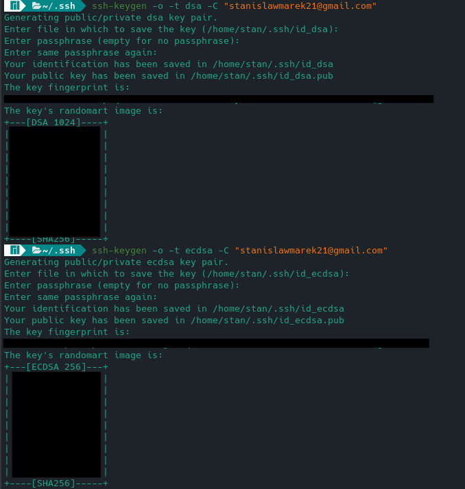
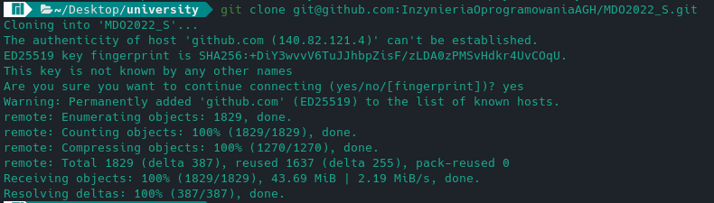
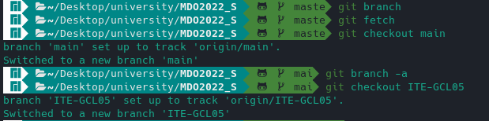
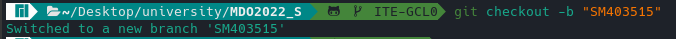
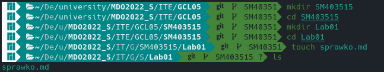
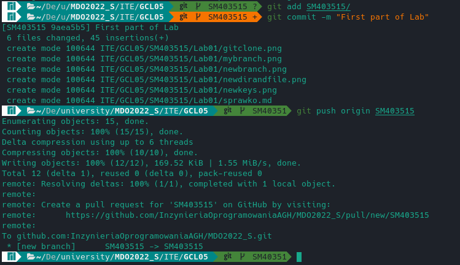

# Sprawozdanie - Lab: 01

### Wygenerowanie klucza DSA i klucza ECDSA

```
ssh-keygen -o -t dsa -C "stanislawmarek21@gmail.com"
ssh-keygen -o -t ecdsa -C "stanislawmarek21@gmail.com"
```



### Klonowanie repo przez SSH

```
git clone git@github.com:InzynieriaOprogramowaniaAGH/MDO2022_S.git
```



### Przełączenie brancha na: main oraz grupowego

```
git checkout main
git checkout ITE-GCL05
```



### Stworzenie i przełączenie na brancha prywatnego

```
git checkout -b "SM403515"
```



### Stworzenie swojego katalogu i pliku sprawozdania

```
mkdir SM403515
mkdir Lab01
touch sprawko.md
```



### Wysłanie wszystkiego do zdalnego repozytorium

```
git commit -m "First part of Lab"
git push origin SM403515
```


