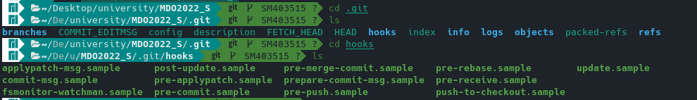

# Sprawozdanie - Lab: 02

### Przejście do folderu .git/hooks



### Przygotowanie git hooka, który sprawdza poprawność tytułu i treści wiadomości

```
#!/bin/sh

FILE=$1

START=`head -n1 $IN`

TITLE_PATTERN="^(SM403515)"

MESS_PATTERN=".*(LAB)[0-9][0-9]*."

if ! [["$START"=~$TITLE_PATTERN]]; then
	echo "Commit title must be yours student id"
	exit 1
fi

while IFS=read -r msg_line
do
	if [[$msg_line=~$MESS_PATTERN]]; then
		exit 0
	fi
done < <(sed 1d $FILE)

echo "Commit message does not contain laboratory id"
exit 1
```

### Nadanie uprawnień dla git hooka

```
chmod +x commit-msg
```

### Przełączenie brancha na: main oraz grupowego

```
git checkout main
git checkout ITE-GCL05
```


### Stworzenie i przełączenie na brancha prywatnego

```
git checkout -b "SM403515"
```


### Stworzenie swojego katalogu i pliku sprawozdania

```
mkdir SM403515
mkdir Lab01
touch sprawko.md
```


### Wysłanie wszystkiego do zdalnego repozytorium

```
git commit -m "First part of Lab"
git push origin SM403515
```


