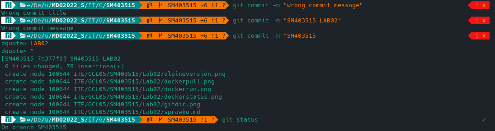
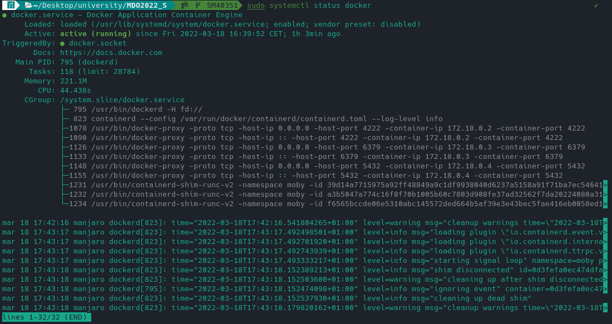
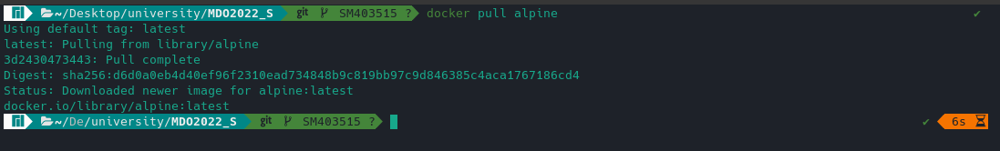
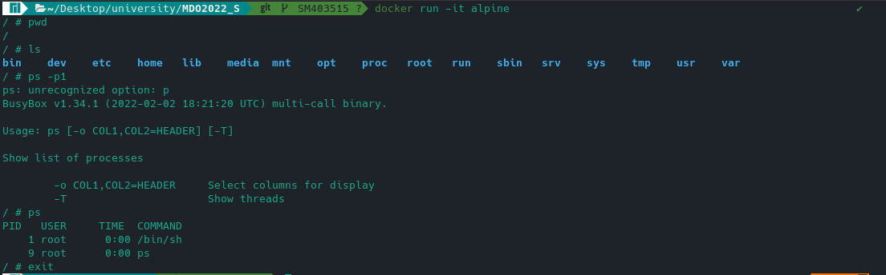
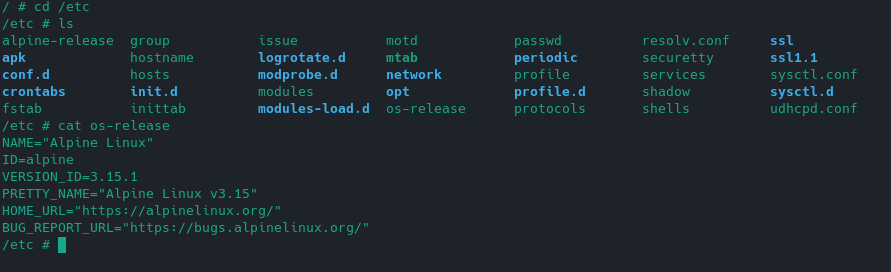
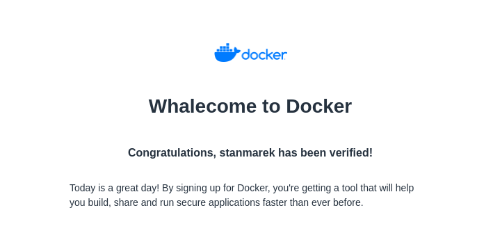

# Sprawozdanie - Lab: 02

### Przejście do folderu .git/hooks


### Przygotowanie git hooka, który sprawdza poprawność tytułu i treści wiadomości

```
#!/usr/bin/env bash

INPUT_FILE=$1

START_LINE=`head -n1 $INPUT_FILE`

TITLE_PATTERN="^(SM403515)"

MSG_PATTERN=".*(LAB)[0-9][0-9]*."

if ! [[ "$START_LINE" =~ $TITLE_PATTERN ]]; then
  echo "Wrong commit title"
  exit 1
fi

while IFS= read -r line
do
	if [[ $line =~ $MSG_PATTERN ]]; then
		exit 0
	fi
done < <(sed 1d $INPUT_FILE)

echo "Wrong commit message"
exit 1
```

Nadanie uprawnień dla git hooka

```
chmod +x commit-msg
```

Sprawdzenie działania hooka

```
git commit -m "*tutaj różne treści w zeleżności co chcę sprawdzić*"
```



### Przygotowanie środowiska dockerowego

Wcześniej posiadałem zainstalowany Docker w swoim systemie

```
sudo systemctl status docker
```



### Pobranie i uruchomienie dockerowego obrazu w trybie interaktywnym

```
docker pull alpine
```



```
docker run -it alpine
```



W kontenerze Alpine'a

```
cat /etc/os-release
```



### Założenie konta na Docker Hub


