# Sprawozdanie Lab 04

## Zadania do wykonania

### Zachowywanie stanu

- Przygotuj woluminy wejściowy i wyjściowy, o dowolnych nazwach, i podłącz je do kontenera bazowego, z którego rozpoczynano poprzednio pracę

```
docker volume create --name volumein && docker volume create --name volumeout
```

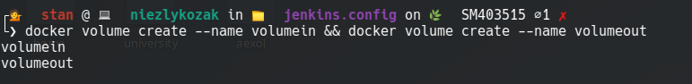

- Uruchom kontener, zainstaluj niezbędne wymagania wstępne (jeżeli istnieją), ale _bez gita_

```
docker run -it --name golang-build -v volumein:/in -v volumeout:/out golang:1.16-alpine

apk add gcc libc-dev bash make
```

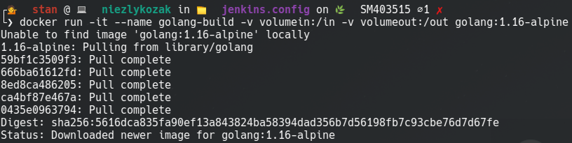

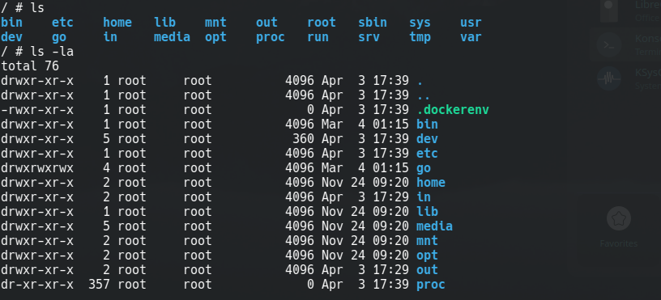

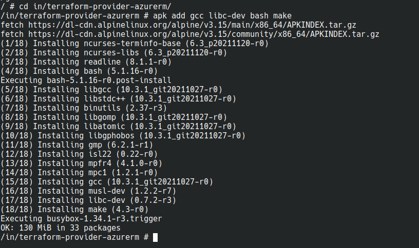

- Sklonuj repozytorium na wolumin wejściowy

```
git clone https://github.com/hashicorp/terraform-provider-azurerm.git
```

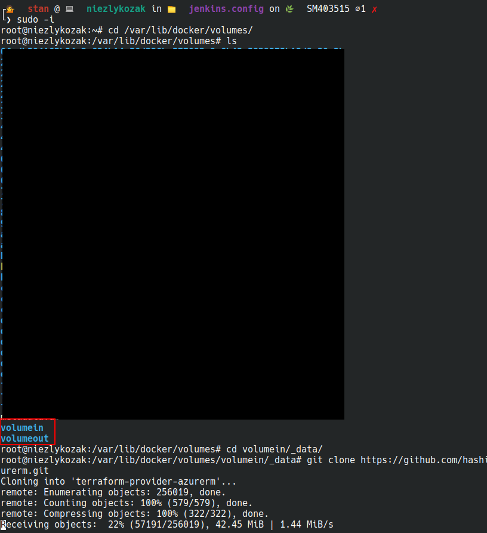

- Uruchom build w kontenerze
- Zapisz powstałe/zbudowane pliki na woluminie wyjściowym

```
go build -o /out/build
```

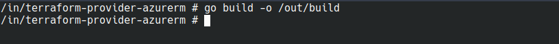

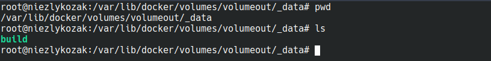

### Eksponowanie portu

- Uruchom wewnątrz kontenera serwer iperf (iperf3)

```
apk add net-tools iperf3

ifconfig

iperf3 -s -p 3000
```

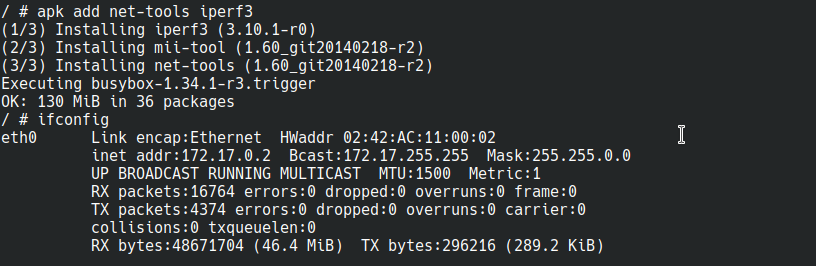

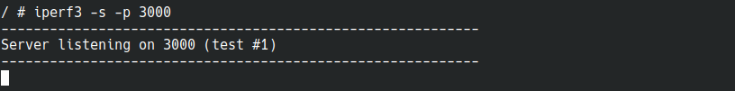

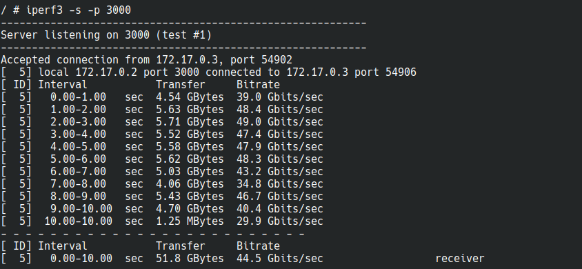

- Połącz się z nim z drugiego kontenera, zbadaj ruch

```
apk add net-tools iperf3

iperf3 -c 172.17.0.2 -p 3000
```

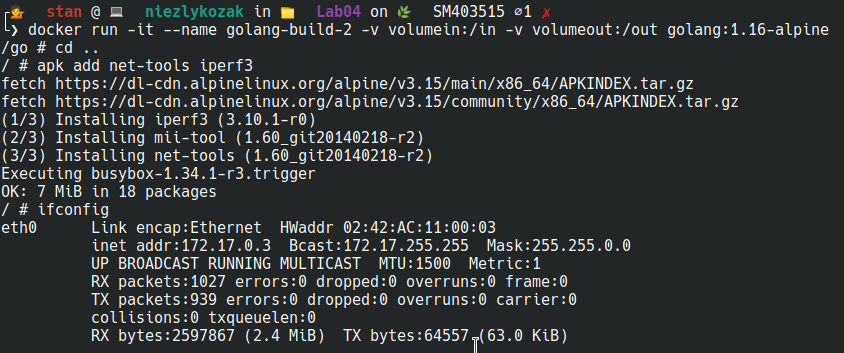

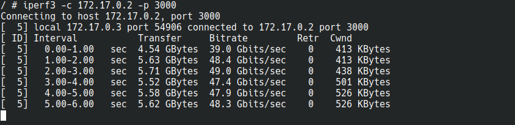

- Połącz się spoza kontenera (z hosta i spoza hosta)

```
iperf3 -c 172.17.0.2 -p 3000

iperf3 -c localhost -p 3000
```

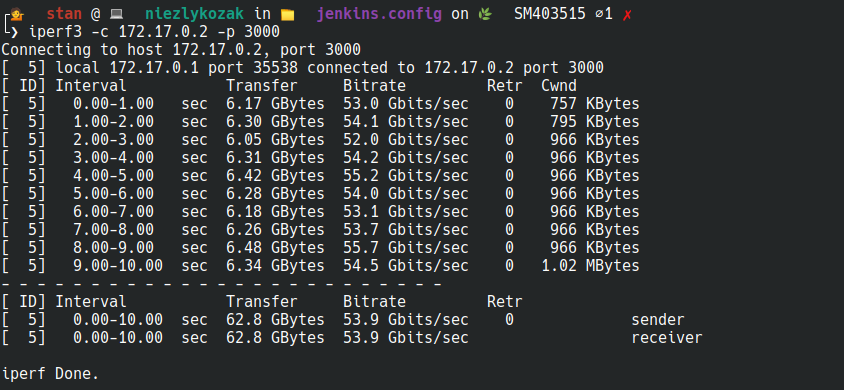

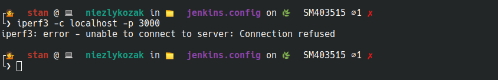

- Przedstaw przepustowość komunikacji lub problem z jej zmierzeniem (wyciągnij log z kontenera)

### Drugi kontener

```
Interval           Transfer     Bitrate         Retr  Cwnd
0.00-1.00   sec  4.54 GBytes  39.0 Gbits/sec    0    413 KBytes
1.00-2.00   sec  5.63 GBytes  48.4 Gbits/sec    0    413 KBytes
2.00-3.00   sec  5.71 GBytes  49.0 Gbits/sec    0    438 KBytes
3.00-4.00   sec  5.52 GBytes  47.4 Gbits/sec    0    501 KBytes
4.00-5.00   sec  5.58 GBytes  47.9 Gbits/sec    0    526 KBytes
5.00-6.00   sec  5.62 GBytes  48.3 Gbits/sec    0    526 KBytes
6.00-7.00   sec  5.03 GBytes  43.2 Gbits/sec    0    724 KBytes
7.00-8.00   sec  4.06 GBytes  34.8 Gbits/sec    0   1.12 MBytes
8.00-9.00   sec  5.43 GBytes  46.7 Gbits/sec    0   1.12 MBytes
9.00-10.00  sec  4.70 GBytes  40.4 Gbits/sec    0   1.30 MBytes
```

### Host

```
Interval           Transfer     Bitrate         Retr  Cwnd
0.00-1.00   sec  6.17 GBytes  53.0 Gbits/sec    0    757 KBytes
1.00-2.00   sec  6.30 GBytes  54.1 Gbits/sec    0    795 KBytes
2.00-3.00   sec  6.05 GBytes  52.0 Gbits/sec    0    966 KBytes
3.00-4.00   sec  6.31 GBytes  54.2 Gbits/sec    0    966 KBytes
4.00-5.00   sec  6.42 GBytes  55.2 Gbits/sec    0    966 KBytes
5.00-6.00   sec  6.28 GBytes  54.0 Gbits/sec    0    966 KBytes
6.00-7.00   sec  6.18 GBytes  53.1 Gbits/sec    0    966 KBytes
7.00-8.00   sec  6.26 GBytes  53.7 Gbits/sec    0    966 KBytes
8.00-9.00   sec  6.48 GBytes  55.7 Gbits/sec    0    966 KBytes
9.00-10.00  sec  6.34 GBytes  54.5 Gbits/sec    0   1.02 MBytes
```

### Instancja Jenkins

- Zapoznaj się z dokumentacją https://www.jenkins.io/doc/book/installing/docker/
- Przeprowadź instalację skonteneryzowanej instancji Jenkinsa z pomocnikiem DIND

```
docker network create jenkins

docker run \
  --name jenkins-docker \
  --rm \
  --detach \
  --privileged \
  --network jenkins \
  --network-alias docker \
  --env DOCKER_TLS_CERTDIR=/certs \
  --volume jenkins-docker-certs:/certs/client \
  --volume jenkins-data:/var/jenkins_home \
  --publish 2376:2376 \
  docker:dind \
  --storage-driver overlay2
```

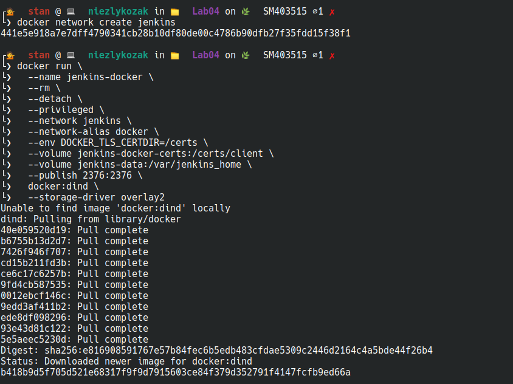

```
cd jenkins.config/

touch Dockerfile

nano Dockerfile

cat Dockerfile

docker build -t jenkins .
```

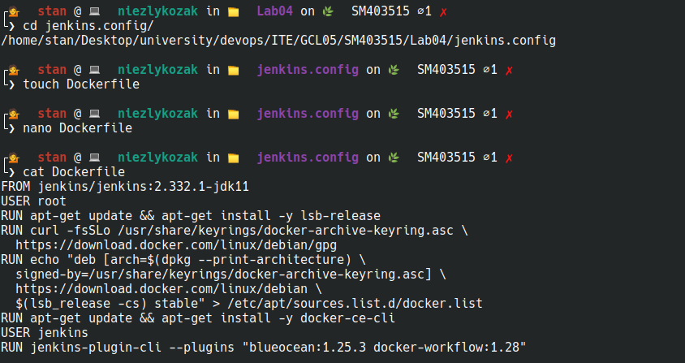

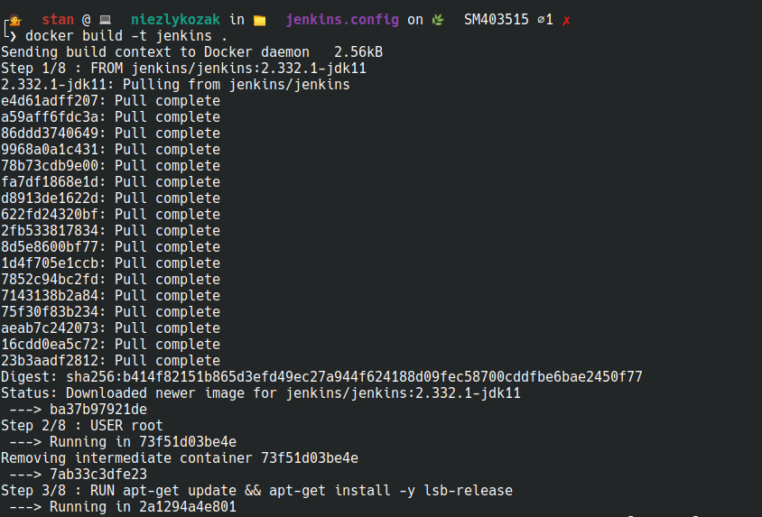
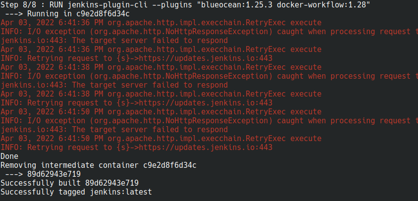

```
docker run \
  --name jenkins-blueocean \
  --rm \
  --detach \
  --network jenkins \
  --env DOCKER_HOST=tcp://docker:2376 \
  --env DOCKER_CERT_PATH=/certs/client \
  --env DOCKER_TLS_VERIFY=1 \
  --publish 8080:8080 \
  --publish 50000:50000 \
  --volume jenkins-data:/var/jenkins_home \
  --volume jenkins-docker-certs:/certs/client:ro \
  jenkins

 docker logs jenkins-blueocean |& grep 'password' -A 10
```

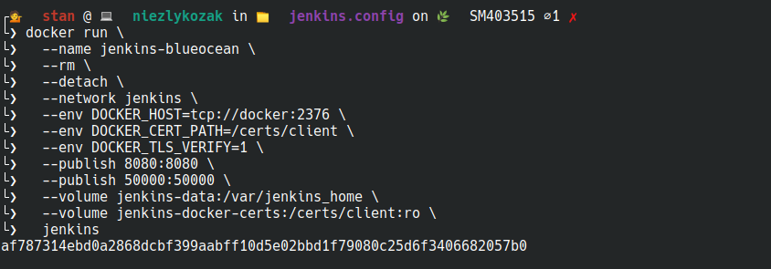
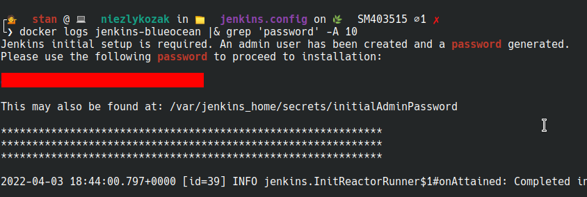

- Zainicjalizuj instację, wykaż działające kontenery, pokaż ekran logowania

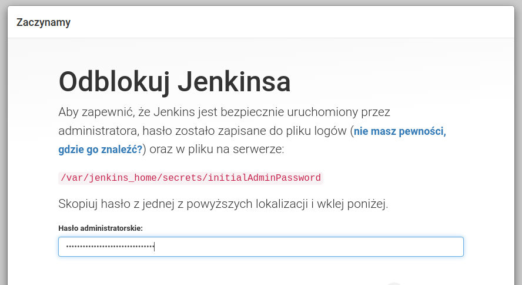

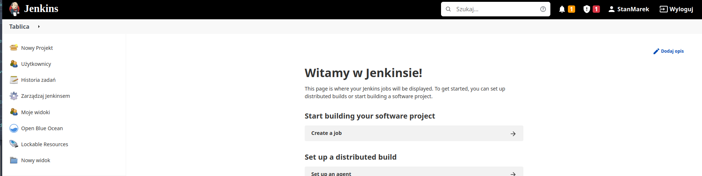

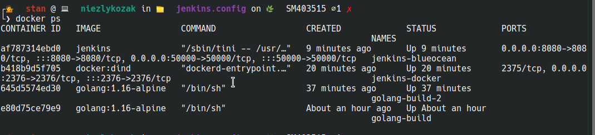

## Zakres rozszerzony

### Komunikacja

- Stwórz kontener czysto do budowania (bez narzędzi do klonowania/kopiowania, bez sklonowanego repozytorium)
- Stwórz na jego bazie kontener przejściowy, który tylko buduje, wyciągnij z niego pliki po skutecznym buildzie

### Usługi w rozumieniu systemu, kontenera i klastra

- Zestaw w kontenerze ubuntu/fedora usługę SSHD, połącz się z nią, opisz zalety i wady (przypadki użycia...?) komunikacji z kontenerem z wykorzystaniem SSH

### Jenkins: zależności

- Co jest potrzebne by w naszym Jenkinsie uruchomić Dockerfile dla buildera?
- Co jest potrzebne w Jenkinsie by uruchomić Docker Compose?
