# Zadania do wykonania - część 1

## Instalacja klastra Kubernetes

- Zaopatrz się w implementację stosu k8s: minikube

  `Instalacja przez curl i program install na Manjaro Linux`

  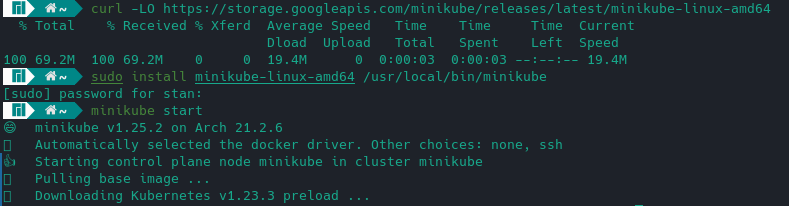

- zaopatrz się w polecenie kubectl

  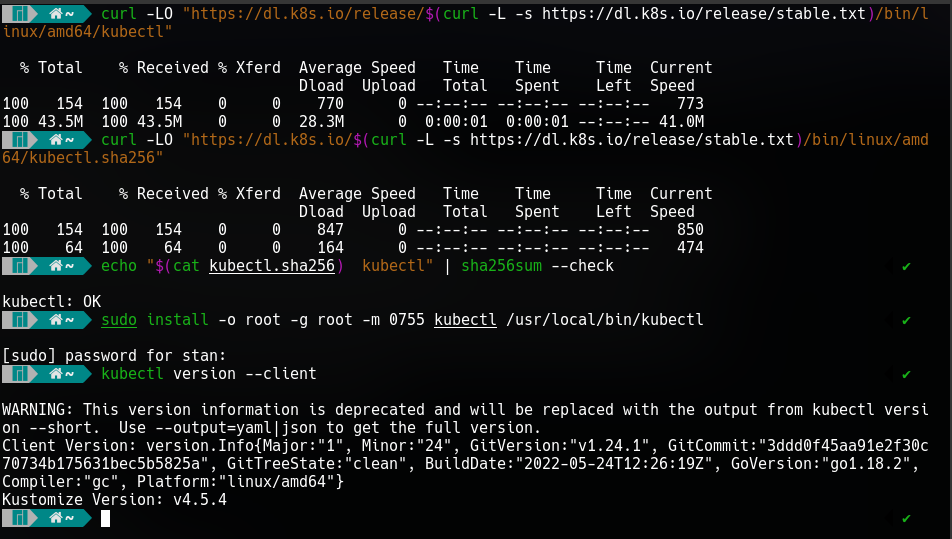

- Uruchom Kubernetes, pokaż działający kontener/worker

  ```
  minikube start
  ```

  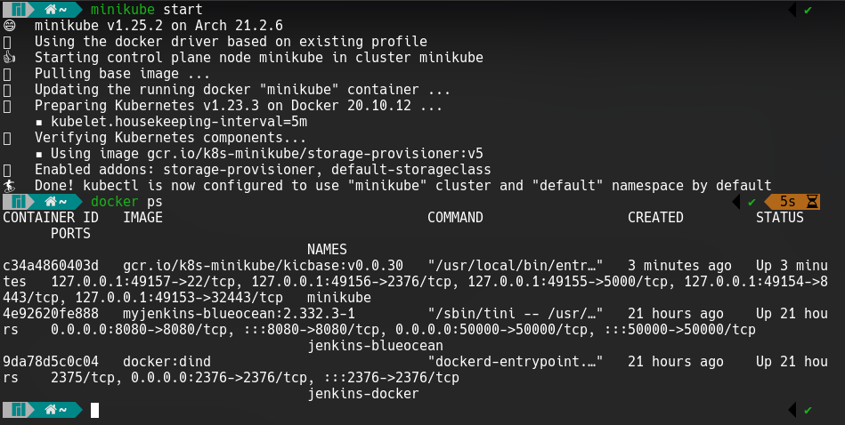

- Zmityguj problemy wynikające z wymagań sprzętowych lub odnieś się do nich (względem dokumentacji)

  `Kontener od razu ma nadaną nazwę zmiast losowej - celem tej operacji jest zablokowanie tworzenia więcej niż jednego kontenera minikube'a`

- Uruchom Dashboard, otwórz w przeglądarce, przedstaw łączność

  ```
  minikube dashboard
  ```

  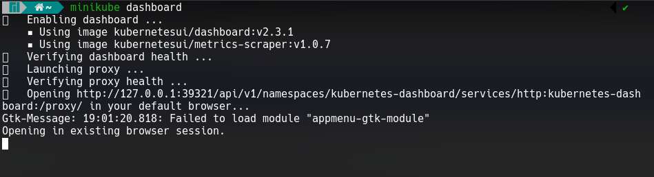

- Zapoznaj się z koncepcjami funkcji wyprowadzanych przez kubernetesa (pod, deployment itp)

  ~~A kto by to robił~~ Zapoznałem się :heavy_check_mark:

## Analiza posiadanego kontenera

- Zdefiniuj krok "Deploy" swojego projektu jako "Deploy to cloud":

  - Deploy zbudowanej aplikacji powinien się odbywać "na kontener"

    `Nie tworzyłem nowego kroku oraz nie modyfikowałem pipeline'a ponieważ juz działał w ten sposób`

  - Przygotuj obraz Docker ze swoją aplikacją

    `https://hub.docker.com/repository/docker/stanmarek/devops-golang-project`

  - Jeżeli wybrana aplikacja nie nadaje się do pracy w kontenerze i nie wyprowadza interfejsu funkcjonalnego przez sieć, wymień projekt na potrzeby tego zadania:

    - Minimum: obraz-gotowiec
    - Optimum: samodzielnie wybrany program, obraz zbudowany na jego bazie
    - Plan max: obraz wygenerowany wskutek pracy pipeline'u

    `Moja apka to plan max`

  - Wykaż, że wybrana aplikacja pracuje jako kontener

  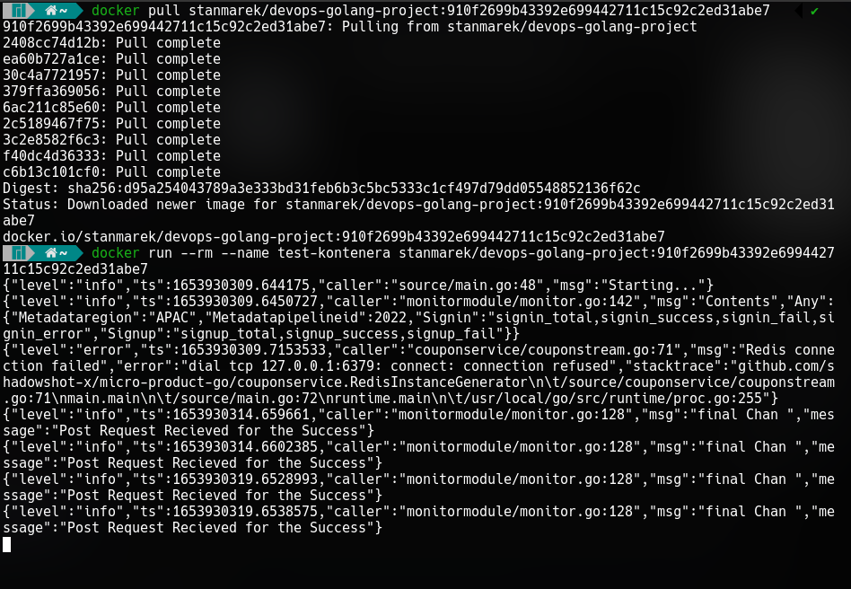

  `Konetner/aplikacja nasłuchuje na różnych endpointach (np. /ping, /login) ponieważ jest to mikroserwis. W tym czasie (zrzut ekranu powyżej) widoczne są logi uruchomieniowowe`

## Uruchamianie oprogramowania

- Uruchom kontener na stosie k8s

  ```
  minikube kubectl run -- devops-golang-microservice
  --image=stanmarek/devops-golang-project:910f2699b43392e699442711c15c92c2ed31abe7
  --port=9090 --labels app=devops-golang-microservice
  ```

- Kontener uruchomiony w minikubie zostanie automatycznie ubrany w pod.
- Przedstaw że pod działa (via Dashboard oraz kubectl)

  ```
  # kontenery z defaultowego namespace
  minikube kubectl -- get pods
  # wszystkie kontenery
  minikube kubectl -- get po -A
  ```

  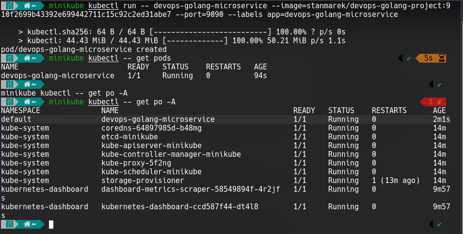
  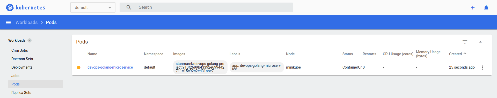
  `Tworzenie kontenera`
  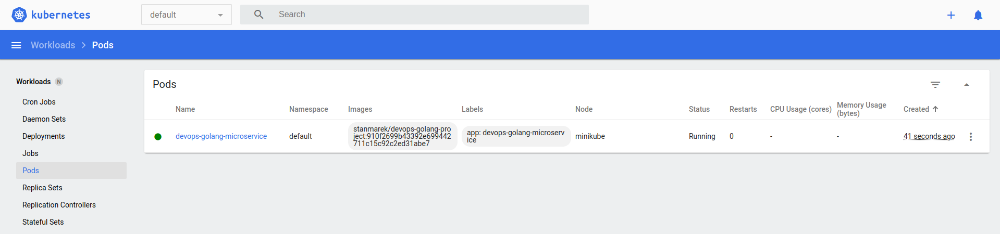
  `Działający kontener`
  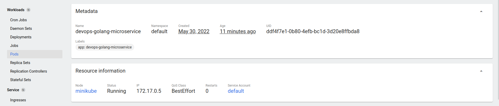

- Wyprowadź port celem dotarcia do eksponowanej funkcjonalności

  ```
  kubectl port-forward devops-golang-microservice 2137:9090
  ```

  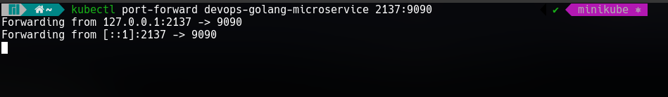

- Przedstaw komunikację z eskponowaną funkcjonalnością

  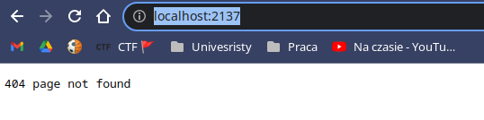
  
  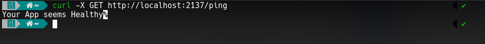
  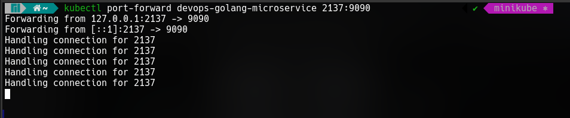

  `Po wykonaniu kilku requestów widać że przekierowany port był wykorzystany`

## Przekucie wdrożenia manualnego w plik wdrożenia (wprowadzenie)

- Zapisanie wdrożenia jako plik YML

  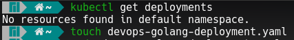

- Dodanie replik

  ```yaml
  apiVersion: apps/v1
  kind: Deployment
  metadata:
  name: devops-golang-microservice-deployment
  labels:
    app: devops-golang-microservice
  spec:
  replicas: 4
  selector:
    matchLabels:
      app: devops-golang-microservice
  template:
    metadata:
      labels:
        app: devops-golang-microservice
    spec:
      containers:
        - name: devops-golang-microservice
          image: stanmarek/devops-golang-project:910f2699b43392e699442711c15c92c2ed31abe7
          ports:
            - containerPort: 9090
  ```

- `kubectl apply` na pliku

  ```
  kubectl apply -f devops-golang-deployment.yaml
  ```

  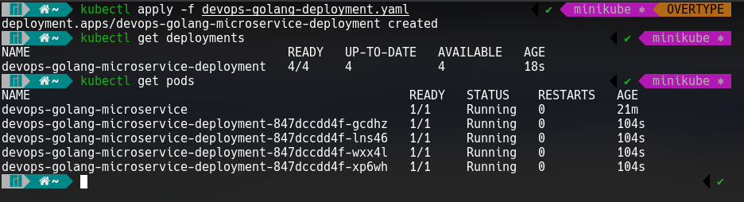
  `Obok pierwszego kontenera utworzone zostały 4 nowe zgodnie z plikiem deploymentu`
  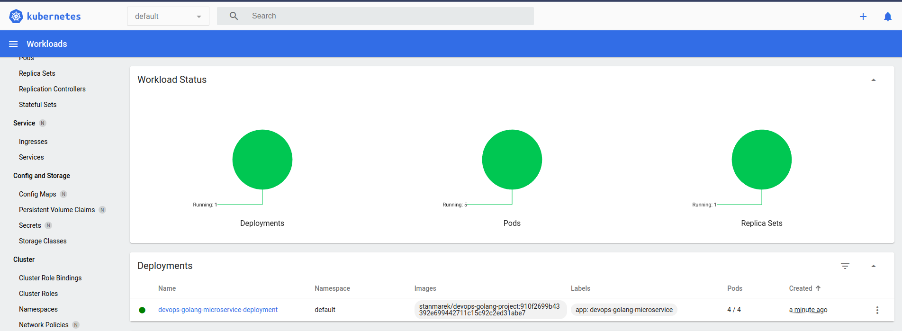
  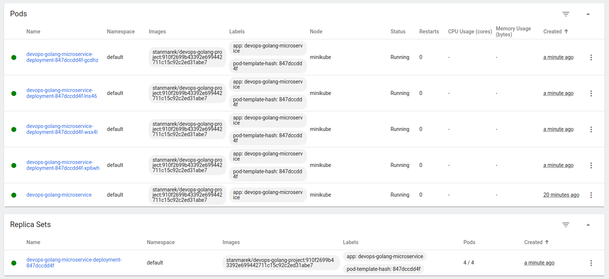

# Zadania do wykonania - część 2

## Konwersja wdrożenia ręcznego na wdrożenie deklaratywne YAML

- Upewnij się, że posiadasz wdrożenie z poprzednich zajęć zapisane jako plik
- Wzbogać swój obraz o 4 repliki
- Rozpocznij wdrożenie za pomocą `kubectl apply`
- Zbadaj stan za pomocą `kubectl rollout status`

  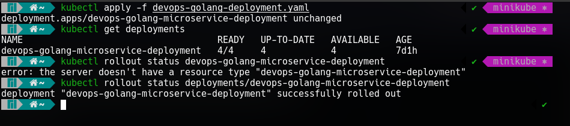

## Przygotowanie nowego obrazu

- Zarejestruj nową wersję swojego obrazu (w Docker Hub lub lokalnie)
- Upewnij się, że dostępne są dwie co najmniej wersje obrazu z wybranym programem
- Będzie to wymagać
  - przejścia przez pipeline dwukrotnie, lub
  - ręcznego zbudowania dwóch wersji, lub
  - przepakowania wybranego obrazu samodzielnie np przez `commit`
- Przyotuj wersję obrazu, którego uruchomienie kończy się błędem

  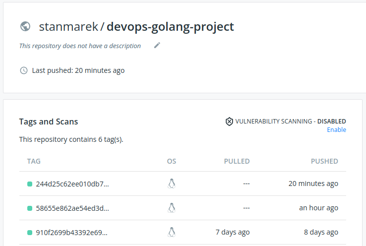

  `Kod którego uruchomienia zawsze kończy się błędem dodany do aplikcji`

  ```go
  func divide(x int) {
  	fmt.Printf("divide(%d) \n", x+0/x)
  	divide(x - 1)
  }

  func main() {
    divide(1)
    /// reszta kodu jest poniżj
    /// to tylko mały snippet
  }
  ```

## Zmiany w deploymencie

- Aktualizuj plik YAML z wdrożeniem i przeprowadzaj je ponownie po zastosowaniu następujących zmian:
- zwiększenie replik

  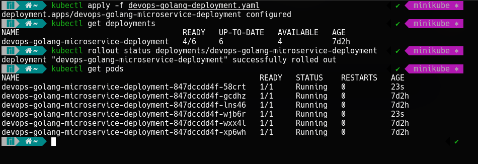
  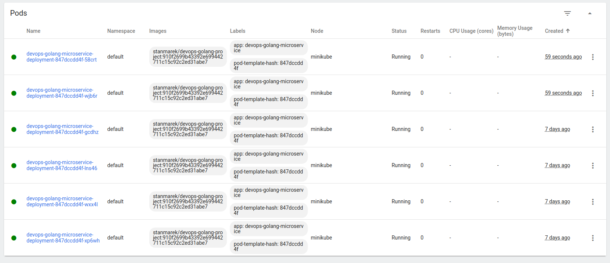

- zmniejszenie liczby replik do 1

  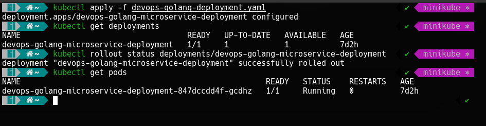
  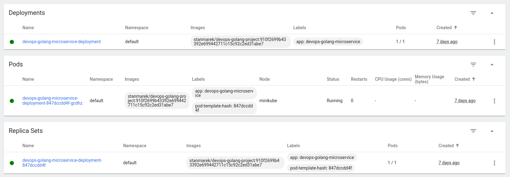

- zmniejszenie liczby replik do 0

  
  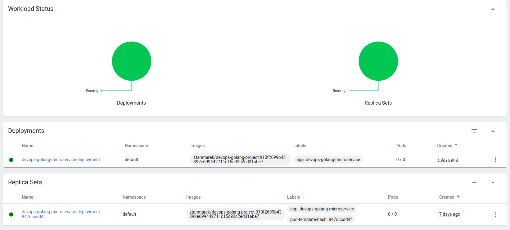

- Zastosowanie nowej wersji obrazu

  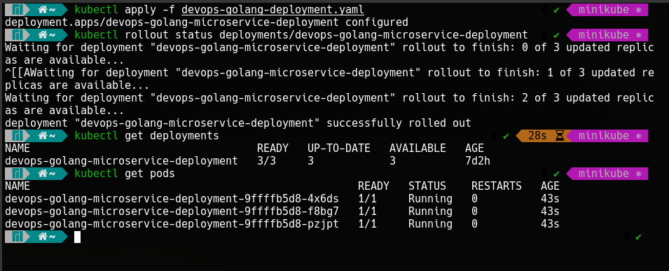
  
  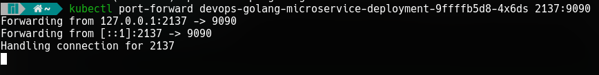
  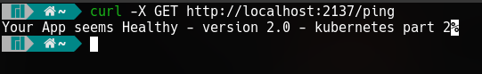

- Zastosowanie starszej wersji obrazu

  `Zastosowałem wersję aplikacji z błędem i przywrociłem później początkową`

  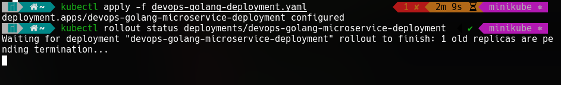
  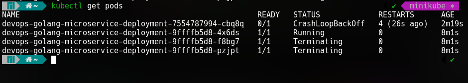
  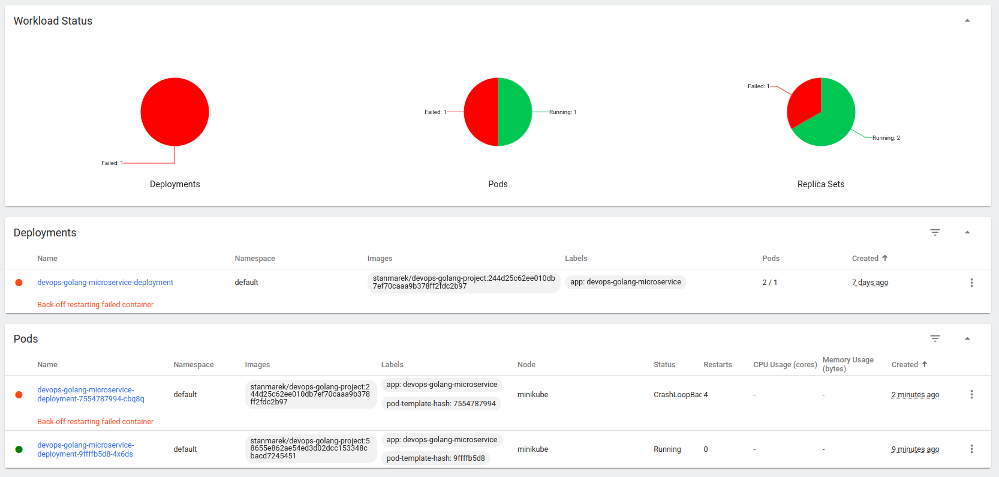

  `Przywrocenie do starej wersji`

  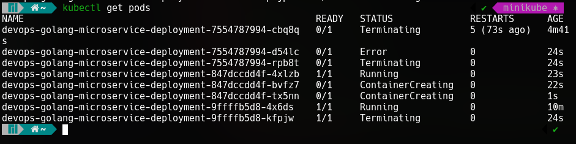
  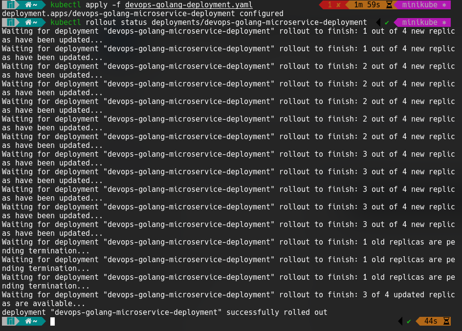
  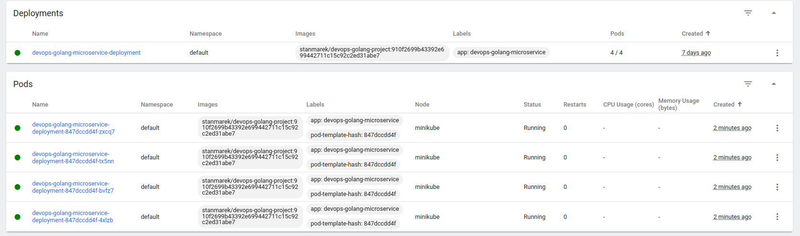

- Przywracaj poprzednie wersje wdrożeń za pomocą poleceń
- `kubectl rollout history`
- `kubectl rollout undo`

  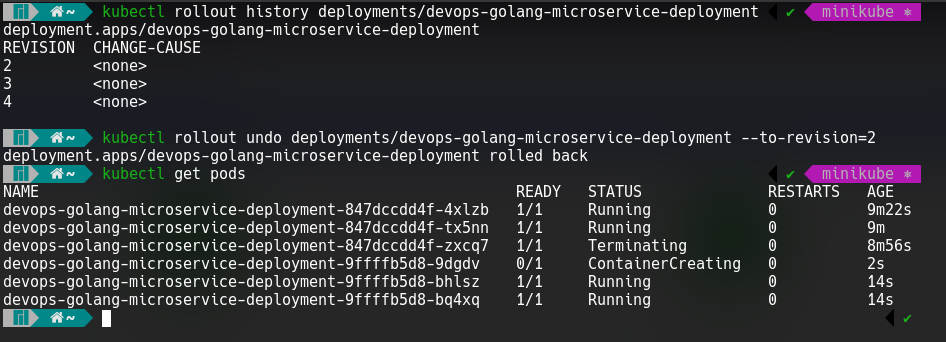

## Kontrola wdrożenia

- Napisz skrypt weryfikujący, czy wdrożenie "zdążyło" się wdrożyć (60 sekund)

  ```bash
  #!/bin/bash

  cmd() {
    kubectl rollout status deployments/devops-golang-microservice-deployment
  }

  if cmd | grep -q 'deployment "devops-golang-microservice-deployment" successfully rolled out'; then
    echo "Deployment is up and running"
  else
    echo "Deployment is not running"
  fi
  ```

- Zakres rozszerzony: Ujmij skrypt w pipeline Jenkins (o ile minikube jest dostępny z zewnątrz)

## Strategie wdrożenia

- Przygotuj wersje wdrożeń stosujące następujące strategie wdrożeń
- Recreate

  `Pody za każdym razem zostają wyłączone i tworzeone są od nowa, wszystkie jednoczesnie. Powoduje chwilowy brak dostępu do aplikacji.`

  ```yaml
  apiVersion: apps/v1
  kind: Deployment
  metadata:
  name: devops-golang-microservice-deployment
  labels:
    app: devops-golang-microservice
  spec:
  strategy:
    type: Recreate
  replicas: 4
  selector:
    matchLabels:
      app: devops-golang-microservice
  template:
    metadata:
      labels:
        app: devops-golang-microservice
    spec:
      containers:
        - name: devops-golang-microservice
          image: stanmarek/devops-golang-project:910f2699b43392e699442711c15c92c2ed31abe7
          ports:
            - containerPort: 9090
  ```

- Rolling Update

  `Jednoczesnie updatowana jest n podow. W danym momencie wyłączane jest n podów, kiedy wstaną - kolejna są updateowane. Minimalizuje brak dostępu do aplikacji.`

  ```yaml
  apiVersion: apps/v1
  kind: Deployment
  metadata:
  name: devops-golang-microservice-deployment
  labels:
    app: devops-golang-microservice
  spec:
  strategy:
    type: RollingUpdate
    rollingUpdate:
      maxSurge: 3
      maxUnavailable: 1
  replicas: 4
  selector:
    matchLabels:
      app: devops-golang-microservice
  template:
    metadata:
      labels:
        app: devops-golang-microservice
    spec:
      containers:
        - name: devops-golang-microservice
          image: stanmarek/devops-golang-project:910f2699b43392e699442711c15c92c2ed31abe7
          ports:
            - containerPort: 9090
  ```

- Canary Deployment workload

  `Wymagane są dwa deploymenty, ze starą i nową wersją. Następnie manualnie zmieniamy wersje która działa na danym podzie.`

- Zaobserwuj i opisz różnice
- Uzyj etykiet
- https://kubernetes.io/docs/concepts/workloads/controllers/deployment/
