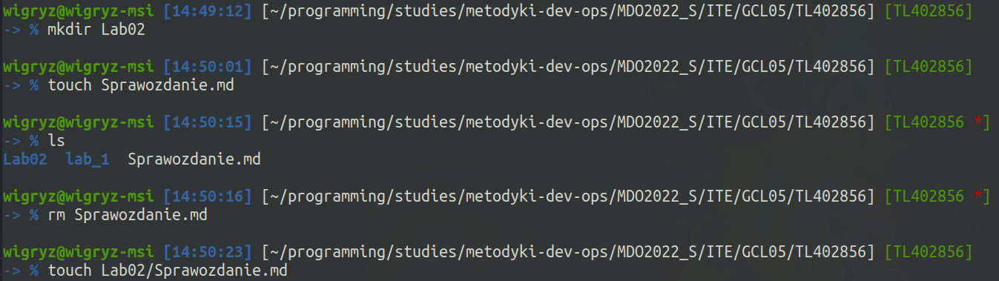
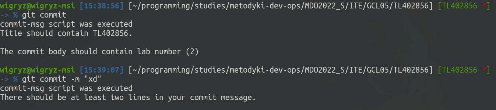
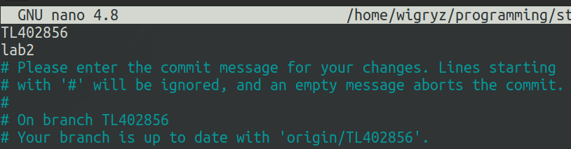
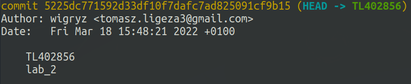
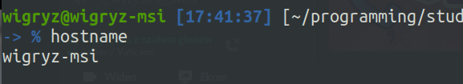
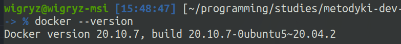
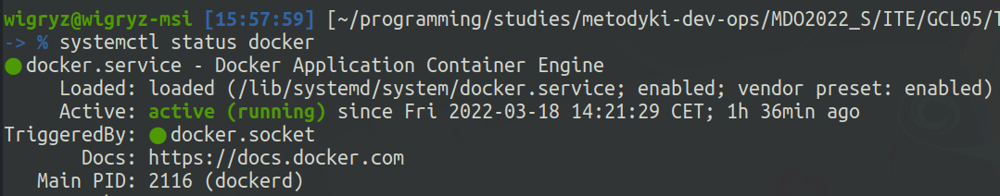
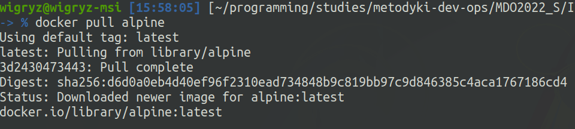
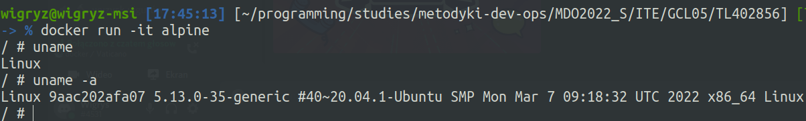
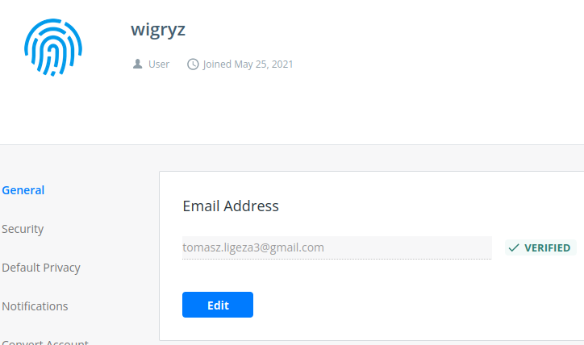

##Tomasz Ligęza
###Sprawozdanie z laboratorium nr 2

1. Stworzyłem katalog Lab02 oraz plik Sprawozdanie.md w tym katalogu.

2. Utworzyłem hook sprawdzający czy tytuł commita to TL402856: (cały kod zamieszczam na samym dole sprawozdania).<br>
Sprawdzam w nim czy commit-msg zawiera więcej niż 1 linijkę, jeśli nie, to wypisuję komunikat o błędzie. Następnie sprawdzam, czy tytuł jest równy "TL402856", a w ostatnim kroku iterując po liniach commita sprawdzam czy którykolwiek zawiera znak "2".



3. Używam systemu Ubuntu 20.04 zainstalowanego obok windowsa (dual boot).<br>
Aby to wykazać wrzucam screen wywołania komendy hostname:

4. Posiadam zainstalowane środowisko docker w systemie operacyjnym:

5. Środowisko dockerowe jest uruchomione i działa:

6. Pobieram obraz alpine:

7. Uruchamiam kontener z obrazem alpine:

8. Posiadam konto na Docker Hub - dla potwierdzenia zamieszczam screen z emailem:

9. Logi z przeprowadzonych działań zamieściłem poniżej zawartości pliku commit-msg.

Zawartość pliku commit-msg:
```python
#!/usr/bin/python3

import sys


def check_commit_msg_pattern():
    msg_temp_file = sys.argv[1]

    with open(msg_temp_file, "r") as f_msg:
        lines = f_msg.readlines()

    has_warning = False
    if len(lines) < 2:
        print("There should be at least two lines in your commit message.")
        exit(1)

    if "TL402856" != lines[0].strip():
        has_warning = True
        print("Title should contain TL402856.")

    contains_lab_number = False
    for line in lines[1:]:
        if "lab_2" in line:
            contains_lab_number = True

    if not contains_lab_number:
        has_warning = True
        print("The commit body should contain lab number (2)")

    if has_warning:
        exit(1)
    else:
        print("The commit message has the required pattern.")


if __name__ == "__main__":
    print("commit-msg script was executed")
    check_commit_msg_pattern()

```

Logi wykonanych komend:
```shell
: 1647611401:0;mkdir Lab02
: 1647611415:0;touch Sprawozdanie.md
: 1647611416:0;ls
: 1647611423:0;rm Sprawozdanie.md
: 1647611441:0;touch Lab02/Sprawozdanie.md
: 1647611684:0;ls
: 1647611687:0;cd ../../..
: 1647611688:0;ls
: 1647611691:0;ls -a
: 1647611696:0;cd .git
: 1647611698:0;ls
: 1647611701:0;cd hooks
: 1647611703:0;ls
: 1647611847:0;gedit commit-msg.sample &
: 1647611894:0;python3 --version
: 1647612653:0;sudo apt install clocks
: 1647612661:0;sudo apt install gnome-clocks
: 1647613592:0;git status
: 1647613601:0;cd ..
: 1647613603:0;ls
: 1647613610:0;cd ITE/GCL05/TL402856
: 1647613611:0;ls
: 1647613614:0;git add .
: 1647613617:0;git commit
: 1647613630:0;git log
: 1647613639:0;sudo reset --soft HEAD~1
: 1647613657:0;git log
: 1647613673:0;git reset HEAD~1 --soft
: 1647613675:0;git log
: 1647613845:0;git add .
: 1647613851:0;git commit -m "xd"
: 1647613890:0;git reset HEAD~1 --soft
: 1647613920:0;ls
: 1647613951:0;git commit -m "xd"
: 1647614059:0;whereis python3
: 1647614068:0;git commit -m "xd"
: 1647614306:0;git commit --help
: 1647614345:0;git commit
: 1647614364:0;git commit -m "xd"
: 1647614373:0;git commit
: 1647614559:0;git reset HEAD~1 --soft
: 1647614561:0;git log
: 1647614588:0;git commit
: 1647614635:0;git reset HEAD~1 --soft
: 1647614638:0;git add .
: 1647614640:0;git commit
: 1647614685:0;git reset HEAD~1 --soft
: 1647614690:0;git commit
: 1647614706:0;git commit -m "xd"
: 1647614716:0;git commit
: 1647614774:0;git commit -m "xd"
: 1647614779:0;git add .
: 1647614787:0;git log
: 1647614793:0;git reset HEAD~1 --soft
: 1647614795:0;git status
: 1647614801:0;git commit -m "xd"
: 1647614807:0;git commit
: 1647614915:0;git log
: 1647615406:0;docker --version
: 1647615427:0;systemctl docker status
: 1647615475:0;systemctl show docker
: 1647615483:0;systemctl status docker
: 1647615694:0;docker pull alpine
: 1647615774:0;docker start alpine
: 1647615798:0;docker container start alpine
: 1647615852:0;docker run alpine
: 1647615872:0;docker container list
: 1647615899:0;docker start alpine
: 1647615910:0;docker run alpine sh
: 1647615959:0;docker run -it alpine
```