1. Jako repozytorium z kodem oprogramowania wybieram projekt PetClinic (java + spring + maven).
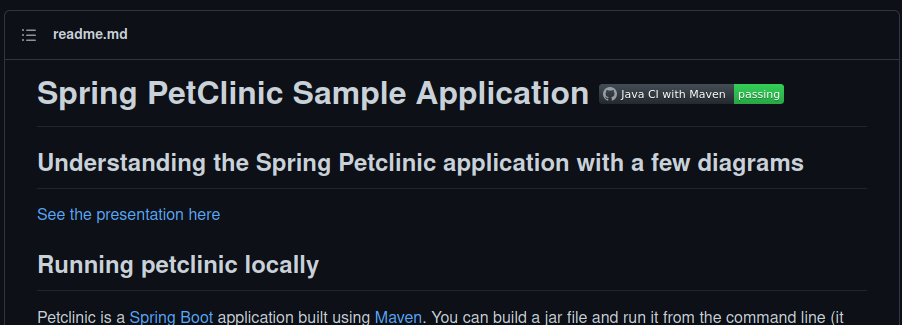
2. Klonuję niniejsze repozytorium przy pomocy komendy ```git clone git@github.com:spring-projects/spring-petclinic.git```
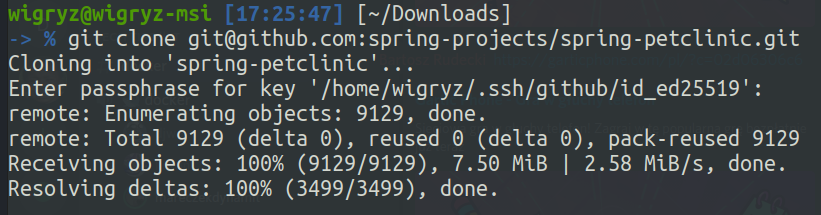
3. Przeprowadzam build programu poprzez wykonanie komendy ```./mvnw install -DskipTests```:
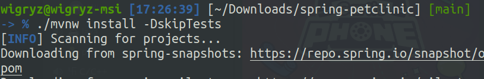
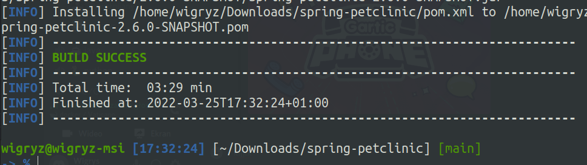
4. Uruchamiam testy dołączone do repozytorium:
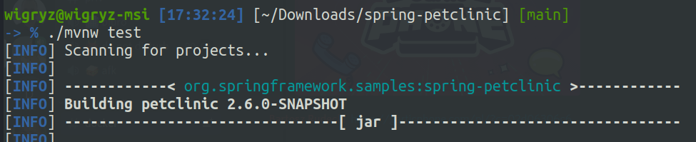
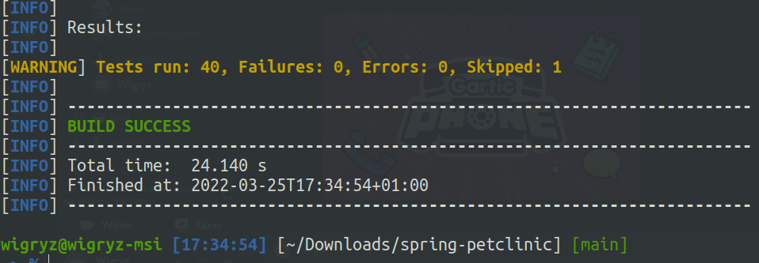
5. Wykonuję kroki build oraz test wewnątrz wybranego konteneru bazowego:<br>
a) uruchamiam kontener oraz podłączam do niego TTY:<br>
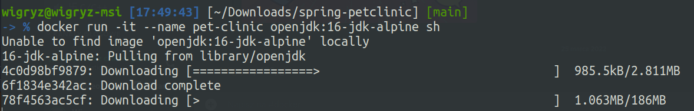
b) klonuję repozytorium:<br>
Aby sklonować repozytorium musiałem zainstalować git w moim obrazie (alpine):
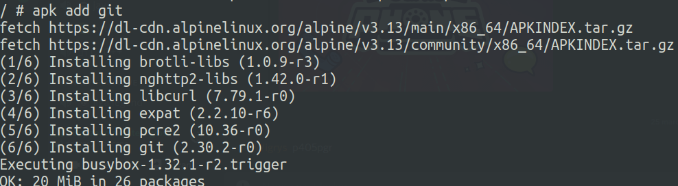
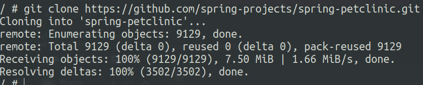
c) uruchamiam build poleceniem ```./mvnv install -DskipTests``` oczywiście po uprzednim przejściu do katalogu z projektem poleceniem ```cd spring-petclinic```:<br>
Po dłuższej chwili pobierania dependencji i budowania proces ten zakończył się powodzeniem:
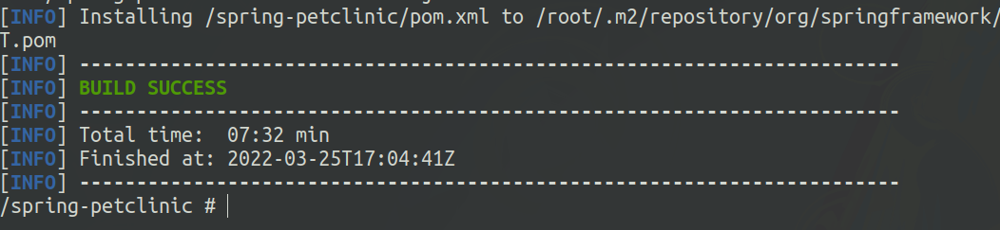
d) uruchamiam testy:<br>
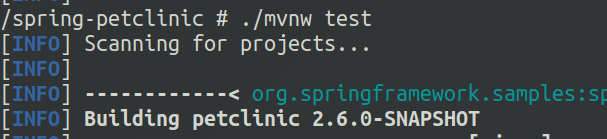
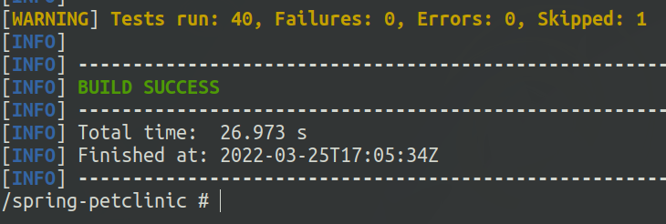
6. Tworzę dwa pliki Dockerfile automatyzujące kroki powyżej:
a) pierwszy przeprowadzający wszystkie kroki aż do builda:<br>
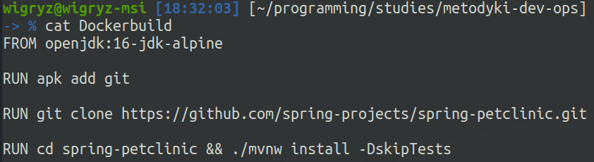
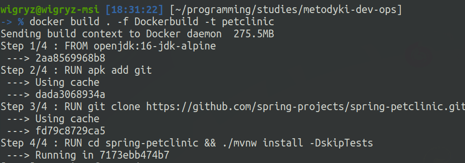
Udało się poprawnie zbudować obraz:
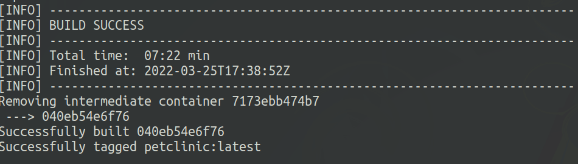
b) drugi kopiujący zbudowany plik .jar zbudowanego projektu, oraz uruchamiający testy tej aplikacji:<br>
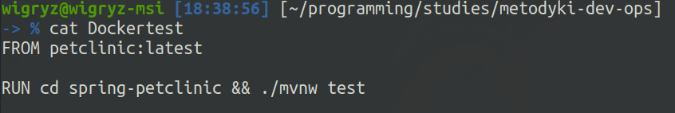
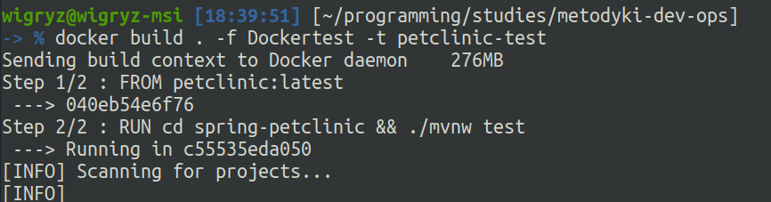
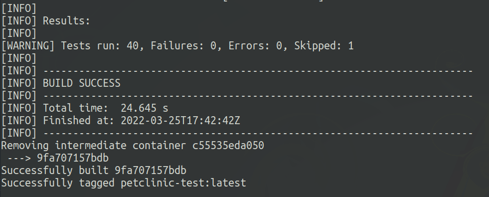

Po sukcesie testów uruchamiam kontener ze zbudowanego obrazu:
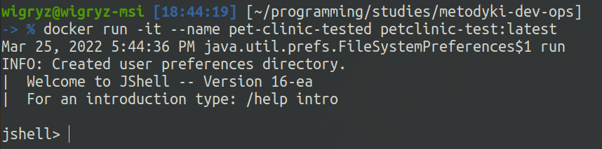
W takim kontenerze nie jest uruchomiona nasza aplikacja -> jak widać na screenie domyślnie uruchamia się jshell (bo jest to obraz na bazie openjdk:alpine).
Możemy po uruchomieniu kontenera wystartować naszą aplikację.


Poniżej wrzucam listing historii poleceń:
3745  cd Downloads
3746  ls
3747  git clone git@github.com:spring-projects/spring-petclinic.git
3748  ls
3749  cd spring-petclinic
3750  ls
3751  ./mvnw install -DskipTests
3752  ./mvnw test
3753  docker run -it --name pet-clinic openjdk:16-jdk-alpine
3754  docker run -it --name pet-clinic openjdk:16-jdk-alpine sh
3755  docker container --list
3756  docker container list
3757  docker run -it --name pet-clinic openjdk:16-jdk-alpine sh
3758* ls
3759* cd Lab03
3760  ls
3761  cd ..
3762  ls
3763  cd programming/studies/metodyki-dev-ops
3764  ls
3765  touch Dockerbuild
3766  nano Dockerbuild
3767  touch Dockertest
3768  nano Dockertest
3769  ls
3770  cat Dockerbuild
3771  cat Dockertest
3772  docker build . -f Dockerbuild -t petclinic
3773  touch Dockertest
3774  ls
3775  cat Dockertest
3776  nano Dockerbuild
3777  cat Dockerbuild
3778  docker build . -f Dockerbuild -t petclinic
3779  nano Dockerbuild
3780  docker build . -f Dockerbuild -t petclinic
3781  nano Dockerbuild
3782  docker build . -f Dockerbuild -t petclinic
3783  docker image rm petlclinic:latest
3784  docker image rm petclinic:latest
3785  docker build . -f Dockerbuild -t petclinic
3786  nano Dockerbuild
3787  docker build . -f Dockerbuild -t petclinic
3788  nano Dockerbuild
3789  docker build . -f Dockerbuild -t petclinic
3790  nano Dockerbuild
3791  docker build . -f Dockerbuild -t petclinic
3792  nano Dockerbuild
3793  docker build . -f Dockerbuild -t petclinic
3794  nano Dockerbuild
3795  docker build . -f Dockerbuild -t petclinic
3796  nano Dockerbuild
3797  docker build . -f Dockerbuild -t petclinic
3798  nano Dockerbuild
3799  docker build . -f Dockerbuild -t petclinic
3800* ls
3801* cat Dockerbuild
3802* cat Dockerte
3803* cat Dockertes
3804* cat Dockertest
3805* nano Dockertest
3806  cat Dockertest
3807  docker build . -f Dockertest -t petclinic-test
3808  docker run -it --name pet-clinic petclinic-test:latest
3809  docker run -it --name pet-clinic-tested petclinic-test:latest
