Zachowywanie stanu:
1. Przygotowuję wolumin wejściowy i wolumin wyjściowy i podłączam je do kontenera bazowego, którym w moim przypadku jest kontener oparty na openjdk:16-jdk-alpine:
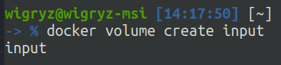
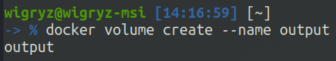
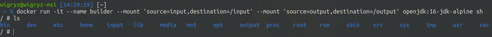
2. Nie instaluję żadnych zależności, ponieważ ich nie potrzebuję.
3. Uruchamianie kontenera na bazie obrazu alpine z podpiętym ovlumenem input:
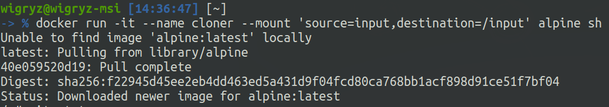
4. Klonuję repozytorium na wolumin wejściowy przy pomocy nowo utworzonego obrazu z podpiętym tym samym volumenem wejściowym:
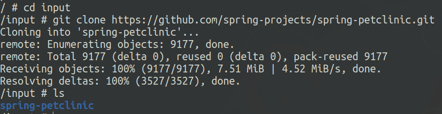
Widok foleru input z poziomu kontenera "builder":
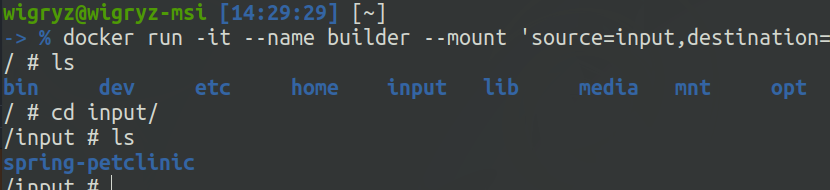
5. Uruchomienie budowania projektu w kontenerze "builder":
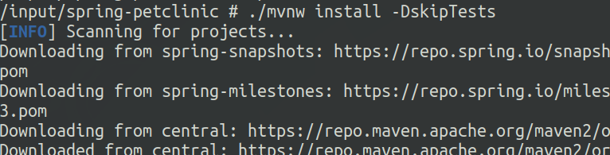
6. Zapisuję zbudowany plik .jar w folderze /output w kontenerze "builder":
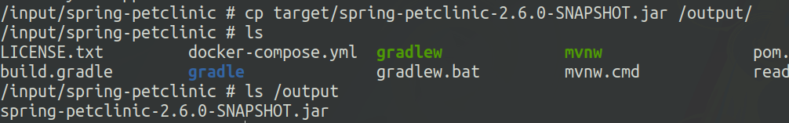
7. Sprawdzam dostępność zbudowanego pliku .jar z poziomu hosta:
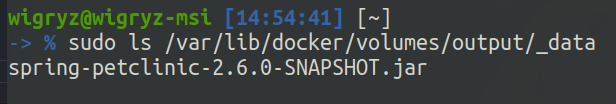

Eksponowanie portów:
1. Stworzone zostały dwa kontenery na bazie obrazu alpine. Na obu zainstalowany został program iperf3:
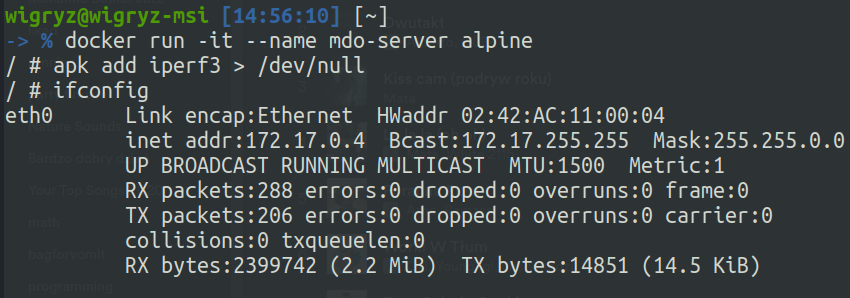
2. Na jednym z nich został uruchomiony iperf3 w trybie serwera z nasłuchiwaniem na porcie 9000:
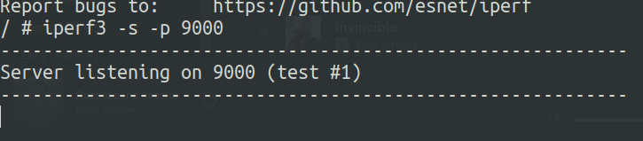
3. Drugi natomiast w trybie klienta połączony został z serwerem na podstawie ip:
Jak widać komunikacja zakończona została sukcesem.
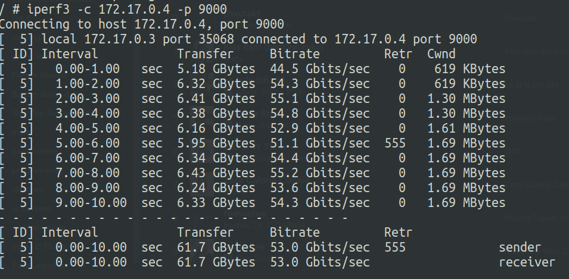
4. Powtórzyłem poprzedni krok - tym razem klientem był host - ubuntu.
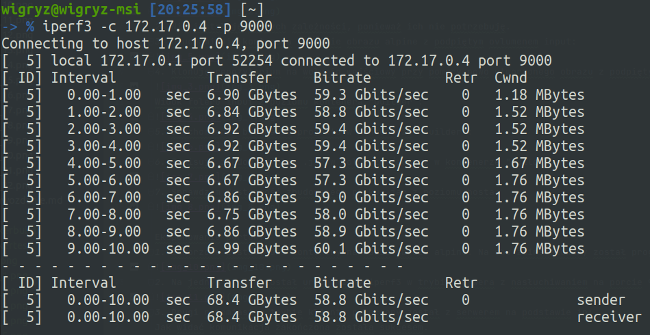
5. Z powyższych zrzutów ekranu możemy odczytać, że przepustowość wynosi: 
a) w przypadku komunikacji Container -> Container: około 6,2GB/s, 
b) w przypadku komunikacji Host -> Container: około 6,8GB/s.

Jenkins:
1. Tworzę nową sieć dla jenkinsa:
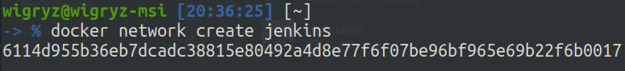
2. Używająć komendy z dokumentacji Jenkinsa tworzę kontener docker:dind:
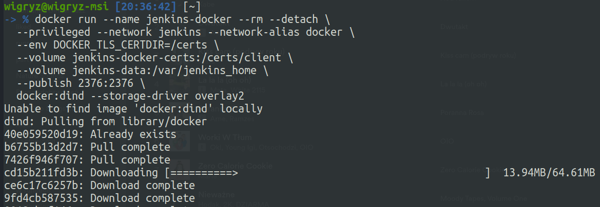
3. Stworzyłem plik Dockerfile customizujący oficjalny obraz Jenkinsa:
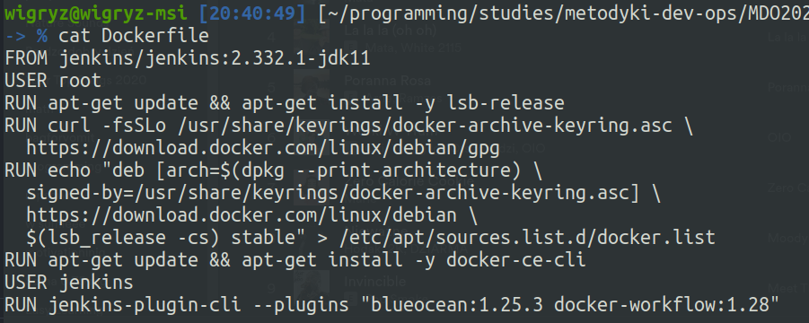
4. Zbudowałem obraz z powyższego pliku Dockerfile również wykorzystując komendę z dokumentacji:
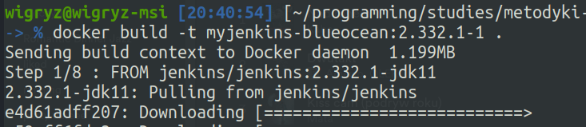
5. Używająć poniższej komendy uruchomiłem własny obraz jenkinsa jako kontener:
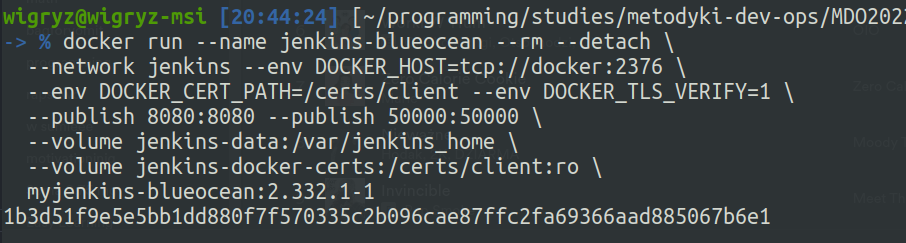
6. Na poniższym screenie prezentuję poprawnie działające kontenery związane z jenkinsem:
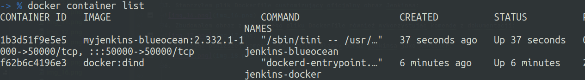
7. Przystępuję do instalacji jenkinsa poprzez otworzenie interfejsu graficznego w przeglądarce pod adresem localhost:8080:
Skopiowałem hasło wypisane w logach kontenera aby odblokować jenkinsa, a następnie uruchomiłem zalecaną instalację pluginów:
Następnym krokiem było stworzenie administratora:
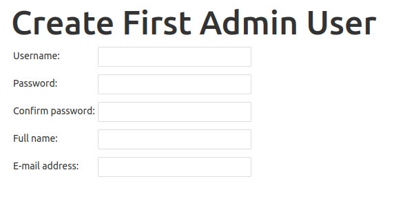
8. Instalacja zakończona sukcesem:

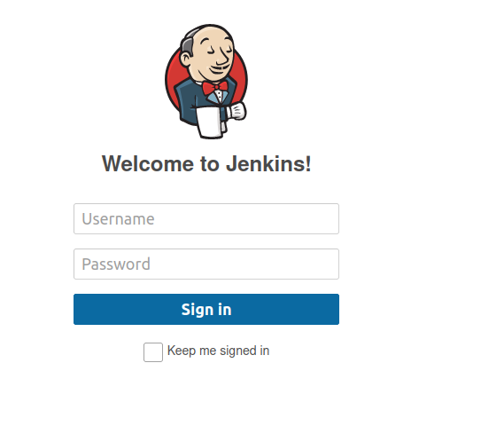
