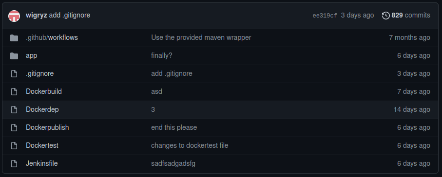
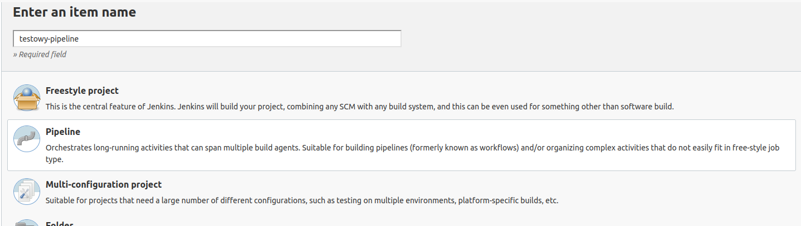
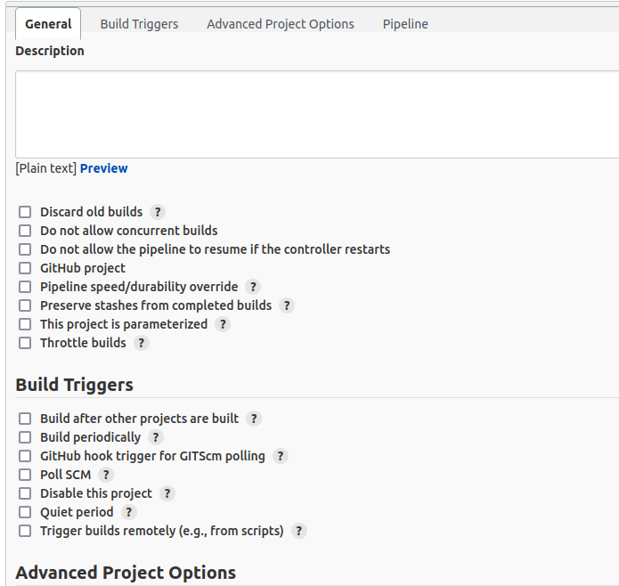
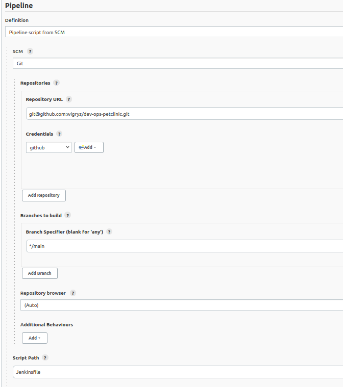
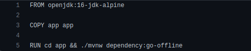
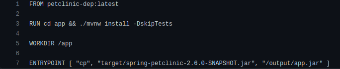
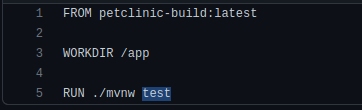
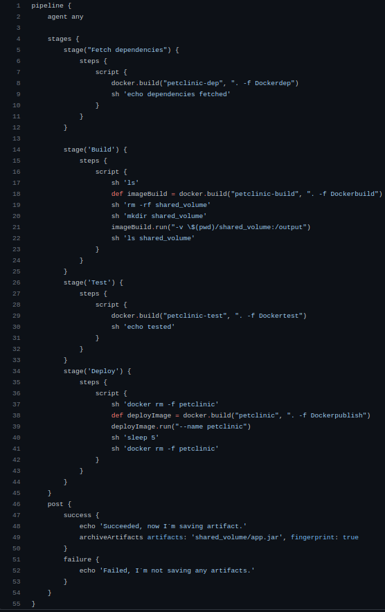

1. Tworzymy repozytorium na którym znajdzie się Jenkinsfile definiujący pipeline, Dockerfile potrzebne do jego wykonania,
oraz kod aplikacji, której działanie chcemy przetestować.
     
2. Kolejnym krokiem będzie dodanie w Jenkinsie Credentials do GitHub tak, aby był w stanie pobierać sobie nasze repozytorium w trakcie wykonywania pipeline`a:
3. Nie jest to szczególnie skomplikowane, w razie potrzeby po wyszukaniu frazy "git jenkins credentials setup" google uraczy nas tuzinem poradników. (tutaj jeden z nich https://www.thegeekstuff.com/2016/10/jenkins-git-setup/)
4. W aplikacji Jenkins tworzymy nowy pipeline:
     
5. Konfigurujemy pipeline - zostawiamy wszystkie opcje niezaznaczone (opcjonalnie możemy wyłączyć możliwość równoległych buildów): 
     
6. W zakładce Pipeline Definition ustawiamy jako <b>Pipeline script from SCM</b>, następnie SCM ustawiamy jako <b>git</b>.
W polu Repository wklejamy adres naszego repozytorium - w moim przypadku <b> git@github.com:wigryz/dev-ops-petclinic.git </b>. Należy pamiętać tutaj, że jeżeli nasz Credentials jest kluczem ssh, to powinniśmy wkleić tutaj wersję URL ssh.
W polu Credentials wybieramy stworzone wcześniej Credentials do GitHub'a (w moim przypadku github). Następnie wybieramy branch, z którego repozytorium powinno być klonowane.
Pole Repository browser ustawiamy na <b>Auto</b> bądź zostawiamy jeśli tak było ustawione od początku. Ostatnim polem które musimy wypełnić 
jest Script Path - jest to ścieżka do pliku z opisem pipeline - w moim przypadku jest to <b>Jenkinsfile</b> jako, że mój plik definiujący pipeline leży u podstawy repozytorium i nosi nazwę Jenkinsfile.
  
7. W naszym repozytorium należy umieścić folder zawierający pliki źródłowe naszej aplikacji, poszczególne Dockerfile oraz Jenkinsfile, który stworzymy w następnym kroku.
8. Następnym krokiem będzie przygotowanie pipeline. Ten proces rozpoczniemy od omówienia poszczególnych Dockerfile'i.
   1. Dockerdep:
        
   Dockerdep służy do pobrania dependencji aplikacji. Moja aplikacja to typowa aplikacja webowa napisana w Javie z wykorzystaniem mavena oraz springa. 
   Build rozpoczynam od podania bazy kontenera - openjdk:16-jdk-alpine, następnie kopiuję pliki aplikacji do kontenera poleceniem COPY app app,
   końcowym krokiem jest przejście do katalogu z plikami źródłowymi oraz uruchomienie polecenia pobierającego dependencje aplikacji.
   2. Dockerbuild:
        
   Dockerbuild bazuje na poprzednio zbudowanym obrazie i buduje aplikację z kodów źródłowych oraz dependencji pobranych wcześniej.
   Ostatecznym poleceniem w buildzie jest ustawienie ENTRYPOINT tak, aby po uruchomieniu kontenera (z podłączonym do niego wolumenem) zbudowany plik .jar został skopiowany na wolumen. 
   W przypadku sukcesu naszego pipeline`a zostanie on zapisany jako artefakt.
   3. Dockertest:
        
   Dockertest bazuje na obrazie zbudowanym poprzez Dockerbuild, i uruchamia testy zbudowanej aplikacji.
   4. Dockerpublish:
     
   Dockerpublish budowany jest bazując na czystym openjdk-alpine, tak by przetestować, czy aplikacja jest w 
   stanie uruchomić się tylko i wyłącznie na podstawie zbudowanego pliku .jar. Na starcie dodawany jest bash, następnie
   kopiujemy zapisany wcześniej plik *.jar do naszego obrazu. Na końcu ustawiamy ENTRYPOINT tak, aby przy starcie kontenera uruchamiana była nasza aplikacja.
9. Przygotowujemy pipeline:

Każdy ze stage wykorzystuje jeden z przygotowanych wcześniej Dockerfile'i. 
Pierwszy z nich buduje obraz z pobieranymi dependencjami aplikacji.  
Kolejny buduje obraz budujący wewnątrz aplikację. Po zbudowaniu tworzy katalog shared_volume, który podpina jako wolumen do uruchamianego konteneru.
W momencie uruchomienia kontenera zbudowany wcześniej plik .jar jest kopiowany do katalogu shared_volume. 
Następnym stagem jest test, który buduje po prostu obraz, w którym uruchamiane są testy aplikacji. 
Ostatnim stagem jest Deploy, w czasie którego tworzymy obraz na podstawie Dockerpublish. Następnie uruchamiany jest kontener i po czasie 5 sekund jest on ubijany. 5 sekund to czas, w którym aplikacja powinna zostać poprawnie uruchomiona. 
Ostatnim krokiem jest zapisanie artefaktu w przypadku sukcesu pipeline`a.
10. Poniżej screenshot stworzonego pipeline`a:
