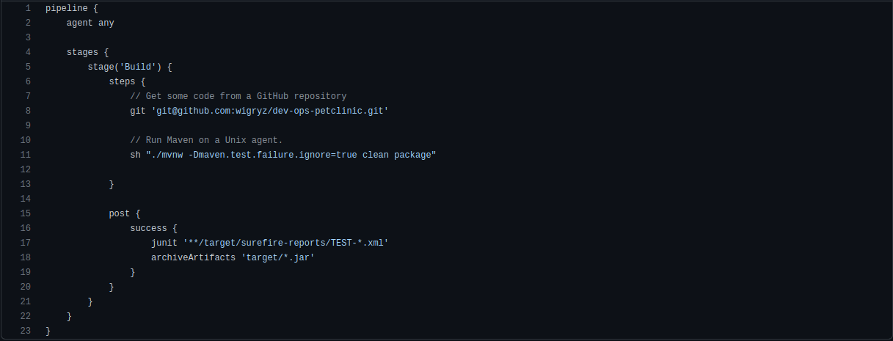

Utworzyłem na moim githubie repozytorium zawierające plik Jenkinsfile.

Stworzyłem pipeline, który pobiera umieszczone na wyżej wspomnianym repozytorium plik a następnie postępuje zgodnie z jego poleceniami.

Utworzyłem klucz ssh który podpiąłem pod githuba, oraz do jenkinsa tak, aby jenkins był w stanie sklonować moje repozytorium w trakcie wykonywania pipeline`a.
