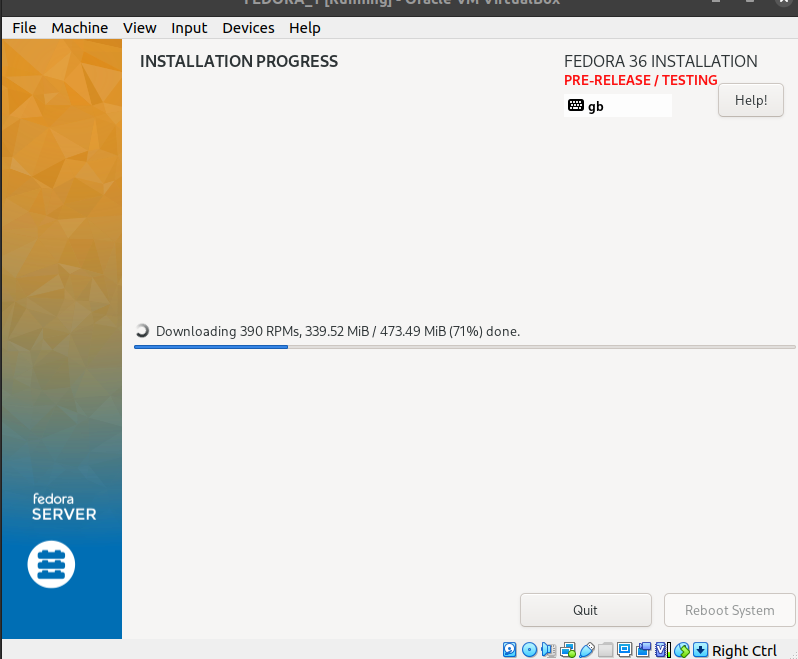
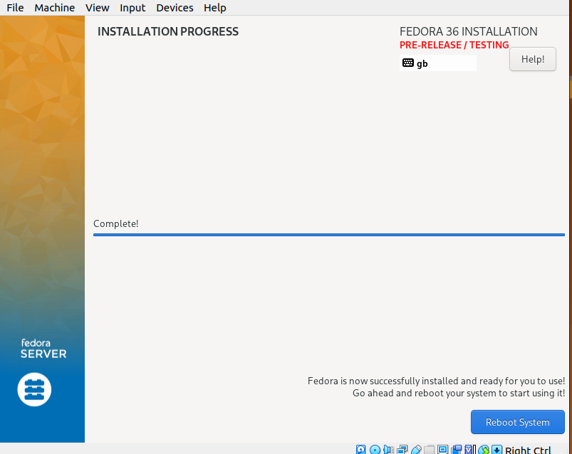
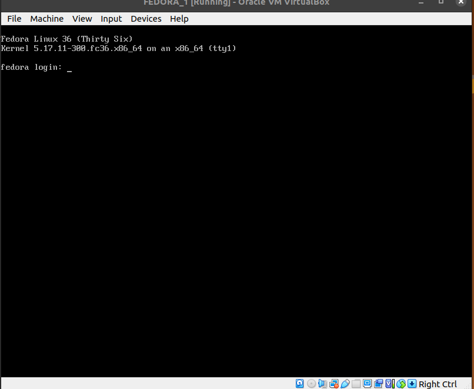
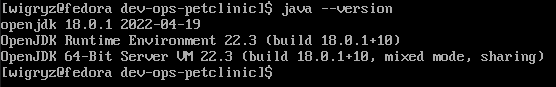
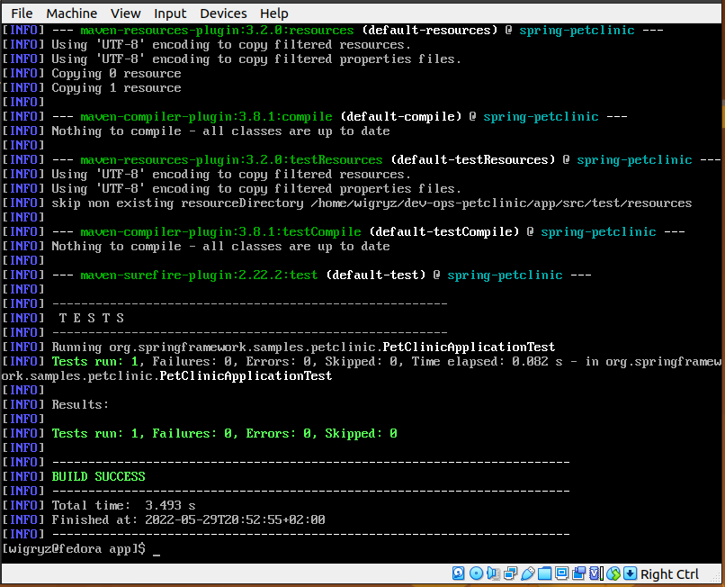
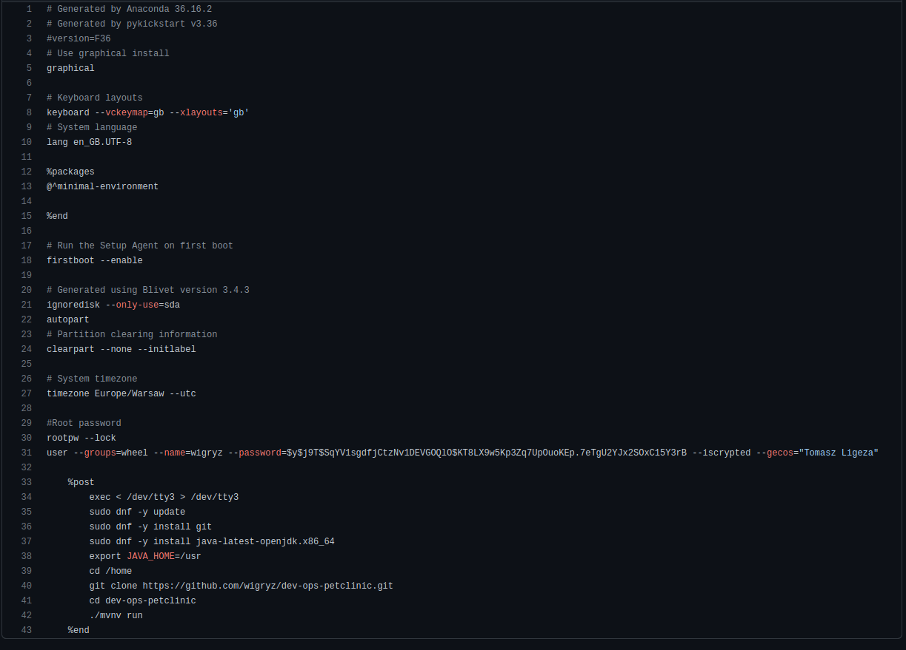
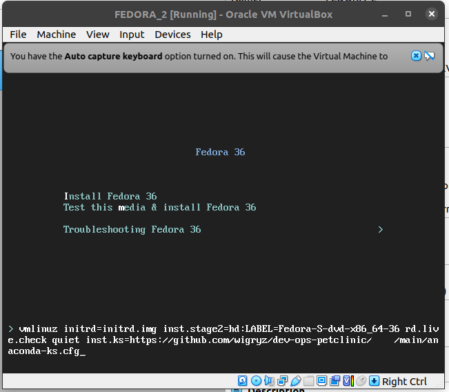
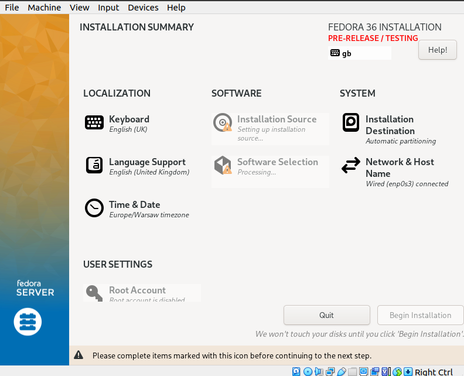
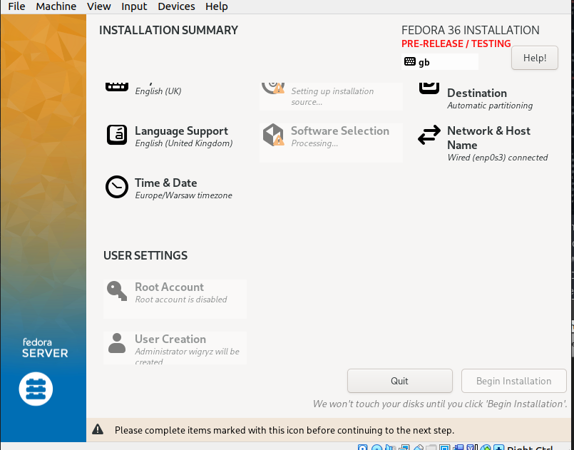

## Sprawozdanie

1. Pierwszym elementem zajęć było ręczne zainstalowanie systemu fedora na wirtualnej maszynie. W tym celu został pobrany obraz systemu fedora-server. Następnie uruchomiona została instalacja. Skonfigurowane zostało jedno konto użytkownika wigryz z hasłem 1234devops. Instalacja bazowała na minimalnym pakiecie systemu.

2. Po zakończonej instalacji na systemie zainstalowany został git, oraz java w wersji 18.

3. Następnie sklonowane zostało repozytorium na którym znajdował się zarówno kod źródłowy aplikacji jak i artefakt.
4. Uruchomione zostały testy, aby sprawdzić poprawność działania.

5. W celu przystąpienia do instalacji automatycznej musiałem przenieść plik kickstart anacondy z systemu fedora do hosta.

Zawiera on również krótki skrypt doinstalowujący git oraz javę w wersji 18, jak róœnież klonujący repozytorium.
6. Po skopiowaniu tego pliku został on wrzucony na repozytorium razem z aplikacją. Dzięki temu mogłem podać ścieżkę do niego tak, aby instalator systemu fedora mógł zaciągnąć ustawienia instalacji z poprzedniej instalacji.

7. Niestety wystąpił problem, którego nie udało mi się ominąć, mianowicie Installation Source blokował się przy ustawianiu źródła instalacji.

8. Pomimo błędu jestem w stanie stwierdzić, że konfiguracja systemu zaciągnęła się poprawnie, gdyż w ustawieniach użytkownika widnieje nazwa mojego użytkownika.

8. Po instalacji spróbowałem zalogować się do systemu przy pomocy loginu oraz hasła z poprzedniego systemu. Wylistowałem również pliki znajdujące się w katalogu /home.
