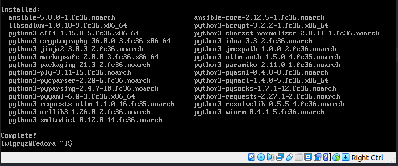
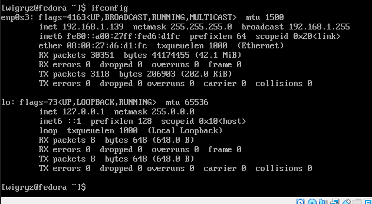
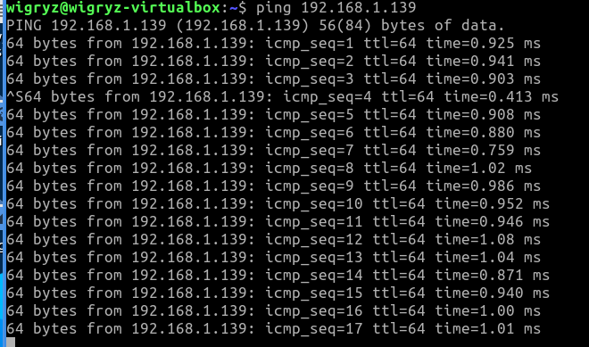

## Sprawozdanie

1. Zainstalowałem dwie maszyny wirtualne w tej samej sieci - jest to instancja fedory oraz ubuntu light.
2. Doinstalowałem ansible poprzez polecenie ```dnf --assumeyes install ansible```.

3. Połączyłem się za pomocą polecenia ping z jednej maszyny do drugiej.

