## Sprawozdanie

### 1. Instalacja klasta Kubernetes:
1. Ze strony https://minikube.sigs.k8s.io/docs/start/ wybieram odpowiedni dla mojego systemu plik instalacyjny.
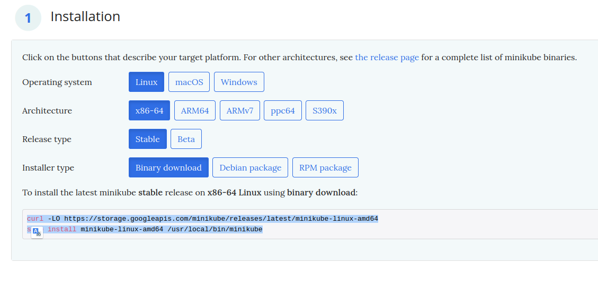
2. Nie posiadam pakietu curl, więc instaluję go poleceniem ```sudo apt install curl```.
3. Uruchamiam polecenie podane na stronie instalacji: 
```
curl -LO https://storage.googleapis.com/minikube/releases/latest/minikube-linux-amd64
   sudo install minikube-linux-amd64 /usr/local/bin/minikube
```
4. Uruchamiam Kubernetes poleceniem ```minikube start```. Następnie wypisuję listę aktywnych kontenerów poleceniem ```docker container list```.
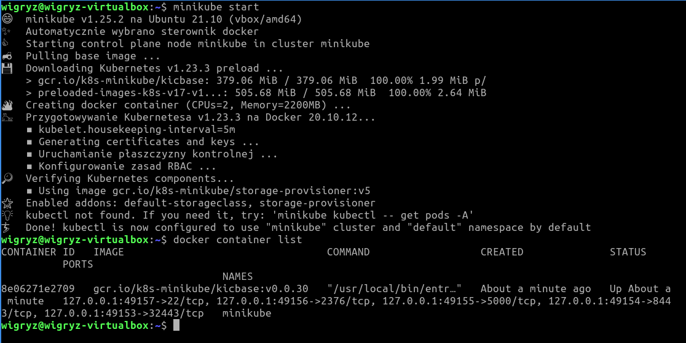
Jak widać kontener o nazwie minikube jest aktywny.
5. Ustawiam alias kubectl.
   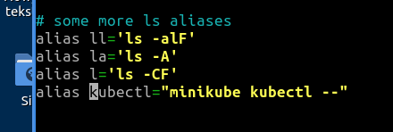
   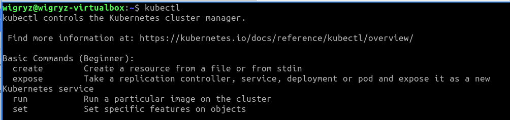
6. Uruchamiam dashboard i otwieram go w przeglądarce by zaprezentować łączność.
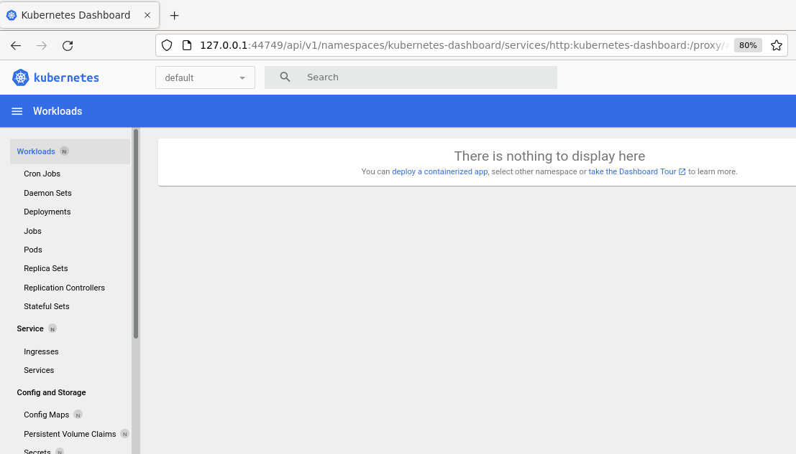

### 2. Analiza posiadanego kontenera:

1. W celu przygotowania obrazu Docker z moją aplikacją dodaję do kroku Deploy w moim pipeline komendy pushujące stworzony obraz na docker-hub.
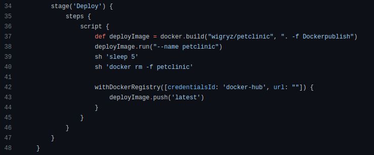
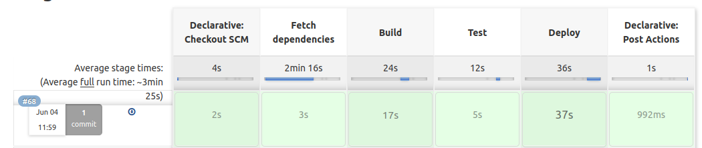
2. Następnie uruchamiam aplikację w kontenerze bez użycia kubernetesa:
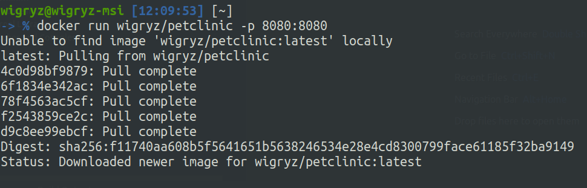
3. Uruchamiam przeglądarkę z adresem udostępnianego przez aplikację endpointu:
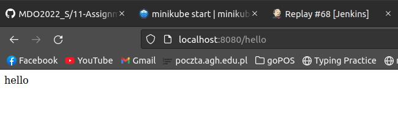
Opis kontenera w którym uruchomiona jest aplikacja:
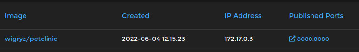
Wykazanie, że aplikacja działa w kontenerze:
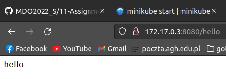


### 3. Uruchomienie oprogramowania:
1. Uruchamiam aplikację na stosie k8s poleceniem: <br>
```minikube kubectl run -- petclinic-xd --image=wigryz/petclinic --port=8080 --labels app=petclinic-xd```
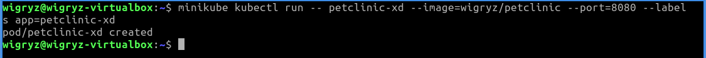
2. Stworzony pod działa:
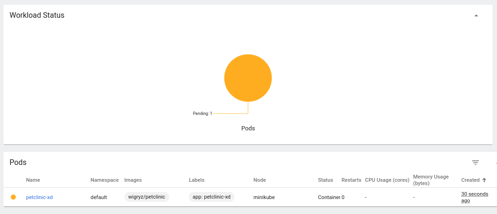
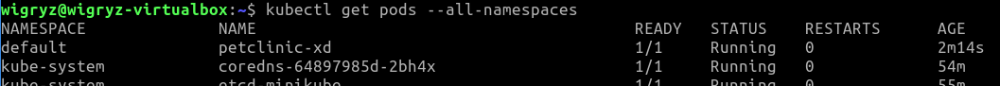
3. Eksponuję port aplikacji poleceniem:<br>
```kubectl port-forward petclinic-xd 8080:8080```<br>
Komunikuję się z nią na udostępnianym endpoincie.


### 4. Przekucie wdrożenia manualnego w plik wdrożenia (wprowadzenie)
1. Stworzyłem deployment poleceniem:
```kubectl create deployment petclinic-xd --image=wigryz/petclinic```<br>
```kubectl get deploy petclinic-xd -o yaml```
2. Uruchomiłem kubectl apply na pliku:
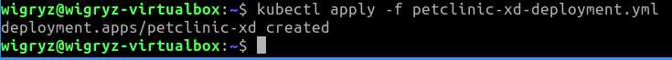
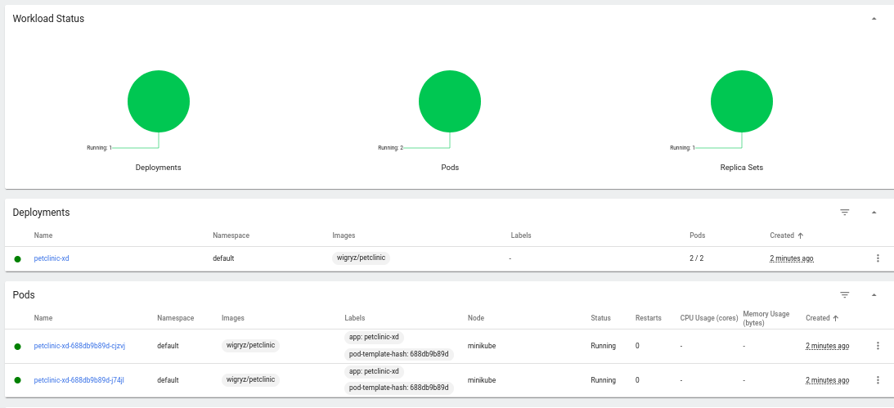
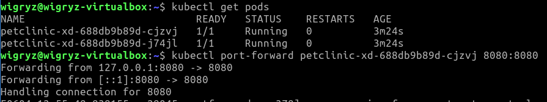

Zawartość pliku petclinic-xd-deployment.yml:
```yaml
apiVersion: apps/v1
kind: Deployment
metadata:
   name: petclinic-xd
   namespace: default
spec:
   selector:
      matchLabels:
         app: petclinic-xd
   replicas: 2
   template:
      metadata:
         labels:
            app: petclinic-xd
      spec:
         containers:
            - name: petclinic
              image: wigryz/petclinic
              ports:
                 - containerPort: 8080
```