## Sprawozdanie

### 1. Konwersja wdrożenia ręcznego na wdrożenie deklaratywne YAML:
1. Wdrożenie z poprzedniego lab wzbogacam o 4 repliki.<br>
<br>
3. Rozpoczynam wdrożenie za pomocą polecenia ```kubectl apply -f petclinic-xd-deployment.yml```:<br>
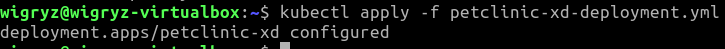<br>
4. Badam stan za pomocą ```kubectl rollout status```:<br>
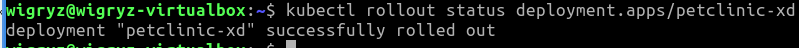<br>

### 2. Przygotowanie nowego obrazu:
1. Na potrzeby laboratorium tworzę failujący obraz. <br>
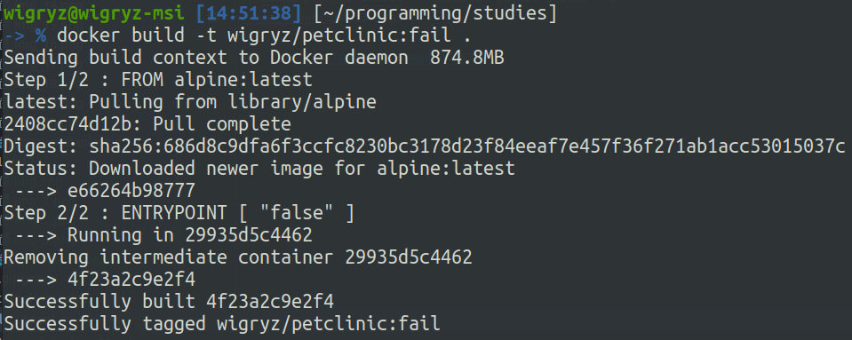<br>
oraz wrzucam go na docker-hub z tagiem wigryz/petclinic:fail<br>
<br>
2. Lista obrazów na docker-hub:<br>
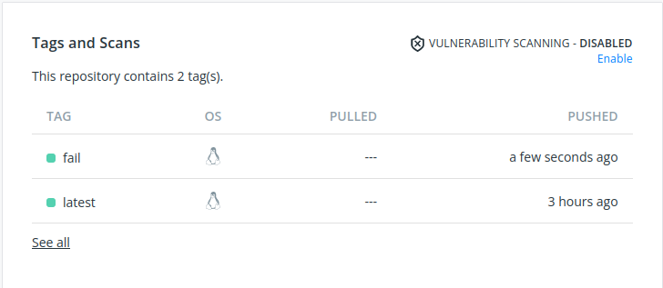<br>

### 3. Zmiany w deploymencie:
1. Zwiększam ilość replik:<br>
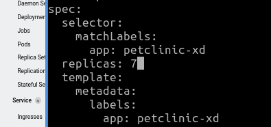<br>
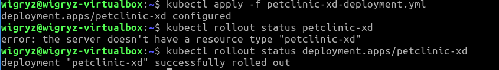<br>
2. Zmniejszam ilość replik do 1:<br>
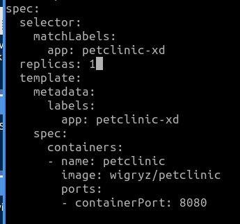<br>
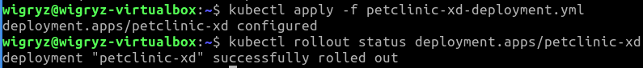<br>
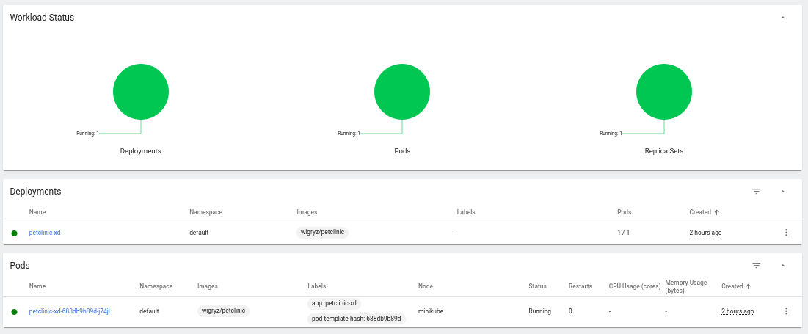<br>
3. Zmniejszam liczbę replik do 0:<br>
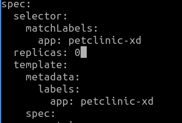<br>
<br>
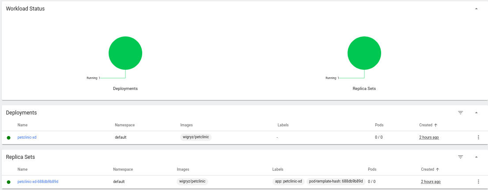<br>
4. Stosuję nową wersję (fail) obrazu (z ustawioną ilością replik na 1):<br>
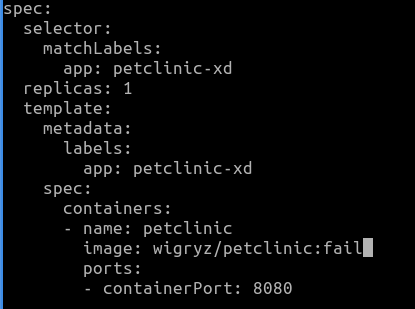<br>
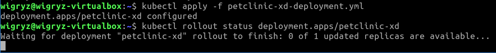<br>
Po upływie kilkunastu sekund ubiłem proces rollout status.<br>
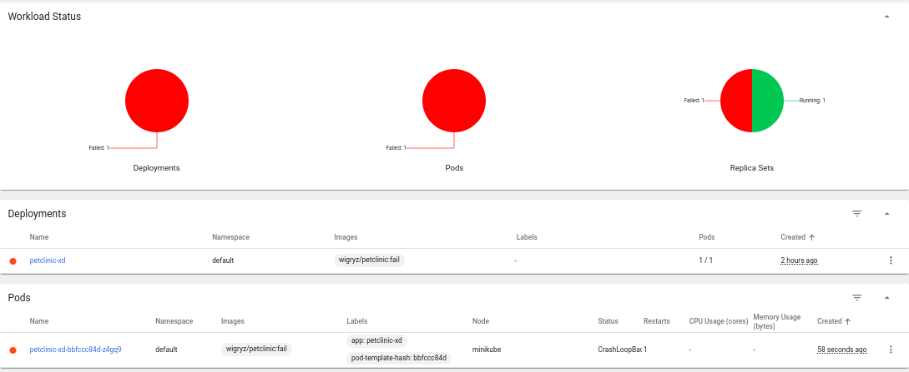<br>

5. Stosuję starą wersję obrazu (z ustawioną ilością replik na 1):<br>
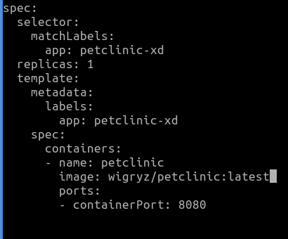<br>
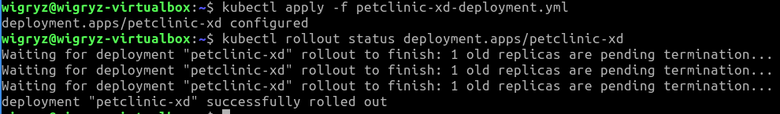<br>
Przez chwilę na dashboardzie widniały dwa pody przy czym ich limit wynosił 1.<br>

6. Wylistowuję rollout history poleceniem<br>
```kubectl rollout history deployment.apps/petclinic-xd```:<br>
<br>
Wypisuję szczegóły rollout revvision 2 poleceniem<br>
```kubectl rollout history deployment.apps/petclinic-xd --revision=2```:<br>
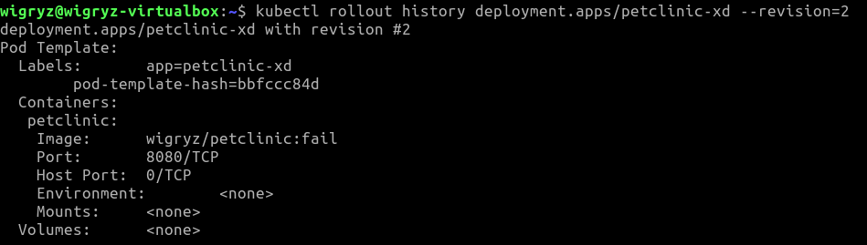<br>
Przywracam deployment do wersji --revision=2 poleceniem<br>
```kubectl rollout undo deployment.apps/petclinic-xd --to-revision=2```:<br>
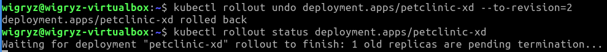<br>
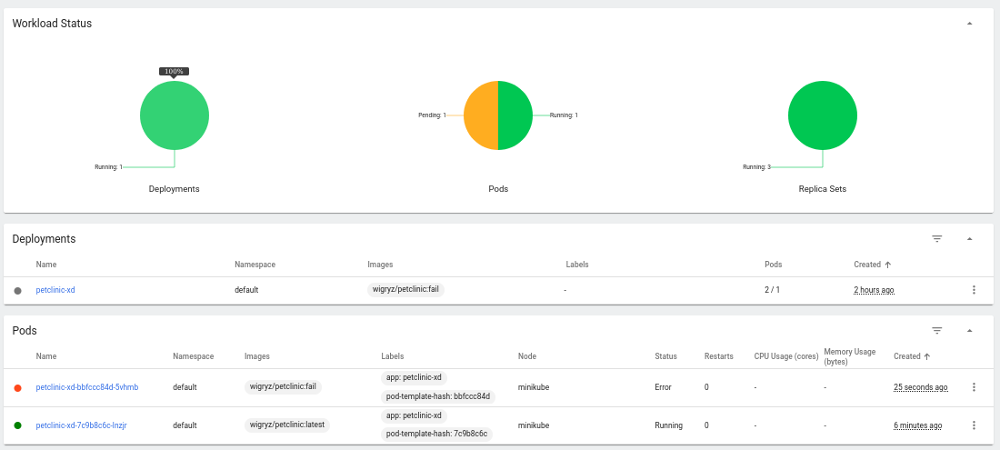<br>
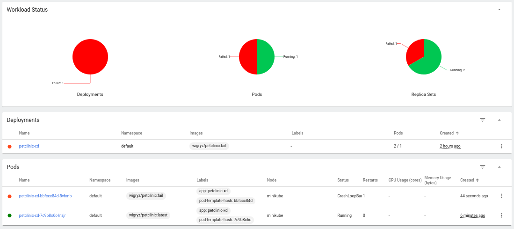<br>

### 4. Kontrola wdrożenia:
1. Napisałem skrypt sprawdzający czy dane wdrożenie przebiegło pomyślnie:
```bash
#!/bin/bash

if [ $# -ne 1 ]; then
	echo "This script requires 1 argument."
	exit
fi

deployment_name=$1

timeout 5 /usr/local/bin/minikube kubectl rollout status $deployment_name

if [ $? -eq 0 ]; then
	echo "Deployment was successful."
else
	echo "Deployment failed."
fi
```

Timeout jest ustalony na 5 sekund, żeby łatwiej było sprawdzić działanie skryptu.<br>
W przypadku powodzenia wyświetla komunikaty:<br>
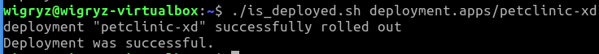<br>
W przypadku niepowodzenia wyświetla komunikaty:<br>
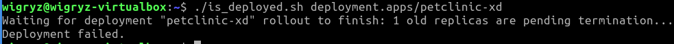<br>

### 4. Strategia wdrożenia:
1. Przygotowałem dwie wersje wdrożeń:
   1. Recreate:
      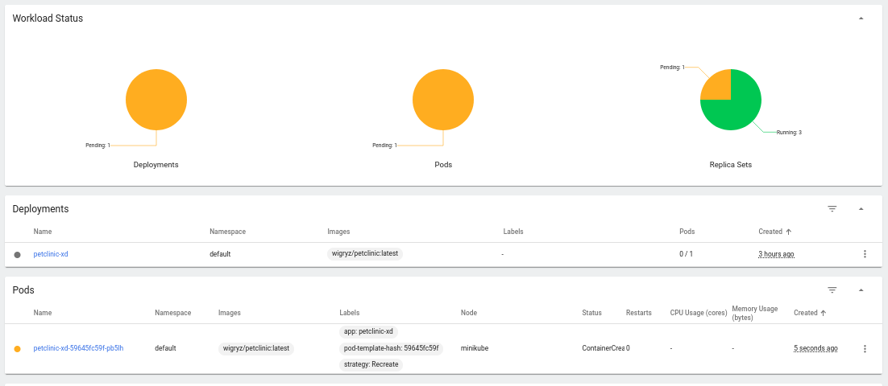<br>
      Najpierw usuwane są poprzednie pody, a następnie tworzone nowe. Powoduje chwilowy brak dostępu do aplikacji.
   2. Rolling Update:
      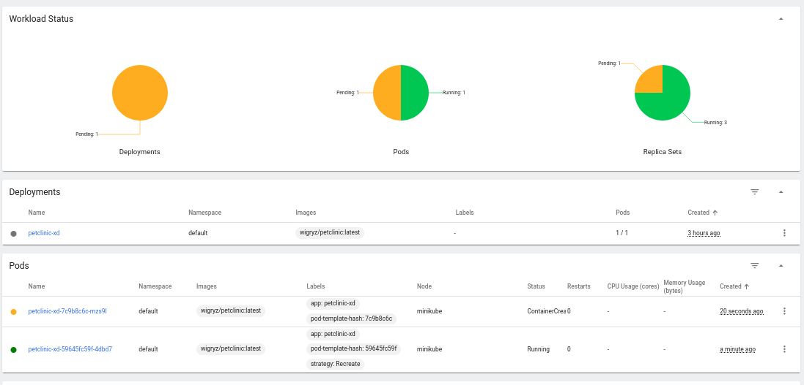<br>
      Najpierw tworzone są nowe pody, a następnie usuwane stare. Minimalizuje brak dostępu do aplikacji.
      

Historię komend zawiera plik history.txt.