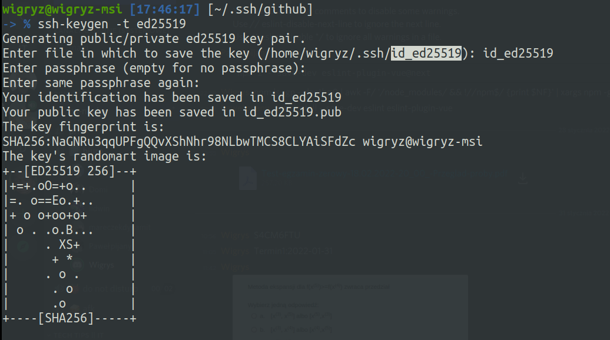
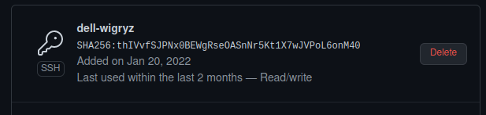
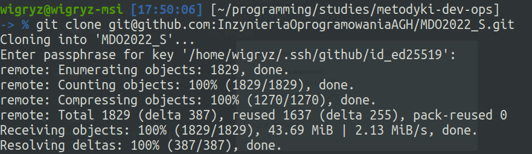
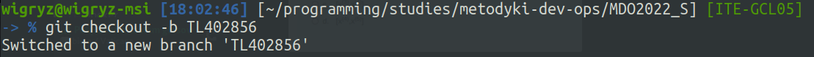

**LAB 1**

Nie pobierałem gita, ponieważ posiadałem już zainstalowanego.

Klonuję repozytorium za pomocą https:

Generuję klucz ssh ed25519 z hasłem:

Generuję klucz ssh ECDSA bez hasła:

Jak widać jeszcze nie mam dostępu do repozytorium przed konfiguracją klucza SSH na githubie.

Skonfigurowałem nowy klucz ssh na github:

Aktualizuję plik ~/.ssh/config:

Po zaktualizowaniu pliku ~/.ssh/config klonuję repozytium:

Zmieniam branch na main, a później na ITE-GCL05.

Tworzę branch TL402856:

Tworzę katalog o tej samej nazwie, oraz katalog lab_1:

