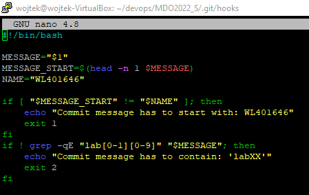
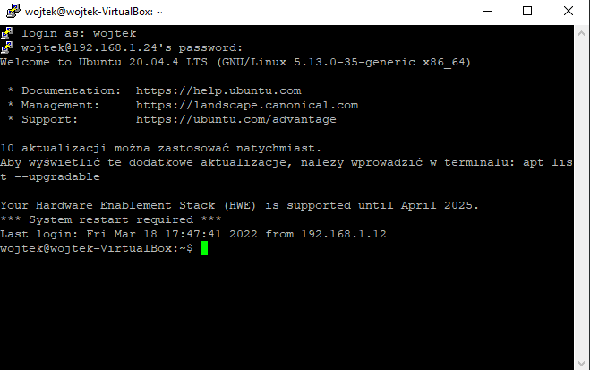
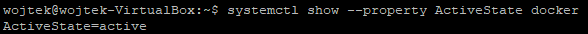

* Utworzenie pliku git-msg sprawdzającego poprawność commita (plik został dodany na gita)

* Praca z maszyną wirtualną odbywała się poprzez połączenie SSH przez Putty 
 
* Wykazanie poprawnego działania dockera na maszynie

> systemctl show --property ActiveState docker

 
* Pobranie Ubuntu, wyświetlenie jego numeru wersji oraz uruchomienie go w trybie interaktywnym
> sudo docker pull ubuntu
> 
> sudo docker images
> 
> sudo docker run -it ubuntu

 
* Utworzenie konta na Docker Hub
