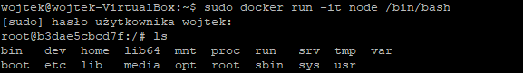
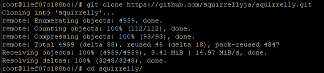
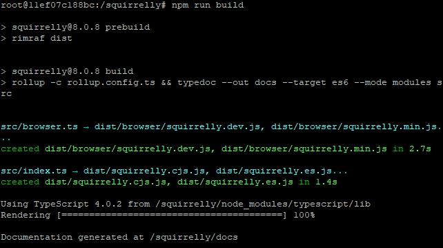
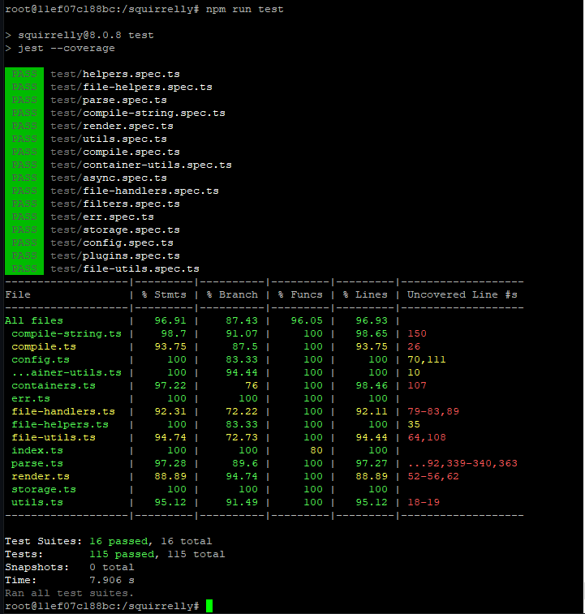
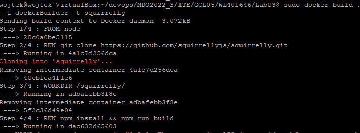
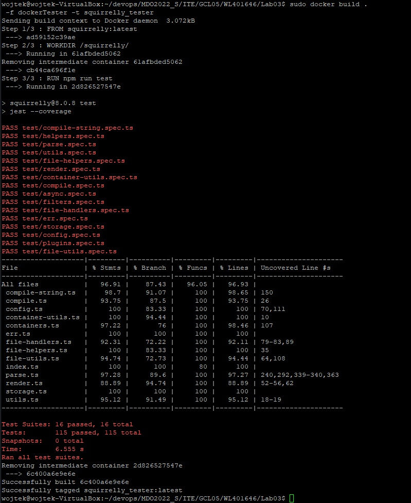
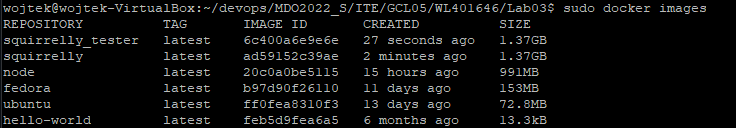
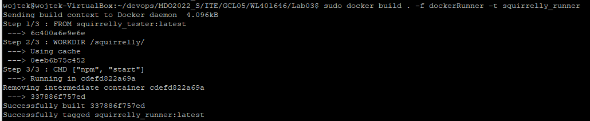
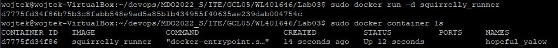

* Uruchomienie kontenera node w trybie interaktywnym 

> sudo docker run -it node

* Sklonowanie repozytorium

* Uruchomienie buildu

> npm run build

* Uruchomienie testów

> npm run test

* Utworzenie pliku dockerBuilder (załączony w plikach), który przeprowadza budowanie programu

>sudo docker build . -f dockerBuilder -t squirrelly 

* Utworzenie pliku dockerTester (załączony w plikach), który uruchamiał testy na bazie obrazu utworzonego za pomocą dockerBuilder

> sudo docker build . -f dockerTester -t squirrelly_tester

* Utworzenie pliku dockerRunner (załączony w plikach), który służył do wykonania komendy nmp start na podstawie wcześniejszego obrazu. Następnie uruchomiono kontener.

> sudo docker build . -f dockerRunner -t squirrelly_runner

> sudo docker run -d squirrelly_runner

