***Woluminy***

* Utworzenie woluminów wejściowych i wyjściowych

> sudo docker volume create input_vol
> 
> sudo docker volume create ouput_vol

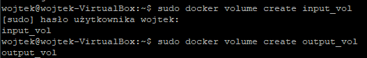

* Uruchomienie kontenera w trybie interaktywnym z zamontowanymi woluminami 

> sudo docker run -it --name builder_lab4 --mount "source=input_vol,target=/in" --mount "source=output_vol, target=/out" squirrelly bin/bash

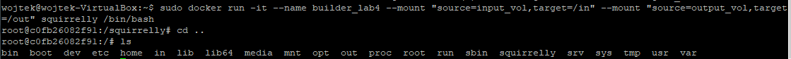

* Sklonowanie repozytorium na wolumin wejściowy

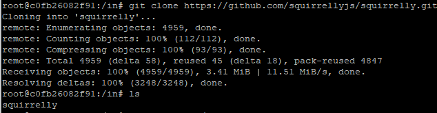

* Uruchomienie buildu w kontenerze

> npm run build

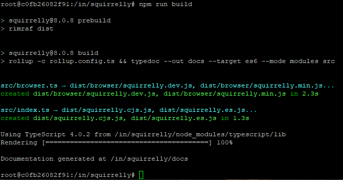

* Skopiowanie plików do woluminu wyjściowego

> cp squirrelly /out -r

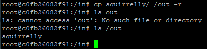

***iperf***

* Uruchomienie serwera iperf3 w kontenerze z Ubuntu

> iperf3 -s -p 2137

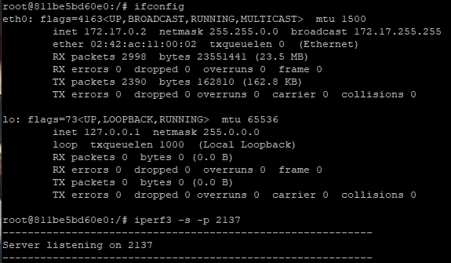

* Połączenie się za pomocą innego kontenera z Ubuntu

> iperf3 -c 172.17.0.2 -p 2137 

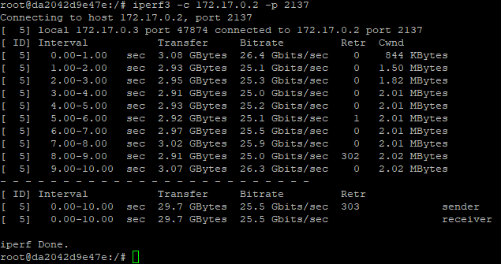

* Połączenie się za pomocą hosta

Jak możemy zauważyć połączenie się z serwerem Dockerowym przy pomocy hosta przyniosło poprawę 2 Gbit/s względem połączenia z użyciem innego kontenera.

***Jenkins***

* Utworzenie sieci dla Jenkinsa
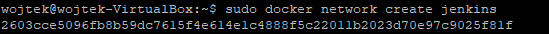
* Utworzenie kontenera docker:dind
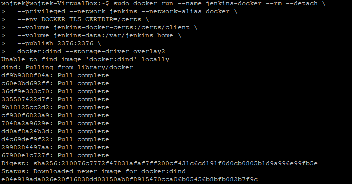
* Zbudowanie nowego obrazu z Dockerfile'a (dostępny w plikach)
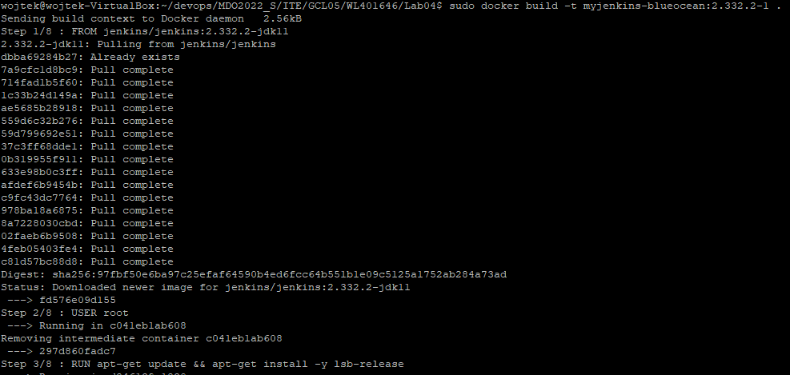
* Uruchomienie kontenera
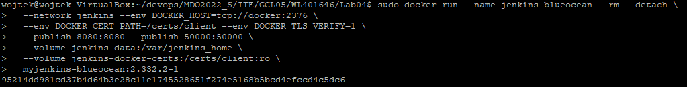
* Działający Jenkins
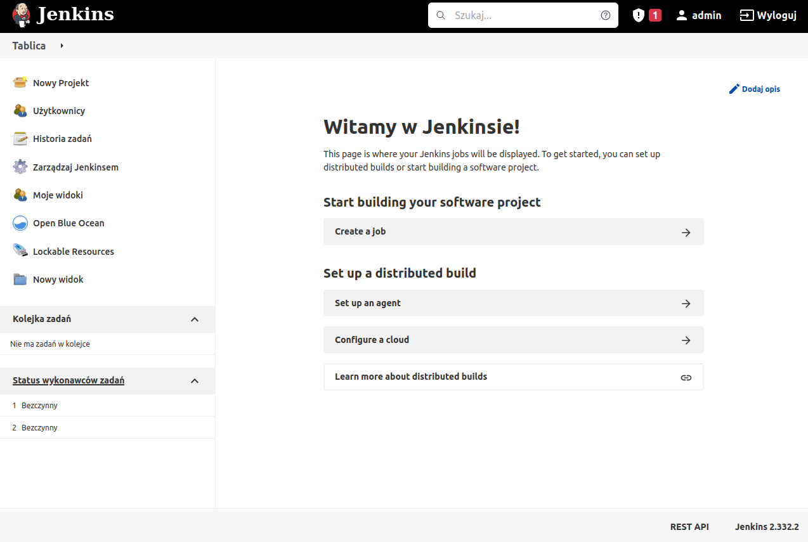