**Cel ćwiczenia**

Celem laboratorium było przeprowadzenie instalacji Fedory w sposób nadzorowany oraz nienadzorowany wraz z instalacją artefaktu przygotowanego przez Jenkinsa.

Wszystkie pliki anaconda-ks.cfg tak jak i logi Jenkinsa znajdują się w repozytorium wraz z tym sprawozdaniem.

**Instalacja Fedory**

Fedora została zainstalowana przez obraz netinstall wraz softwarem dla serwera. Utworzony został użytkownik *client* wraz uprawnieniami administratora.
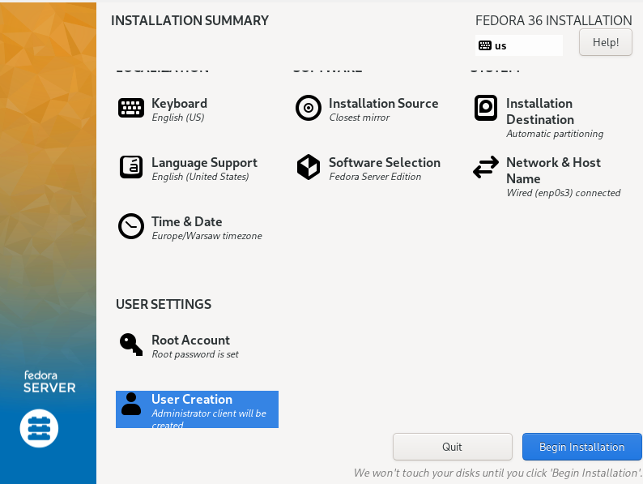
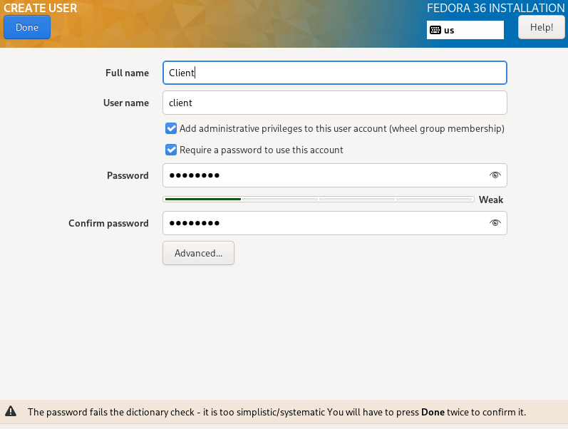

Na systemie zainstalowano usługę httpd
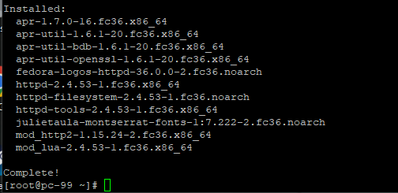

Usługa została uruchomiona
> systemctl enable httpd --now

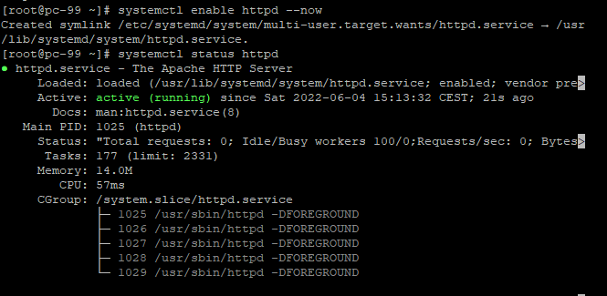

Http zostało dodane do firewalla aby umożliwić dostęp

> firewall-cmd --permanent --add-service=http && firewall-cmd --reload

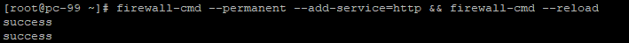

Następnie utworzono kolejną maszynę wirtualną z Fedorą, bliźniaczą do poprzedniej na której pobrano artefakt z programem, który znajdował się na utworzonym serwerze http. Następnie rozpakowano paczkę i zainstalowano zależności 

> wget http://192.168.1.36/artifacts/nodejs.org-1.0.0.tgz
> 
> tar -xzf nodejs.org-1.0.0.tgz 
> 
> cd package
> 
> npm install

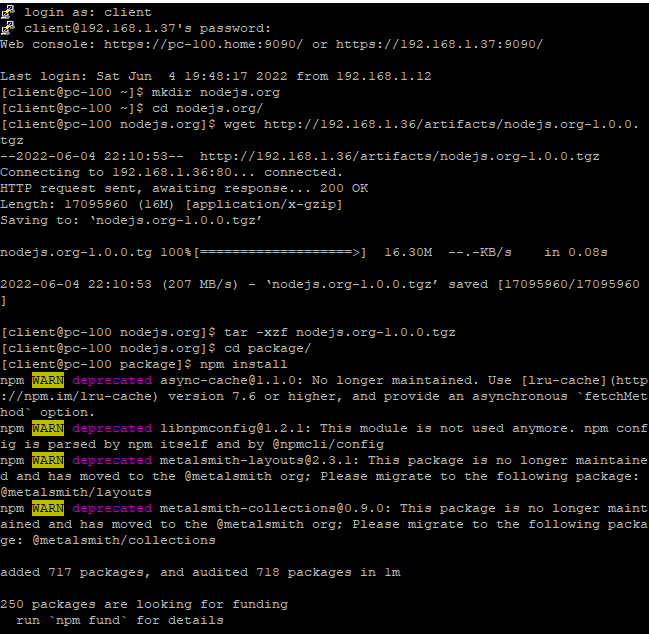

Następnie uruchomiono aplikację 
> npm start

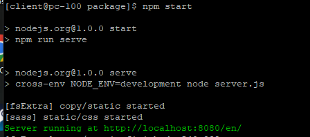

**Modyfikacja pipeline'u w celu automatycznego wysyłania plików na serwer**

Następnym krokiem była modyfikacja pipeline'u, aby wysyłał automatycznie artefakt na serwer utworzony wcześniej.

W tym celu utworzono klucze SSH z czego publiczny został wysłany na serwer. Na Jenkinsie dodano plugin ssh-agent, który pozwolił na dodanie prywatnego klucza SSH jako Credential oraz komunikację SSH ustanowioną w pipelinie Jenkinsa. 

W Jenkinsfile zmodyfikowany został krok Publish, który poprzez wykorzystanie pluginu ssh-agent mógł ustanowić połączenie SSH z serwerem. Dwie pierwsze linie są konieczne, aby wstawić klucz prywatny w odpowiednie miejsce oraz ustanowić jego prawa, jak również dodać serwer do pliku known_hosts. Bez tego weryfikacja SSH nie powiodłaby się. Kolejne linie tworzą folder na artefakt oraz kopiują artefakt przygotowany w kroku Build na serwer.

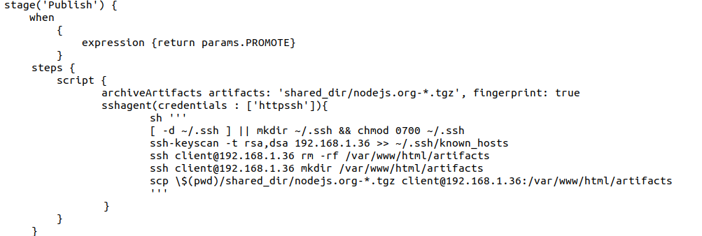
Wynik działania pipeline

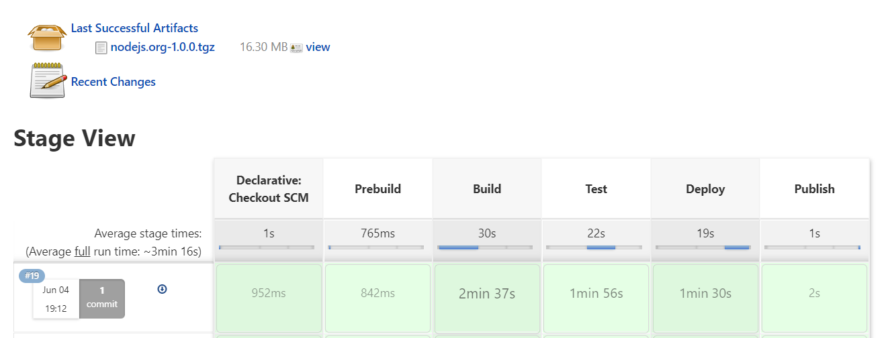
Artefakt wysłany na serwer 

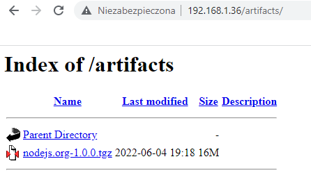

**Instalacja nienadzorowana Fedory**

W celu instalacji nienadzorowanej wyciągnięto plik anaconda-ks.cfg z folderu /root oraz zmodyfikowano go dodając linki do repozytorium, zmieniając tryb instalacji na tekstowy oraz dodając do instalowanych pakietów nodejs. 

Dodatkowo dopisana została sekcja %post, która odpowiadała za pobranie artefaktu z serwera http, a następnie jego rozpakowanie oraz instalacje dependencji, analogicznie jak to było dla instalacji nadzorowanej.
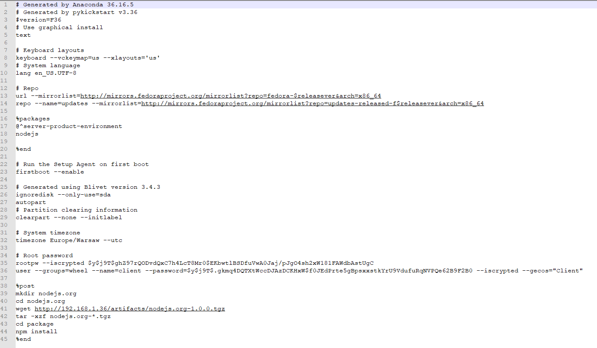

Następnie plik anaconda-ks.cfg udostępniony został na serwerze http, a instalacja została przeprowadzona przez podanie tego pliku instalatorowi.

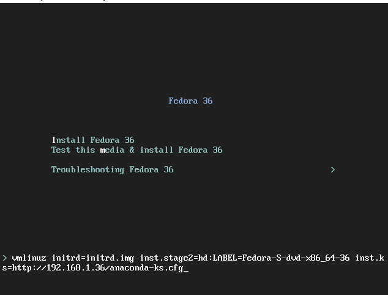

Zakończona automatyczna instalacja Fedory
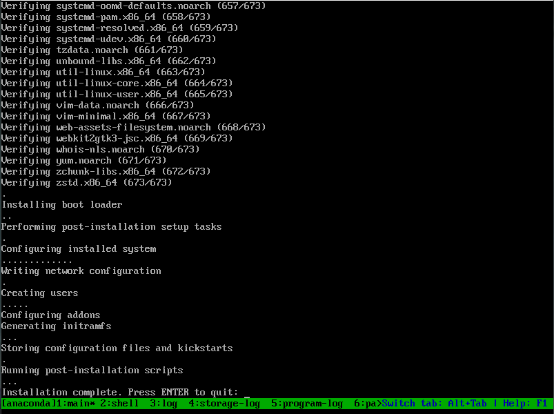

W celu sprawdzenia poprawności instalacji, po zainstalowaniu systemu zalogowano się na konto *client*, a następnie uruchomiono aplikację.
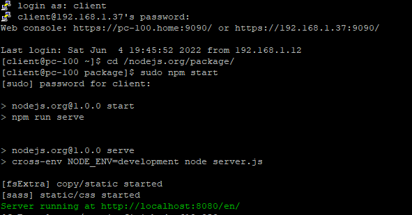