# Sprawozdanie 1:

### Zadanie 1:

- Instalacja klienta Git:

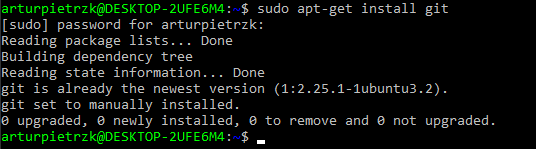

-Utworzenie klucza SSH

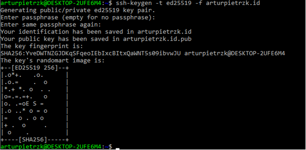

### Zadanie 2:

-Sklonowanie repozytorium za pomoca HTTPS:

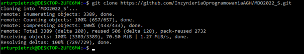
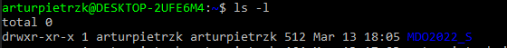

### Zadanie 3:

-Utworzenie dwoch kluczy z wykorzystaniem kodowania ed25519, drugi klucz został zabezpieczony hasłem

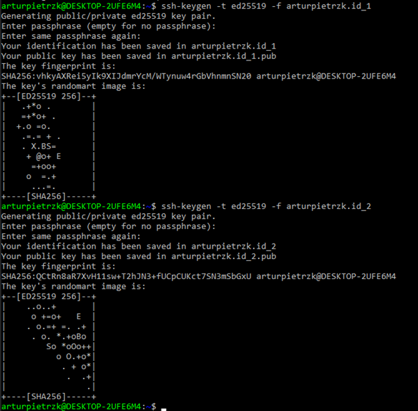

-Skonfigurowanie klucza SSH jako metode dostepu do Githuba

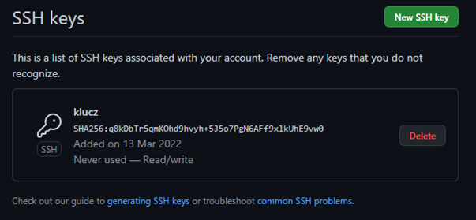

-Sklonowanie repozytorium z wykorzystaniem protokołu SSH

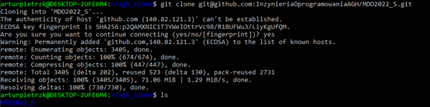

### Zadanie 4:

-Przelaczenie na gałąź main a potem na gałąź swojej grupy

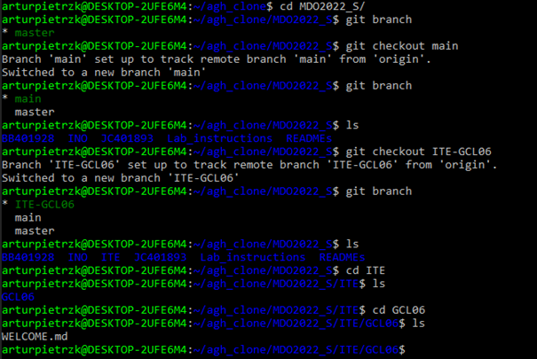

### Zadanie 5:

-Utworzenie nowej gałęzi o nazwie AP304152

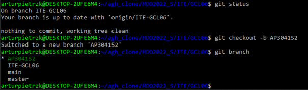

### Zadanie 6:

-Stworzenie własnych folderów oraz plików ze sprawozdaniem

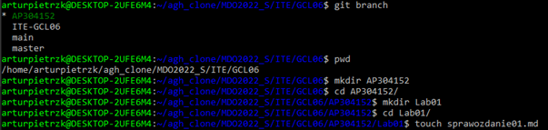

-Wysłanie zmian do zdalnego źródła, utworzenie commita oraz push

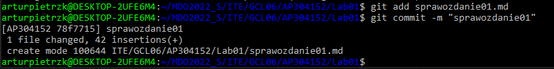
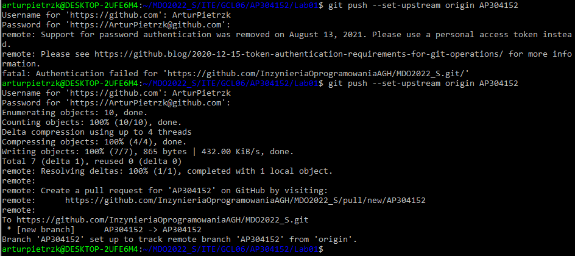

-Wciągnięcie utworzonej gałęźi do gałęzi grupowej:

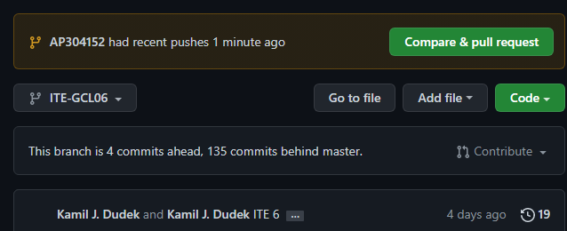

-Utworzenie nowego pull request:

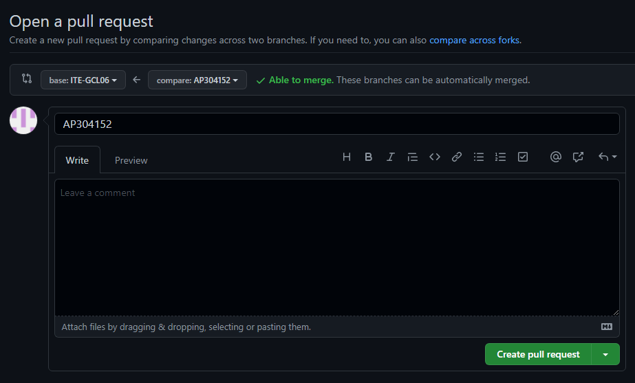
