# Sprawozdanie 2

### Zadanie 1

-Utworzenie wymaganych folderów
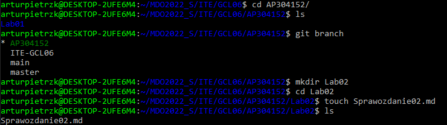

-Hook sprawdzający czy tytuł commita nazywa się <AP304152> tak jak nasz branch oraz czy w treści commita znajduję się numer laboratorium
  
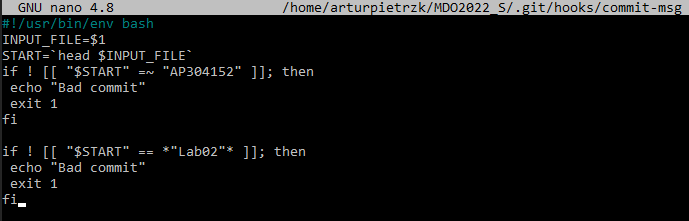

-Przetestowanie działania
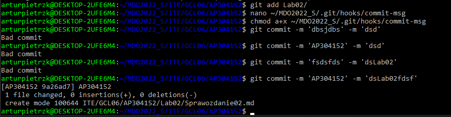

  
  ### Zadanie 2
-Zawartość commit-msg:
  
  #!/usr/bin/env bash

INPUT_FILE=$1

START=head $INPUT_FILE

if ! [[ "$START" =~ "JP300987" ]]; then

echo "Bad commit"

exit 1

fi

if ! [[ "$START" == *"Lab02"* ]]; then

echo "Bad commit"

exit 1

fi
  
### Zadanie 3
  -Wykorzystano WSL, dzięki czemu nie ma potrzeby konfiguracji SSH
  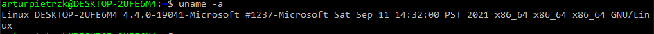
  
  
  -Sprawdzenie w Windows PowerShell działających dystrybucji Linux'a oraz ich wersji i  ewentualna zmiana wersji wsl z 1 na 2:
  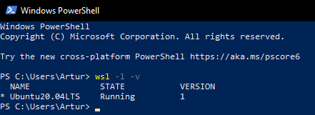
  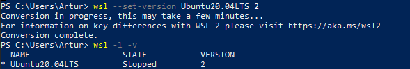
  
  
  -Instalowanie środowiska Dockerowego:
  
  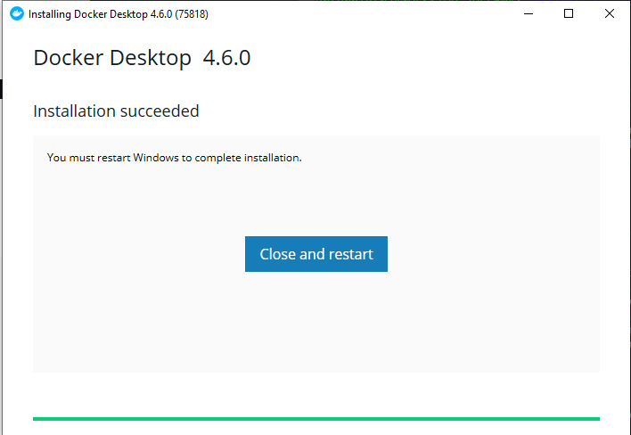
  
  
  -Następnie należy przejść do ustawień i sprawdzić czy jest włączona integracja dla WSL:
  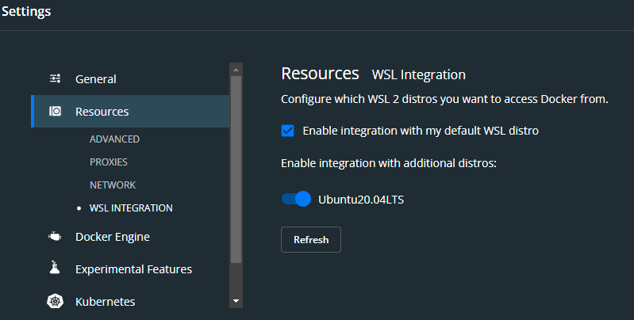
  
  
  ### Zadanie 4
  Przetestowanie działania środowiska:
  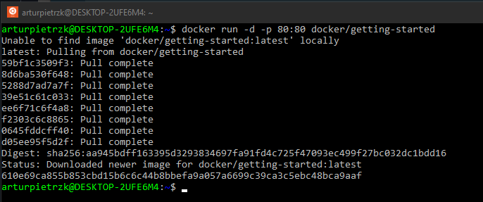
  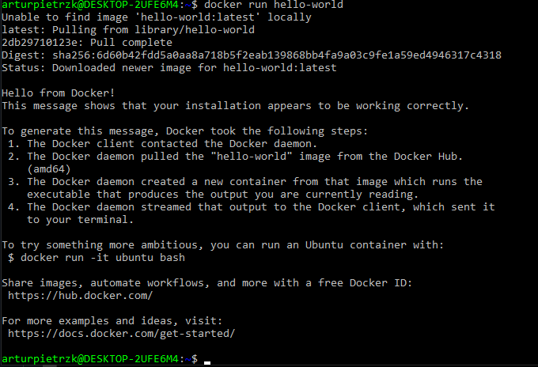
  
  
  -Wykazanie, że środowisko dockerowe jest uruchomione i działa(z definicji):
  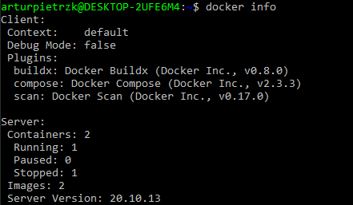
  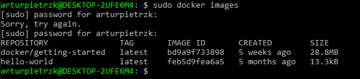
  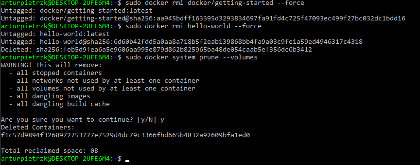
  
  
   -Wykazanie, że środowisko dockerowe jest uruchomione i działa(sposób praktyczny):
  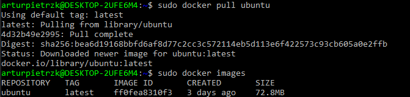
  
  
  -Uruchomienie dystrybucji Ubuntu i wyświetlenie numeru wersji:
  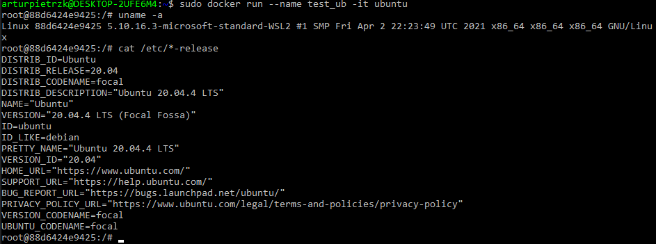
  
  
  ### Zadanie 5
  -Założenie konta na DockerHub
  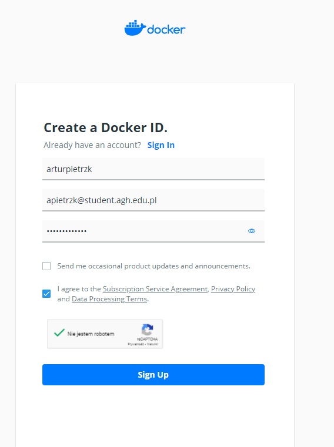
  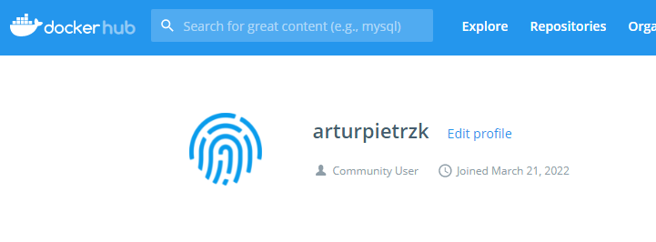
