# Zajęcia 01

### 1. WSL Ubuntu zawiera preinstalowanego klienta Git oraz obsługę SSH
### 2. Sklonowano repo poprzez HTTPS

### 3. Dostęp poprzez SSH

   - utworzenie kluczy 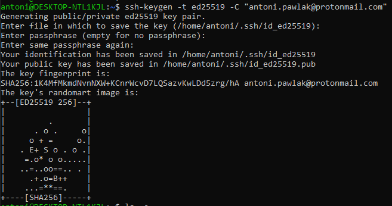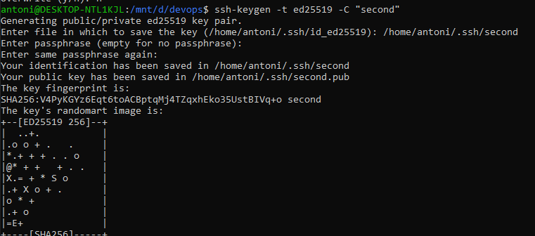
   - skopiowanie klucza publicznego 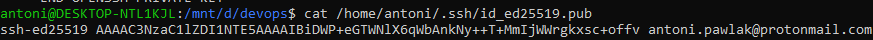
   - dodanie klucza do githuba 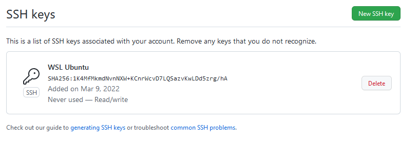
   - dodanie klucza do klienta ssh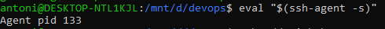 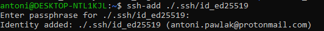
   - sklonowanie repo poprzez SSH 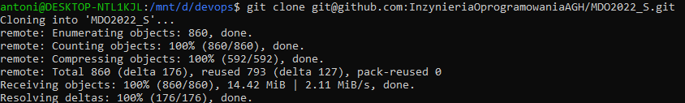

### 4. Git checkout
    
    - main 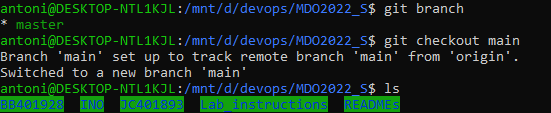
    - gałąź grupy 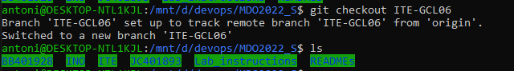

### 5. Przełączenie na swoją gałąź 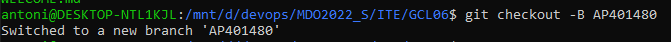
### 6. Praca na gałęzi
    
    -utworzenie potrzebnych katalogów 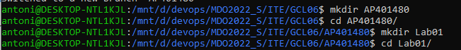
    -dodanie pliku ze sprawozdaniem 

