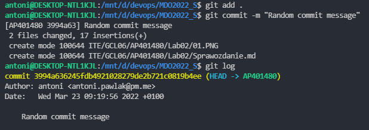
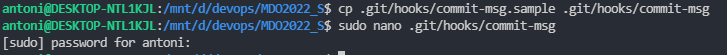
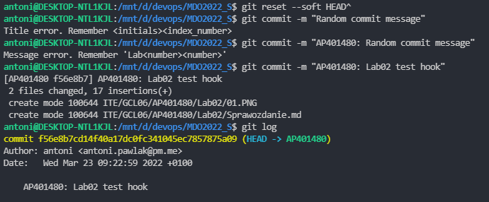
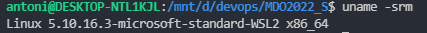
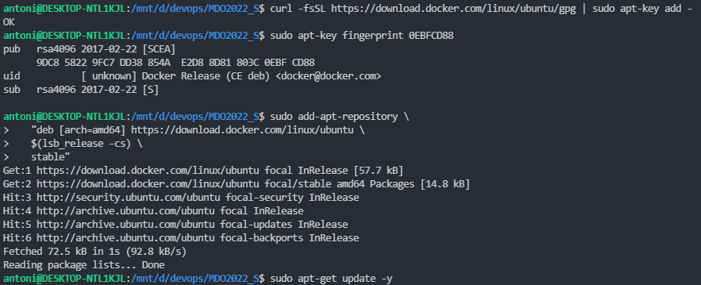
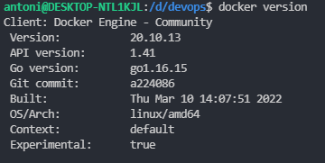
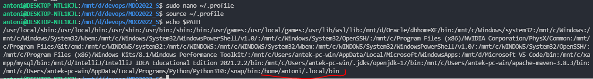
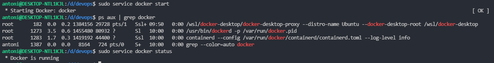
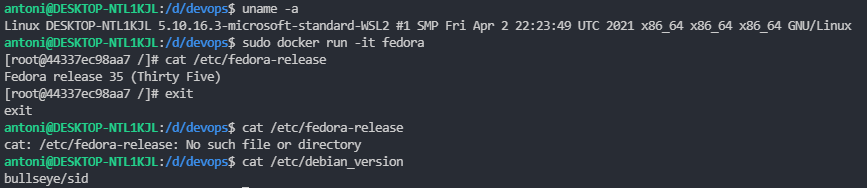

# Laboratorium 02

## 1. Przygotowanie git hook'a

przed stworzeniem git hook możemy dodać dowolny commit message 



tworzymy plik ./git/hooks/commit-msg 



umieszczamy wewnątrz kod z [punktu 2](#2-kod-git-hooka)

sprawdzamy działanie naszego hook'a



## 2. Kod git hook'a
   
```bash
#!/bin/bash

if grep -q -w -v  "AP401480" $1
then
echo "Title error. Remember <initials><index_number>"
exit 1
fi

path=`git diff --cached`
echo "$path" | grep -o 'Lab[0-9][0-9]'
lab_num=`echo "$path" | grep -o 'Lab[0-9]*'`

if grep -q -v lab_num $1
then 
echo "Message error. Remember 'Lab<number><number>'"
exit 1
fi
```

## 3. Przygotowujemy środowisko Docker'owe

do wykonania zadania został wykorzystany WSL



dodajemy repozytorium dockera i instalujemy



zainstalowano dockera



dodajemy user'a do odpowiedniej grupy, aby mieć dostęp bez root'a


dodajemy nowy folder do zmiennej środowiskowej PATH



## 4. Działanie środowiska Dockerowego

poniższymi komendami wykazujemy, że środowisko jest uruchomione i działa




wykazujemy, że nasze środowisko działa poprzez pobranie obrazu Fedory




## 5. Założono konto na Docker Hub
   


