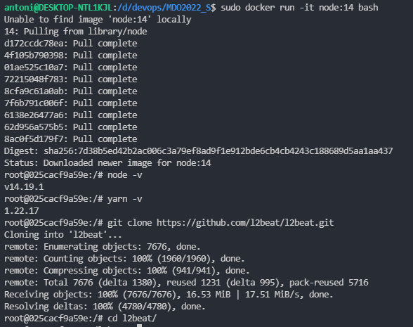
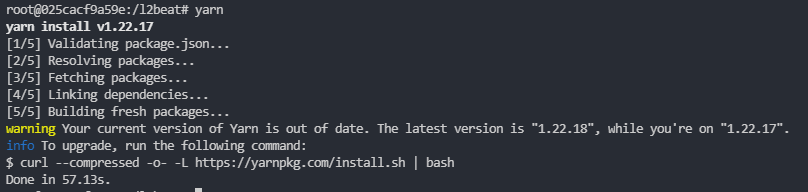
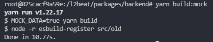
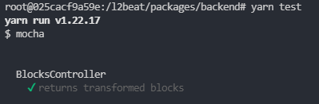
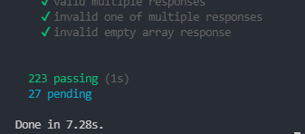
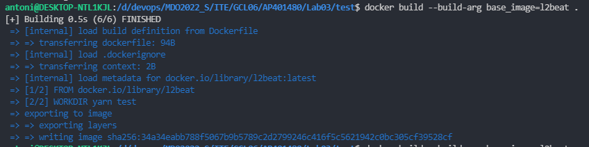
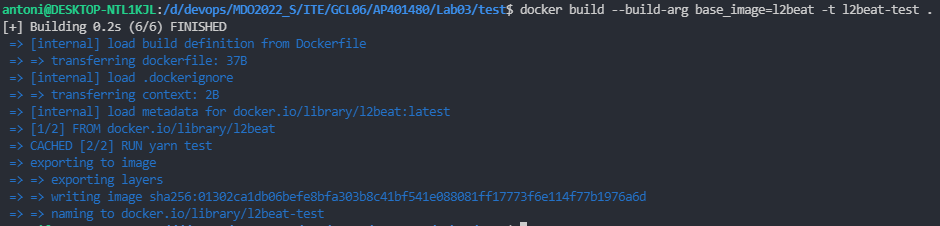
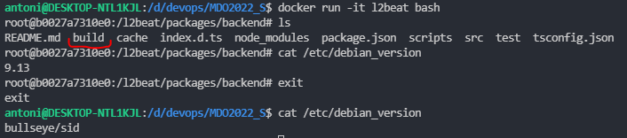
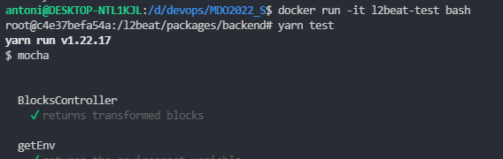
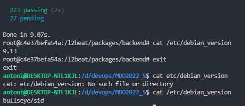

# Laboratorium 03

## 1. Wykonanie kroków ręcznie

### uruchomiono kontener i sklonowano repo

### zainstalowano potrzebne dependency

### uruchomiono build

### uruchomiono testy

## 2. Tworzenie plików Dockerfile

### build image
na podstawie [Dockerfile](./build/Dockerfile) zbudowano obraz kontenera do build'u

### test image
na podstawie [Dockerfile](./test/Dockerfile) zbudowano kontener do testów, oparty na poprzednim

## 3. Sprawdzanie działania kontenera

### build container
uruchamiamy kontener w trybie interaktywnym i sprawdzamy wersję debiana, jak widać jest inna niż wersja w WSL

### test container
uruchamiamy kontener w trybie interaktywnym i sprawdzamy wersję debiana, jak widać jest inna niż wersja w WSL, dodatkowo uruchamiamy testy

