# Laboratorium 04

## Zachowywanie stanu

### tworzymy wolumeny za pomocą komendy` docker volume create`
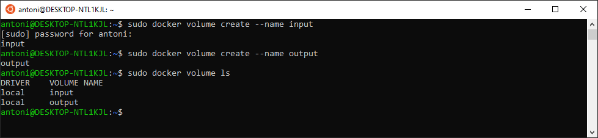

### sprawdzamy poprawność utworzenia komendą `docker volume inspect`
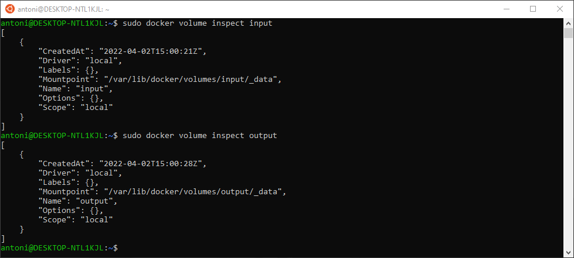

### uruchamiamy kontener i dołączamy do niego volumeny za pomocą flagi `-v <name>:<mounting-point>`

### klonujemy repozytorium z poziomu systemu Windows
odnalezienie lokalizacji volumenów wybranej przez Docker Desktop okazało się nie do końca trywialne, po tej przygodzie podjęto decyzję o instalacji dockera wewnątrz Ubuntu
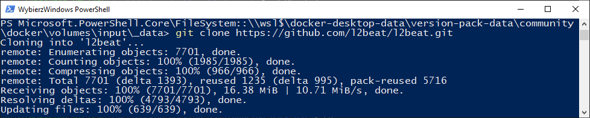

### uruchamiamy build w kontenerze
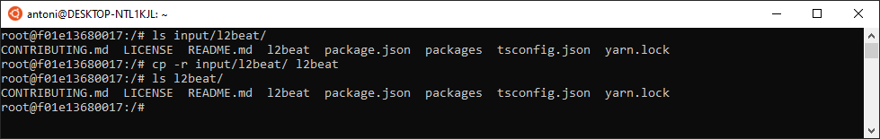
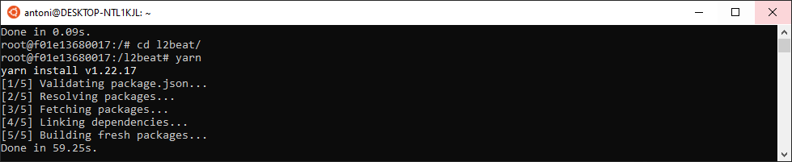
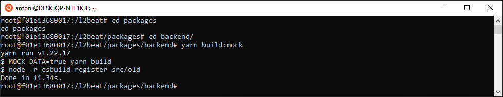

### kopiujemy output na volumen wyjściowy
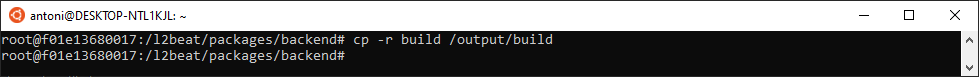
wynik builda jest dostępny z poziomu hosta
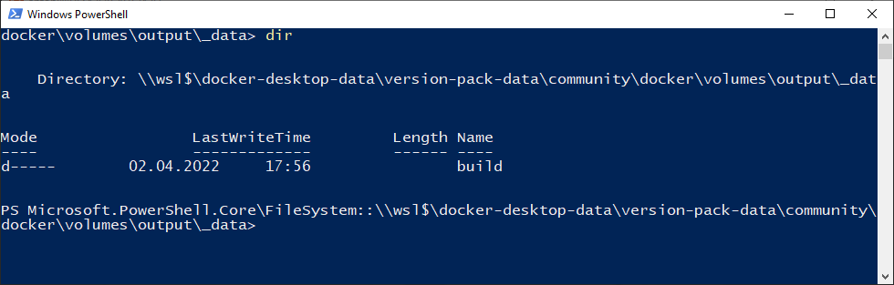

## Eksponowanie portu

### uruchamiamy kontener z udostępnionym portem `-p <host-port>:<container-port>`
instalujemy `net-tools` w celu zbadania adresu IP oraz `iperf3` w celu zbadania przepustowości połączenia
uruchamiamy serwer iperf3 na porcie `1234` 
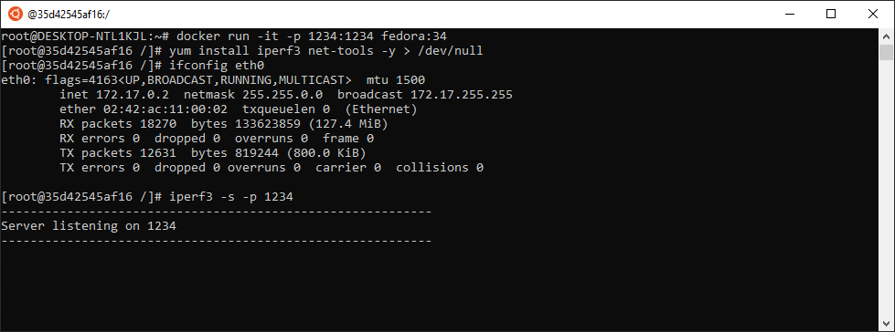

### badamy przepustowość z drugiego kontenera
wykonujemy podłączenie klientem `iperf -c` z kontenera znajdującego się w tej samej sieci co serwer
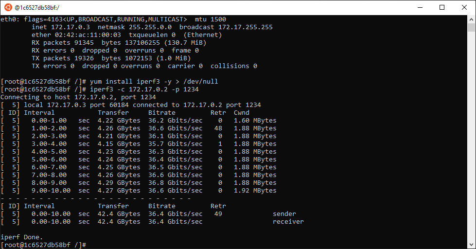

### badamy przepustowość z hosta
wykonujemy test z poziomu WSLa
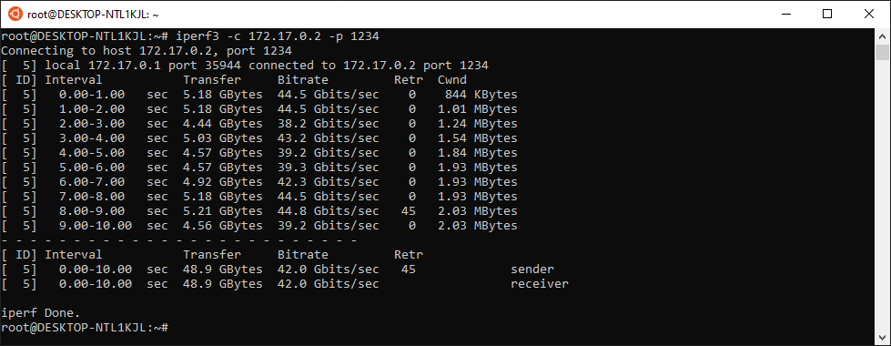

### badamy przepustowość z poza hosta 
wykonujemy test z poziomu Windowsa
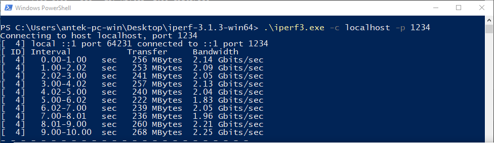

### zestawienie przepustowości

| docker-docker| docker-wsl| docker-win |
|--------------|-----------|------------|
| ~ 37 Gb/s    | ~ 42 Gb/s | ~ 2Gb/s    |

przepustowość spoza hosta jest o rząd wielkości mniejsza, co ciekawe, przepustowość z WSLa jest większa niż z sieci Dockerowej

## Instancja Jenkins
wykonujemy kroki z dokumentacji Jenkinsa

### tworzymy sieć i uruchamiamy obraz docker-in-docker
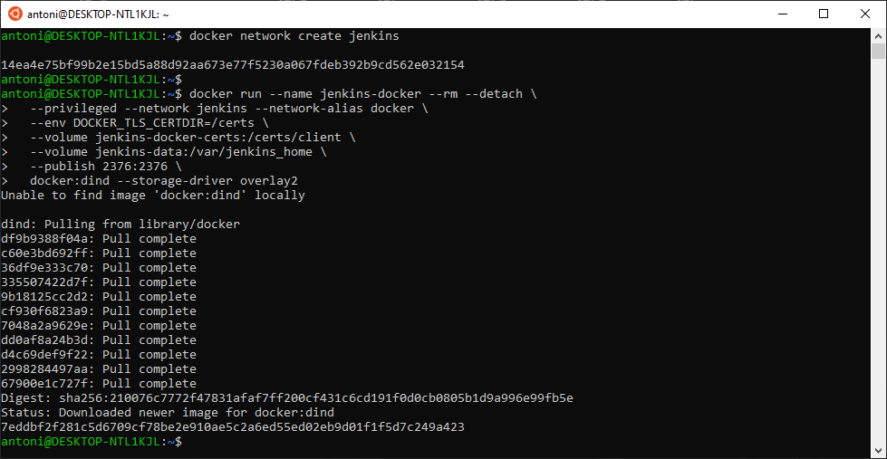

### tworzymy customowy obraz jenkinsa
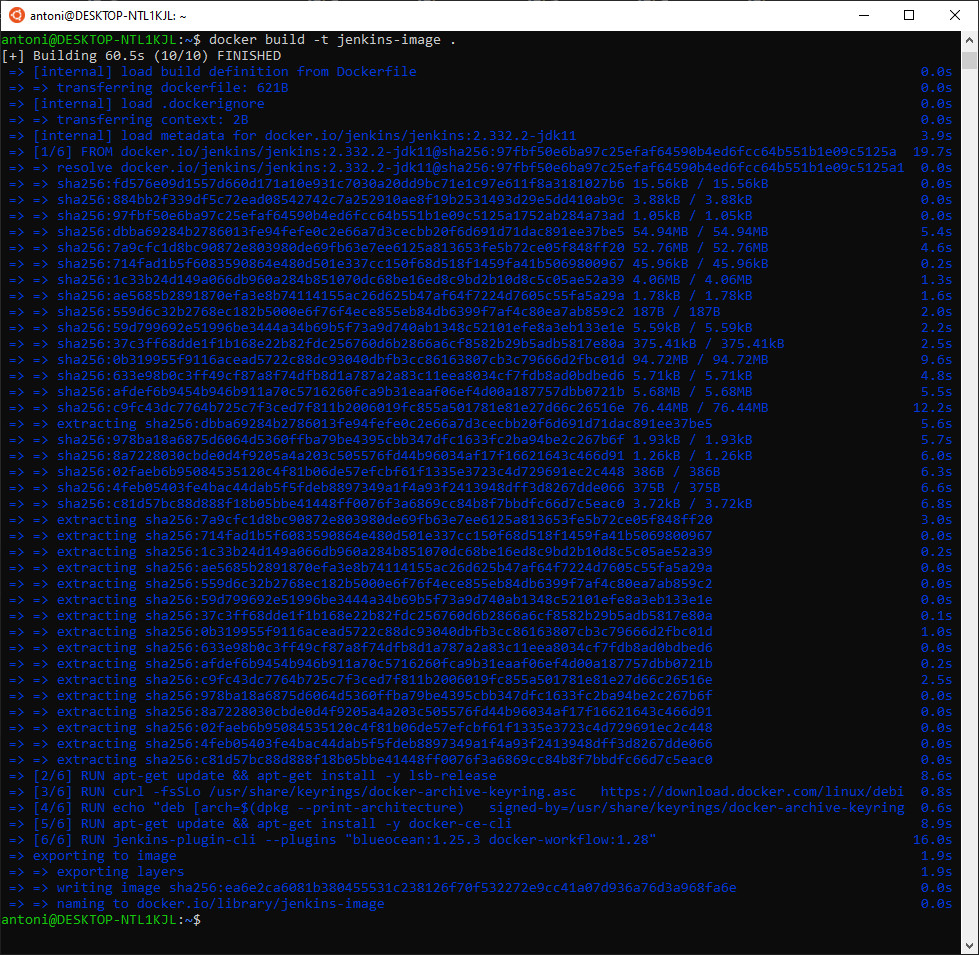

### uruchamiamy ten customowy obraz
uruchomione są dwa kontenery
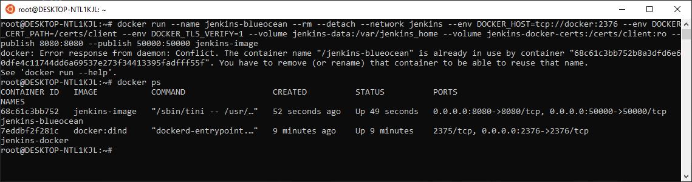

### wchodzimy na `localhost:8080` i logujemy się hasłem z logów
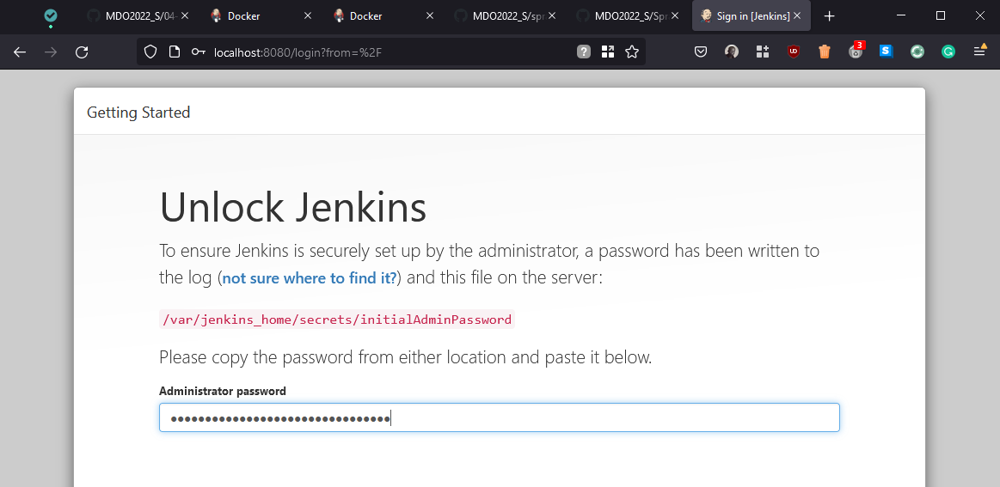

### pomyślnie zakończono procedurę, widzimy ekran startowy Jenkinsa
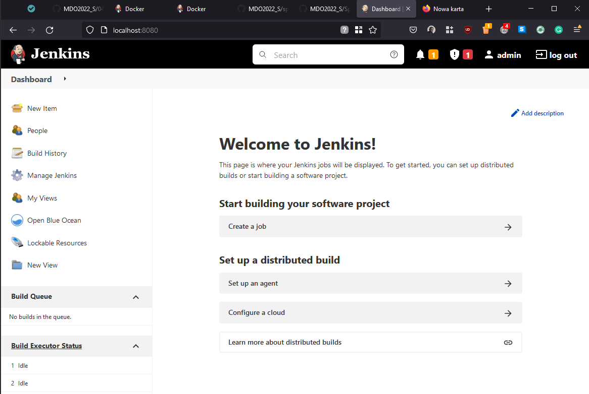

