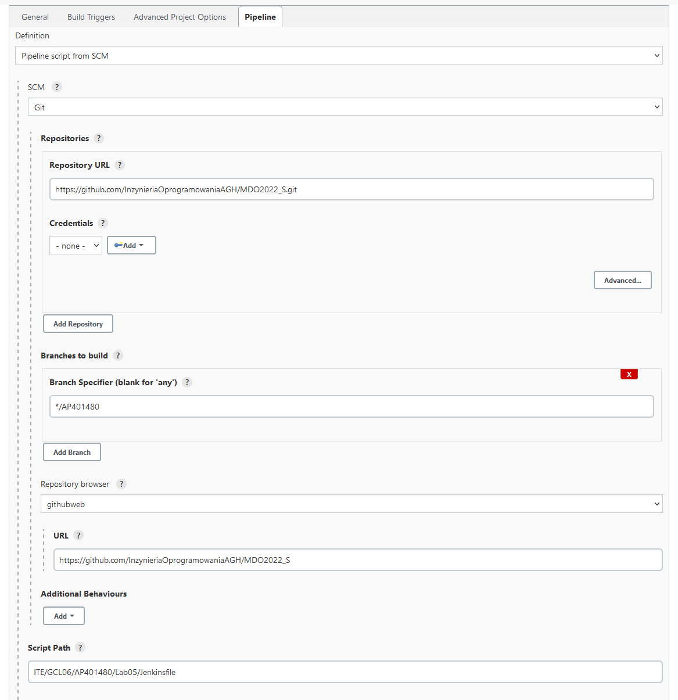
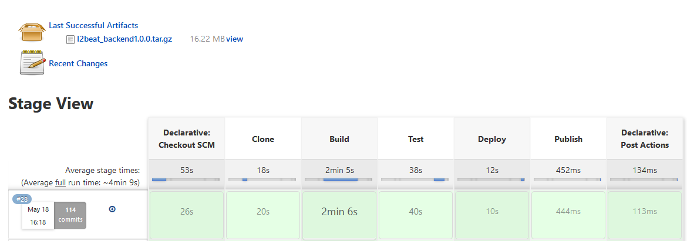
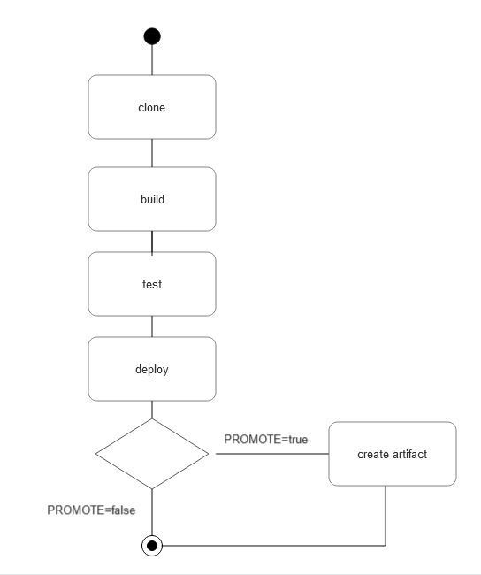
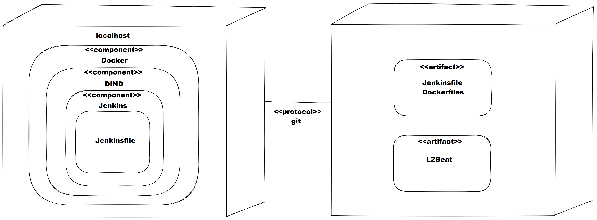

# Lab05

# Cel
Wykonanie projektu ma doprowadzić do stworzenia środowiska do automatyzacji procesów rozwóju i wdrażania oprogramowania, tzw. CI/CD.

# Streszczenie
Projekt obejmuje wykorzystanie oprogramowania Jenkins, które pozwoli na automatyczne uruchamianie procesów które do tej pory uruchamiane były z palca. Przekazujemy w Jenkinsfile kolejne etapy wdrażania naszego oprogramowania, które w ostateczności stworzą pipeline, czyli nic innego jak łańcuch kroków które mogą się powieść albo nie i na tej podstawie wykonane zostaną "afterefekty". Jenkins pozwoli nam zwyczajnie zautomatyzować tworzenie kontenerów i łączyć je w ciąg przyczynowo skutkowy. Poświęcając jeden raz więcej czasu tworzymy sobie narzędzie które zaoszczędzi nam tego czasu w przyszłości.

# Wykonanie

## 0. Jenkinsfile + Jenkins
Tworzymy plik o nazwie 'Jenkinsfile' w naszym repozytorium, jest to plik tekstowy zawierający specyfkację naszego pipeline. Piszemy go deklaratywnie w języku Groovy podając kolejne kroki w sekcji 'stages'. W naszym pipeline zawrzemy następujące etapy:
- clone
- build
- test
- deploy
- publish
  
Ostatecznym wynikiem naszego pipeline będzie archiwum z wynikiem procesu budowania.

Uruchamiamy UI Jenkinsa, dodajemy pipeline, następnie ustawiamy odpowiednie parametry w konfiguracji.




## 1. Clone
Etap klonowania ma za zadanie umieszczenie repozytorium w wolumenie. Początkowe komendy mają za zadanie posprzątać po poprzednich pipeline, następnie tworzony jest obraz kontenera do klonowania i uruchamiany.

```groovy
stage('Clone') {
    steps {
        sh '''
            docker container prune -f
            docker volume prune -f
            docker volume create --name input
            docker build -t clone -f ./ITE/GCL06/AP401480/Lab05/Clone .
            docker run -v "input:/input" clone
        '''
    }
}

```
Do klonowania stworzono obraz oparty o Fedore, podjąłem taką decyzję ze względu na elastyczność konfiguracji jaką on oferuje, z myślą o skalowaniu w przyszłości i dodaniu kolejnych komend. Użycie bardziej wyspecjalizowanego obrazu mogłoby zamknąć mi niektóre furtki. Wewnątrz dockerfile widzimy instalację gita i klonowanie.

```dockerfile
FROM fedora:36

RUN yum install git -y

CMD sh -c 'git clone https://github.com/antooni/l2beat.git /input/l2beat'
```


## 2. Build
Etap build ma za zadanie stworzyć środowisko do budowania dla mojej aplikacji, obejmuje to pobranie dependencji. Nastęnie ma zbudować mój program i wystawić efekt końcowy do obecnego folderu. Nie podejmowałem się dzielenia etapu build na dependency+build ze względu na specyfikę środowiska npm i systemu modułów node_modules. 
```groovy
stage('Build') {
    steps {
        sh '''
            docker build -t build -f ITE/GCL06/AP401480/Lab05/Build .
            docker run -v "input:/input" -v "${PWD}:/output" build
        '''
    }
}
```
Użyto wyspecjalizowanego obrazu node (wersja 14 jest wymagana przez moją aplikację). W dockerfile widzimy pobieranie dependencji (yarn) oraz budowanie (yarn build).
```dockerfile
FROM node:14

WORKDIR /input/l2beat

CMD sh -c 'yarn && cd ./packages/common && yarn build && cd ../config && yarn build && cd ../backend && yarn build:mock && tar cvzf l2beat_backend.tar.gz ./build && cp l2beat_backend.tar.gz /output'
 
```

## 3. Test
Etap test ma uruchomić testy mojego oprogramowania i w przypadku pomyślnego przejścia zwrócić kod 0, czyli popchnąć pipeline do przodu. W przypadku błędu pipeline się przerwie. Krok ten zapewnia, że wdrażane jest jedynie przetestowane oprogramowanie.
```groovy
stage('Test') {
    steps {
        sh '''
            docker build -t test -f ITE/GCL06/AP401480/Lab05/Test .
            docker run -v "input:/input" test
        '''
    }
}
```
Bazujemy na obrazie build, gdyż środowisko jak i dependecje są bardzo zbliżone. W dockerfile widzimy uruchamianie komendy do testowania (yarn test).
```dockerfile
FROM build

WORKDIR /input/l2beat

CMD sh -c 'yarn test'
```

## 4. Deploy
Proces służący do zbadania poprawności uruchomienia naszego oprogramowania. Wykryjemy tutaj wszelkie nieścisłości w środowisku oraz błędy w runtime. Poprawne przejście tego kroku to wykonanie kodu i zwrócenie kodu 0 aby pipeline mógł iść dalej do przodu. Proces deploy jest bardzo ważny, gdyż to dopiero on jest tym prawdziwym polem bojowym naszego oprogramowania. Budowanie i testy to procesy i środowiska stworzone przez programistę, zaś deploy to praca na żywym organizmie i uruchomienie w warunkach produkcyjnych.
```groovy
stage('Deploy') {
    steps {
        sh '''
            docker build -t deploy -f ITE/GCL06/AP401480/Lab05/Deploy .
            docker run -v "input:/input" deploy
        '''
    }
}
```
Dockerfile definiuje uruchomienie komendy yarn start.
```dockerfile
FROM build

WORKDIR /input/l2beat/packages/backend

CMD bash -c 'yarn start'
```

## 5. Publish
Ostatani krok naszego pipeline, tutaj obserwujemy parametryzację. Pierwszy parametr PROMOTE ustawiamy w celu doprecyzowania czy chcemy publikować artefakt czy jedynie sprawdzić czy pipeline przechodzi. Kolejny parametr VERSION służy do zachowania unikalności nazewnictwa kolejnych archiwów. 
```groovy
stage("Publish") {
    when {
        environment name: 'PROMOTE', value: "true"
    }
    steps {
        sh '''
            mv l2beat_backend.tar.gz l2beat_backend${VERSION}.tar.gz
        '''
        archiveArtifacts artifacts: "l2beat_backend${VERSION}.tar.gz"
    }
}
```

# Efekt końcowy
Uruchamiając pipeline obserwujemy jak Jenkins automatycznie wykonuje kolejne kroki. Po zakończeniu widzimy zbudowany artefakt.



# Diagram aktywności



# Diagram wdrożenia

