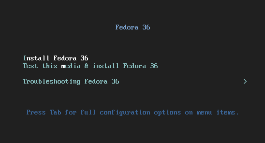
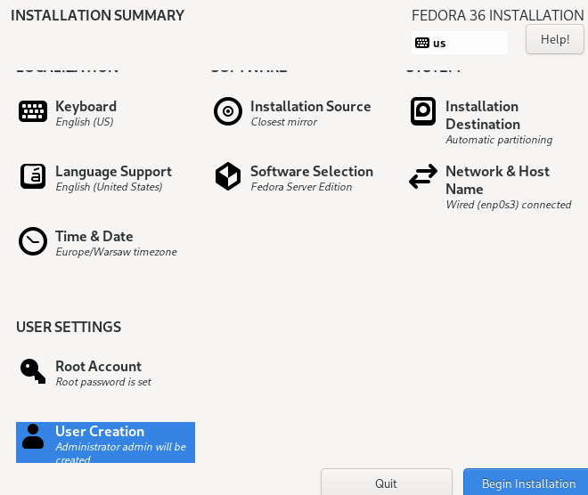
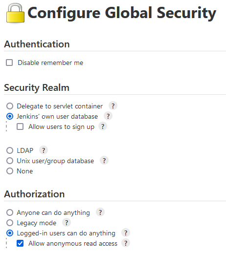
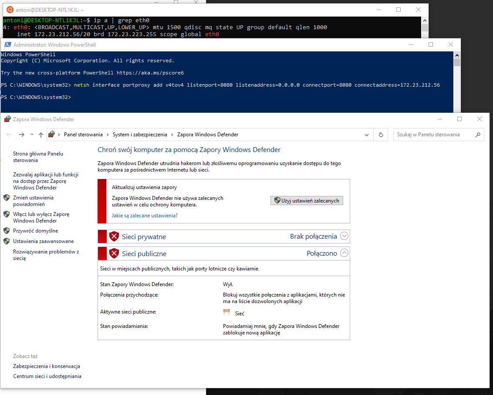
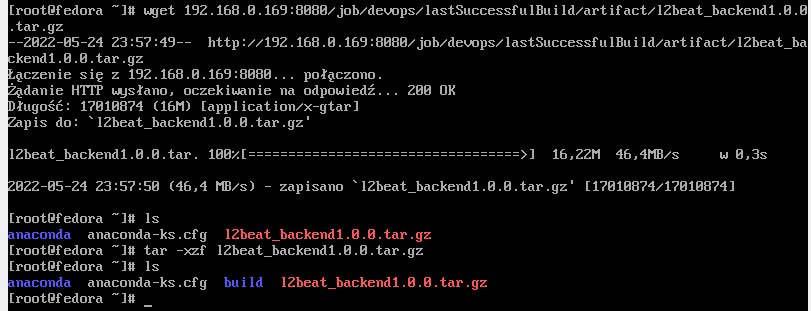
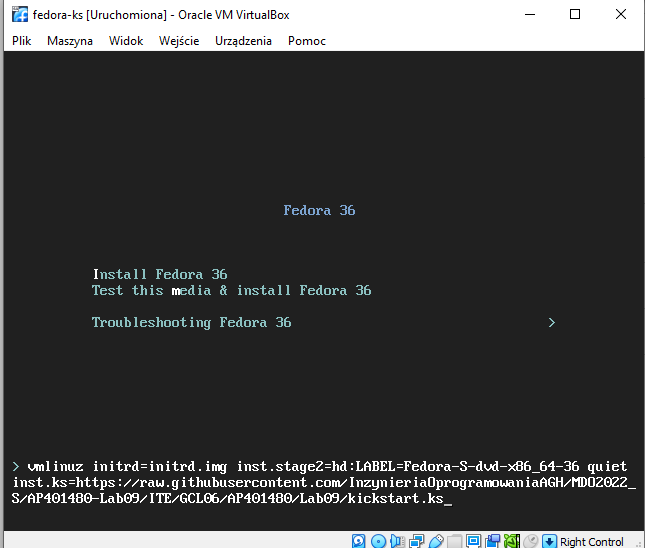
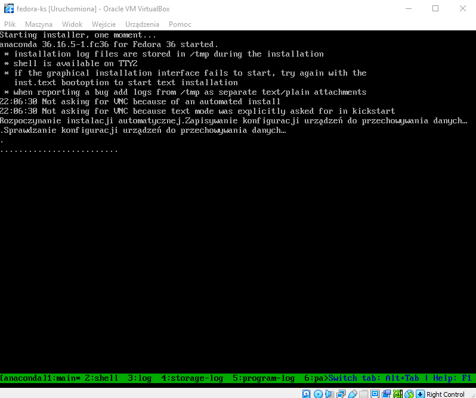
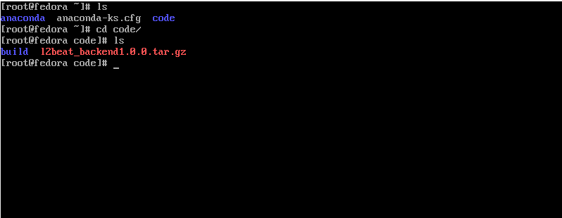
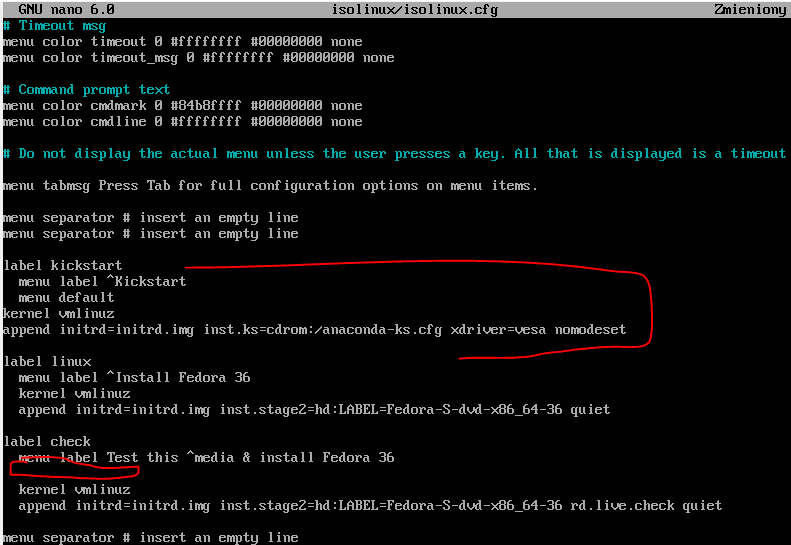
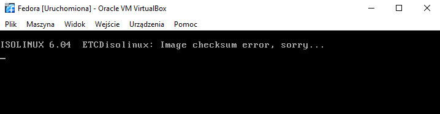

# Lab 09

## Instalacja Fedory w VM

Na początek instalujemy system Fedora 36 na naszej maszynie wirtualnej. Montujemy obraz w wirtualnym napędzie i przechodzimy kolejne kroki instalatora.



Wybieramy

- język
- układ klawiatury
- ustawiamy duski
- wybieramy strefę czasową
- tworzymy konto admina


Kiedy wszystkie kroki sa już zdefiniowane przechodzimy dalej, czyli rozpoczynamy instalację. Po pewnym okresie oczekiwania nasz system jest gotowy. W katalogu domowym roota znajdujemy plik odpowiedzi anaconda-ks.cfg i kopiujemy go. W późniejszych etapach nastąpi jego modyfikacja.



## Artefakt na serwerze HTTP

Jenkins udostępnia możliwość pobierania artefaktu będącego efektem końcowym naszego pipeline. Udostępnia on specjalny endpoint z ostatnim poprawnym buildem. Okazało się jednak, że dostęp z poziomu maszyny wirtualnej nie będzie taki trywialny, należało uczynić kilka małych poprawek dla setupu sieciowego.

Przede wszystkim należało zmienić ustawienia bezpieczeństwa w samym Jenkins aby zezwolić nieautoryzowanemu klientowi na pobranie builda. 



Następnie stworzono przekierowanie portu z dockera na port karty sieciowej PC. Zapobiegawczo wyłączono również Windows Defendera. 



Przy obecnym setupie możliwe jest wykonanie `wget` na odpowiedni endpoint wystawiony przez Jenkinsa.



## Plik odpowiedzi

Do pliku odpowiedzi wygenerowanego przez Fedore dodano następujące segmenty

### repozytoria

ustawiono odpowiednie źródła dla aktualizacji oprogramowania systemowego
```
# Repo
url --mirrorlist=http://mirrors.fedoraproject.org/mirrorlist?repo=fedora-$releasever&arch=x86_64
repo --name=updates --mirrorlist=http://mirrors.fedoraproject.org/mirrorlist?repo=updates-released-f$releasever&arch=x86_64
```

### post install czynności
pobieramy artefakt i rozpakowujemy go
```
%post
mkdir program
cd program
wget 192.168.0.169:8080/job/Lz4Main/lastSuccessfulBuild/artifact/l2beat_backend1.0.0.tar.gz
tar -xzf l2beat4*.tar.gz
%end
```

Zmodyfikowany plik odpowiedzi umieszczono w repozytorium na serwisie github [(link)](./kickstart.ks)

## Instalacja nienadzorowana

Podczas startu systemu klikamy TAB i modyfikujemy argumenty dodając `inst.ks=[link_do_repo]`



Po zaakceptowaniu uruchamia się instalacja nienadzorowana.



Po zakończeniu instalacji sprawdzamy poprawność procedur post-instalacyjnych. Jak widzimy rozpakowany artefakt znajduje się w odpowiednim folderze.




## Infrastructure as a code

### Repozytorium
Zmodyfikowany plik odpowiedzi umieszczono w repozytorium na serwisie github [(link)](./kickstart.ks)

### ISO
W celu edycji obrazu systemu należy przede wszystkim uzyskać dostęp do plików jakiegoś podstawowego obrazu. W tym celu umieszczamy ISO w wirtulanym napędzie wirtualnej maszyny a nastęnie montujemy go w dowolnym folderze, ja wybrałem `/iso`. 
Plik który nas najbardziej tam interesuje to `isolinux/isolinux.cfg`, zawiera on konfigurację menu startowego instalatora.

Na potrzeby naszego zadania: 
- dodajemy pozycję `kickstart`
- zmieniamy defaultową akcję z `check` na kickstart



Po zapisaniu pliku należy stworzyć nowy dysk instalacyjny systemu Fedora, niestety w moim przypadku nie do końca się to udało i miałem problem z `checksum error`. Winę pokładałbym w nie do końca poprawnie działającym programie do tworzenia obrazów.



