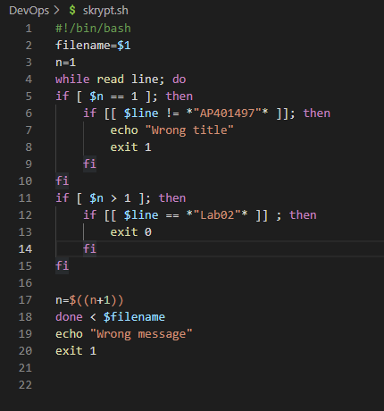
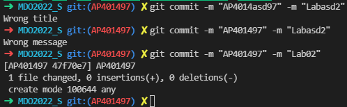
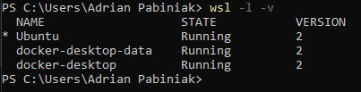
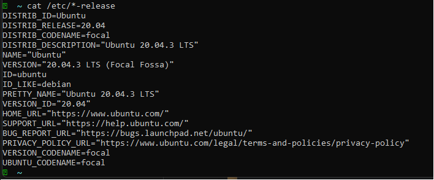
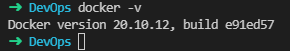
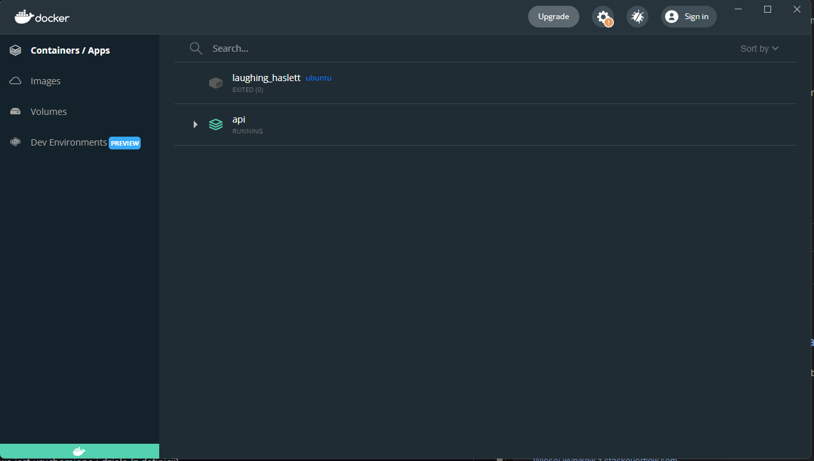
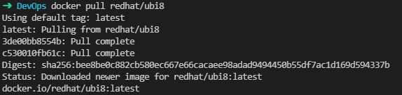
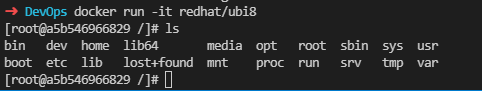
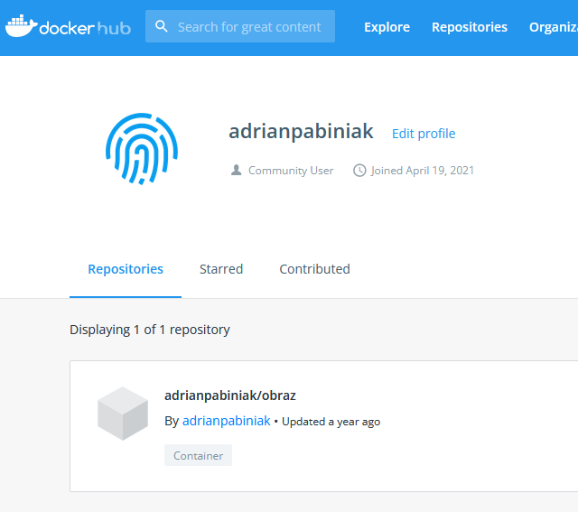

# Lab 2 - Sprawozdanie

### 1. Uzycie commit-msg.sample do stworzenia własnego commit-msg

> cp .git/hooks/commit-msg.sample .git/hooks/commit-msg
### 2. Stworzony skrypt
```
#!/bin/bash
filename=$1
n=1
while read line; do
if [ $n == 1 ]; then
    if [[ $line != *"AP401497"* ]]; then
        echo "Wrong title"
        exit 1
    fi
fi
if [ $n > 1 ]; then
    if [[ $line == *"Lab02"* ]] ; then
        exit 0
    fi
fi

n=$((n+1))
done < $filename
echo "Wrong message"
exit 1
```


### 3. Testowanie hooka
 >  git commit -m "AP4014asd97" -m "Labasd2" 
 
 >  git commit -m "AP401497" -m "Labasd2" 
 
 >  git commit -m "AP401497" -m "Lab02"   



### 4. Wykazanie posiadania WSL 2


### 5. Dokładna wersja systemu


### 6. Docker był już zainstalowany w systemie


### 7. Docker desktop na windowsie


### 8. Działanie środowiska
Pobranie obrazu redhat


Uruchomienie obrazu redhat w trybie interaktywnym


### 9. Wersja systemu uruchomionego w dockerze


### 10. Wykazania wcześniejszego posiada konta do Docker Hub
